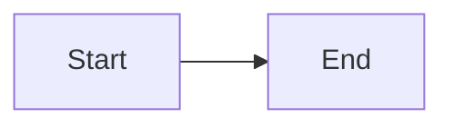

This is the **headless content repository** for the sauravgpt.in platform. It holds
the raw Markdown, media, and manifests for the **Learn** (`learn.sauravgpt.in`) and
**Blog** (`blog.sauravgpt.in`) sites.

The Next.js apps live in a **separate** private repo. They fetch this content **in the
browser at runtime** over the jsDelivr CDN. **Editing content here does NOT require
rebuilding or redeploying the apps** — pushing to `main` is enough (subject to CDN cache).

> Architecture pattern: The Odin Project style — application code and content are
> decoupled into two repositories.

---

## 1. Repository layout

```
/
├── course-manifest.json     # Learn: the source of truth for tracks → modules → lessons
├── blog-manifest.json       # Blog: the source of truth for posts
├── learn/                    # Learn Markdown, grouped by subject (track)
│   └── <track>/<module>/<lesson>.md
├── blogs/                    # Blog post Markdown
│   └── <post>.md
└── assets/                   # Media files; referenced by absolute https CDN URLs (not relative paths)
```

The apps read files via jsDelivr:

```
https://cdn.jsdelivr.net/gh/sauravgpt/sauravgptin-content@main/<path>
```

---

## 2. The golden rule — the manifest drives everything

Navigation, the landing page, and the curriculum are **built entirely from the
manifests**, NOT from directory listing (a CDN cannot list folders). Two consequences:

- A `.md` file that is **not** listed in the manifest is **invisible** in the UI
  (nothing links to it).
- The **folder and file names MUST match the manifest slugs**, because the app builds
  the fetch URL from the slugs (see §5, Mapping).

Always update the relevant manifest when you add or move content.

---

## 3. How to add a new SUBJECT (a "track", e.g. DSA)

A subject is a **track** — a sibling entry in `course-manifest.json` → `tracks[]`.
It appears automatically as a new card on the Learn landing page. **No app code change.**

**Step 1 — create the folders/files** under `learn/`:

```
learn/dsa/
├── module-1-arrays-and-strings/
│   ├── two-pointers.md
│   └── sliding-window.md
└── module-2-trees/
    └── binary-search-trees.md
```

**Step 2 — add a track object** to `course-manifest.json`:

```json
{
  "version": 1,
  "tracks": [
    { "slug": "system-design", "title": "System Design", "modules": [ /* ... */ ] },

    {
      "slug": "dsa",
      "title": "Data Structures & Algorithms",
      "description": "From arrays to graphs — interview-grade DSA.",
      "modules": [
        {
          "slug": "module-1-arrays-and-strings",
          "title": "Arrays & Strings",
          "order": 1,
          "lessons": [
            {
              "id": "dsa-m1-two-pointers",
              "slug": "two-pointers",
              "title": "Two Pointers Technique",
              "order": 1,
              "estimatedMinutes": 15,
              "path": "learn/dsa/module-1-arrays-and-strings/two-pointers.md"
            }
          ]
        }
      ]
    }
  ]
}
```

**Step 3 — push to `main`** and purge the CDN cache (see §8).

What you get automatically: a new track card on `/`, a curriculum page at `/dsa`, and
lesson pages at `/dsa/<module>/<lesson>`.

---

## 4. How to add a CHAPTER / TOPIC to an existing subject

- **New topic (lesson)** in an existing module:
  1. Add the `.md` file, e.g. `learn/system-design/module-1-foundations-of-system-design/backpressure.md`.
  2. Add a `lesson` object to that module's `lessons[]` in `course-manifest.json`
     (`id`, `slug`, `title`, `order`, `path`).

> **`id` convention:** the migration generator builds ids as `"<moduleSlug>-<lessonSlug>"`.
> Hand-authored ids don't have to follow that pattern — they only need to be unique across
> the manifest and match `^[a-z0-9-]+$`.
- **New chapter (module)** in an existing track:
  1. Create the module folder + its lesson `.md` files.
  2. Add a `module` object (with `slug`, `title`, `order`, `lessons[]`) to that
     track's `modules[]`.

Ordering is controlled by the `order` field (ascending; ties broken alphabetically by
slug) — NOT by file name or array position.

---

## 5. How mapping works (URL ↔ file ↔ manifest)

The URL slug segments map **directly** to the file path:

```
URL:   /system-design/module-1-foundations-of-system-design/caching
fetch: learn/system-design/module-1-foundations-of-system-design/caching.md
```

Rules:
- `track.slug`  = folder name under `learn/`
- `module.slug` = subfolder name
- `lesson.slug` = file name without `.md`
- `path`        = `learn/<track.slug>/<module.slug>/<lesson.slug>.md`

The app fetches by the track/module/lesson **slugs** (which must match the folder/file
names); `path` is descriptive metadata, not what the fetch URL is built from.

Resolution: the app requests `<...slug>.md` first, and falls back to
`<...slug>/index.md` if that 404s. So a folder can have an `index.md` for its own page,
but `index.md` files are **optional** — the landing/curriculum are built from the
manifest, not from `index.md`.

Blog mapping is flat: `/my-post` → `blogs/my-post.md`; `/tag/<tag>` filters posts by the
`tags` array in `blog-manifest.json` (blog routing is still being implemented — see §7).

---

## 6. Authoring a lesson `.md`

**Frontmatter** (YAML at the very top, between `---` fences):

```markdown
---
title: "Two Pointers Technique"      # REQUIRED
order: 1                              # controls sidebar/curriculum order
secondaryTitle: "Arrays & Strings"    # optional
description: "..."                    # optional
tags: ["arrays", "interview"]         # optional (0–20)
videoUrl: "https://youtu.be/xyz"      # optional, MUST be https
---
```

**Body** is standard Markdown (GitHub-flavored: tables, task lists, etc.). Code fences
are syntax-highlighted for registered languages (ts, js, python, bash, sql, json, yaml);
unknown languages render as plain preformatted text.

**Images & media** — reference them with absolute `https://` URLs. Store the files under
`assets/` in this repo, but link them by their full CDN URL:

```markdown

```

RELATIVE paths (`./diagram.png`, `/assets/diagram.png`, `assets/diagram.png`) are
**BLOCKED** and render a placeholder — the renderer's https-only guard rejects any URL
that isn't an absolute `https://` URL.

**Interactive blocks (Learn only)** — authored as fenced code blocks with a reserved
language tag and a **valid JSON** payload:

````markdown
```quiz
{ "question": "Best case for two pointers?", "options": ["Sorted array", "Hash map"], "correctAnswerIndex": 0, "explanation": "Sorted input lets pointers converge." }
```

```match
{ "question": "Match the term", "pairs": [ { "left": "O(1)", "right": "constant" } ] }
```

```callout
{ "type": "tip", "content": "Two pointers shine on sorted inputs." }
```



```lottie
{ "src": "https://cdn.jsdelivr.net/gh/sauravgpt/sauravgptin-content@main/assets/lottie/system-design/caching-strategies-layers.lottie", "loop": true, "autoplay": true, "speed": 1 }
```
````

- `type` for callout: `info | warning | tip | success`.
- `lottie` props: `src` (required, absolute `https://` URL to a `.lottie` or `.json`
  file), `loop` (boolean, default `true`), `autoplay` (boolean, default `true`), `speed`
  (positive number, default `1`). Supports both dotLottie (`.lottie`) and classic Lottie
  JSON (`.json`) formats.
- Payloads are parsed with `JSON.parse` only — they must be **strictly valid JSON**
  (double quotes, no trailing commas). An invalid payload is hidden in production and
  shown as an error card in development.
- `mermaid` and `lottie` work in both Learn and Blog. `quiz` / `match` / `callout` are
  **Learn-only** (in the Blog they render as plain code).

---

## 7. Blog posts (`blog-manifest.json`)

> **Status:** the Blog pipeline is mid-migration. The manifest shape below is final, but
> tag routing (`/tag/<tag>`), some views (not-found / empty states), and removal of the
> legacy pipeline are still being implemented. The Learn side is fully live.

```json
{
  "version": 1,
  "posts": [
    {
      "slug": "my-first-post",
      "title": "My First Post",
      "brief": "A short summary for cards.",
      "tags": ["nextjs", "cdn"],
      "publishedAt": "2026-01-15",
      "coverImage": "https://.../cover.png",
      "path": "blogs/my-first-post.md"
    }
  ]
}
```

- `publishedAt` is an ISO 8601 date; posts are shown newest-first.
- A post file lives at `blogs/<slug>.md`.

---

## 8. Publishing workflow

1. Add/edit the `.md` file(s) under `learn/` or `blogs/`.
2. Update the matching manifest (`course-manifest.json` / `blog-manifest.json`).
3. Validate the JSON (see §9) and commit.
4. Push to `main`.
5. Content goes live once the jsDelivr cache expires (a period that varies, roughly up to
   ~12h for a branch ref) **or**, deterministically, as soon as you purge it:
   ```
   https://purge.jsdelivr.net/gh/sauravgpt/sauravgptin-content@main/course-manifest.json
   https://purge.jsdelivr.net/gh/sauravgpt/sauravgptin-content@main/learn/<track>/<module>/<lesson>.md
   ```

**No app rebuild or redeploy is needed.**

---

## 9. Validation rules (manifests)

The apps validate the manifest on load; if it fails, the site shows a "Couldn't load"
panel instead of mis-rendering. Every entry must satisfy:

| Field                     | Rule                                             |
|---------------------------|--------------------------------------------------|
| `version`                 | must be `1`                                      |
| `slug`, `id`              | match `^[a-z0-9-]+$`, 1–128 chars, `id` unique   |
| `title`                   | 1–200 chars, required                            |
| `order`                   | integer 1–9999 (ties broken by slug)             |
| `estimatedMinutes`        | integer 1–1440 (optional)                        |
| `tags`                    | 0–20 strings                                     |
| `videoUrl`, media URLs    | absolute `https://` only                         |
| `path`                    | should mirror the real file location; used by tooling/humans, but the app fetches by the track/module/lesson **slugs** (which must match folder/file names), not by `path` |

---

## 10. Features

- **Zero-rebuild publishing** — content changes go live via the CDN without touching
  the apps.
- **Manifest-driven** — add a subject/module/lesson by editing content + manifest only.
- **Interactive lessons** — quizzes, match-the-following, callouts, Lottie animations,
  and Mermaid diagrams authored directly in Markdown.
- **Syntax highlighting** for common languages.
- **Fast & cheap** — static shells on Firebase Hosting + free jsDelivr CDN.

---

## 11. Limitations & gotchas

- **Not instant** — jsDelivr caches `@main` for a period that varies (roughly up to ~12h
  for a branch ref); purging is the deterministic way to force an immediate update.
- **Manifest is mandatory for visibility** — an unlisted `.md` won't appear in nav.
- **Names must match slugs** — folder/file names must equal the manifest slugs.
- **Strict JSON** in interactive blocks — invalid JSON is dropped (prod) / flagged (dev).
- **No raw HTML** — HTML embedded in Markdown is rendered as literal text (security).
  Use Markdown / the reserved blocks instead.
- **https-only media** — image/video URLs must be absolute `https://` URLs; relative
  paths and non-https URLs are blocked and show a placeholder.
- **SEO tradeoff** — content is fetched client-side, so it is not in the initial HTML;
  crawlers that execute JS will still see it.
- **Interactive blocks are Learn-only** — in the Blog, only `mermaid` + `lottie` + code +
  Markdown render; `quiz`/`match`/`callout` show as plain code.
- **A malformed manifest breaks the whole section** — validate before pushing.

---

## Quick checklists

**Add a subject:** create `learn/<subject>/…` → add a `track` to `course-manifest.json` → push → purge.

**Add a lesson:** create the `.md` → add a `lesson` to the module's `lessons[]` (with `path`, `slug`, `order`) → push → purge.

**Add a blog post:** create `blogs/<slug>.md` → add a `post` to `blog-manifest.json` → push → purge.

---

## 12. Generating Lottie animations (LottieFiles Creator MCP)

This repo uses the **LottieFiles Creator MCP** to generate Lottie JSON animations
directly from AI prompts. The MCP connects to the browser-based
[LottieFiles Creator](https://creator.lottiefiles.com) editor, giving full programmatic
access to scenes, layers, shapes, keyframes, and easing curves.

### Prerequisites

- **Node.js 18+** (for `npx`)
- **LottieFiles Creator** open in a browser tab with MCP enabled
- **Kiro CLI** (or any MCP-compatible AI client)

### Setup (already configured)

The MCP is registered in `~/.kiro/settings/mcp.json`:

```json
"lottiefiles-creator": {
  "command": "npx",
  "args": ["-y", "@lottiefiles/creator-mcp@latest"],
  "disabled": false
}
```

### How to use

1. **Open Creator** — navigate to [creator.lottiefiles.com](https://creator.lottiefiles.com)
2. **Enable MCP** — go to **Settings → MCP Settings → Enable MCP**. You should see
   "Local MCP bridge connected" in Creator.
3. **Prompt the AI** — describe the animation you want (e.g. "create a loading spinner",
   "animate a bouncing ball", "build a checkmark success animation").
4. **Export** — once the animation looks good in Creator, export it as Lottie JSON from
   Creator's export menu.

### Important notes

- Only **one MCP client** can connect to Creator at a time. If you get a "bridge
  unavailable" error, close other editors (Cursor, VS Code, other Kiro sessions) that
  may have the same MCP running.
- The AI uses the `run_script` tool to execute JavaScript against the Creator API. It
  must call `get_rules` and `get_api_doc` (all pages) before writing scripts.
- **Layer ordering**: first layer in the array renders on top (foreground), last is
  background. Create foreground layers first.
- Animations are built in the Creator canvas — you can preview, tweak, and refine them
  visually before exporting.

### Optional: Motion Design Skill

For higher quality animations (better easing, timing, choreography):

```bash
npx skills add LottieFiles/motion-design-skill
```

### Example prompt → result

> "Create a 200×200 loading spinner — blue arc that rotates and pulses over 2 seconds"

This produces a scene with:
- 200×200 canvas, 60fps, 2s duration
- Ellipse with blue stroke (no fill)
- Animated trim path (arc grows/shrinks) + rotation keyframes
- Smooth cubic-bezier easing on the pulse, linear rotation

### Where to store exported Lottie JSON

Store exported `.lottie` files under `assets/lottie/` in this repo, organized by track:

```
assets/
└── lottie/
    ├── system-design/
    │   ├── client-server-architecture-flow.lottie
    │   ├── client-server-architecture-failover.lottie
    │   ├── caching-strategies-layers.lottie
    │   └── ...
    ├── generative-artificial-intelligence/
    │   └── ...
    ├── data-structures-and-algorithms/
    │   └── ...
    └── shared/
        ├── loading-spinner.lottie
        └── success-checkmark.lottie
```

**Naming convention:** `<lesson-slug>-<descriptor>.lottie`

- Folder names mirror track slugs (same as `learn/` directories)
- File names start with the lesson slug, followed by a short descriptor
- `shared/` holds reusable animations used across multiple tracks
- If a lesson has multiple animations, each gets a distinct descriptor suffix

### Theming Lottie animations (light / dark)

The app supports 3 color themes (Minimalist, GenZ, Google) × 2 modes (light/dark) = 6
combinations. To keep animations manageable, we flatten to **2 embedded themes** inside
each `.lottie` file: `light` and `dark`. The palette uses **indigo** as the universal
accent — it blends naturally with all 3 app themes (zinc, fuchsia/violet, Google-blue).

**Universal Lottie color palette:**

| Role | Light (`light` theme) | Dark (`dark` theme) |
|------|-----------------------|---------------------|
| Background | `#f4f4f5` | `#27272a` |
| Surface | `#ffffff` | `#18181b` |
| Primary/Accent | `#6366f1` | `#a5b4fc` |
| Secondary | `#64748b` | `#94a3b8` |
| Foreground/Text | `#1e1b4b` | `#e0e7ff` |
| Border/Line | `#cbd5e1` | `#475569` |
| Success | `#16a34a` | `#4ade80` |
| Error | `#dc2626` | `#f87171` |
| Info/Highlight | `#2563eb` | `#60a5fa` |

**How it works at runtime:**

1. The app detects the user's current color mode (light or dark).
2. It passes `themeId: "light"` or `themeId: "dark"` to the `LottieAnimation` component.
3. The dotLottie player reads the matching embedded theme from the `.lottie` file and
   swaps all mapped colors instantly — no re-download, no flicker.

**Usage in markdown (with theming):**

````markdown
```lottie
{ "src": "https://cdn.jsdelivr.net/gh/sauravgpt/sauravgptin-content@main/assets/lottie/system-design/caching-strategies-layers.lottie", "loop": true, "autoplay": true, "speed": 1, "themeId": "light" }
```
````

> **Note:** `themeId` is optional. If omitted, the animation renders with its default
> (authored) colors. The app will auto-pass the correct `themeId` based on the user's
> current mode when support is wired up.

**Authoring themed `.lottie` files:**

When creating animations in LottieFiles Creator, define two theme variants inside the
`.lottie` export using the colors above. The `.lottie` container structure:

```
my-animation.lottie
├── animation.json        (raw animation with default/light colors)
└── themes/
    ├── light.json        { "primary": "#6366f1", "surface": "#ffffff", ... }
    └── dark.json         { "primary": "#a5b4fc", "surface": "#18181b", ... }
```

### Canvas size standards

Lottie is vector-based, so animations scale losslessly — what matters for a consistent
look is the **aspect ratio**, plus a shared working scale so stroke widths, font sizes,
and spacing feel uniform across animations. Always pick one of these presets:

| Preset | Size | Ratio | Use for |
|--------|------|-------|---------|
| `wide` | 1200 × 500 | 12:5 | Left-to-right pipelines and flow diagrams (e.g. client → server chains, request lifecycles) |
| `standard` | 1200 × 675 | 16:9 | General diagrams, layered architectures, sequence-style animations — the default when unsure |
| `tall` | 800 × 1000 | 4:5 | Vertical stacks (e.g. layered caches, protocol stacks, top-down hierarchies) |
| `square` | 600 × 600 | 1:1 | Icons, spinners, small inline illustrations (most `shared/` animations) |

**Authoring conventions (at the working scales above):**

- Framerate: **60 fps**; duration: **4–8 s**, looping
- Node boxes: ~**160 × 60 px**, corner roundness **12**
- Connection lines: **3 px** stroke; container/panel borders: **2 px**, roundness **16**
- Labels: **16–17 px**; group/panel titles: **15 px**; animated dots: **12–16 px** diameter
- Keep ~**40 px** minimum padding between content and canvas edges

**Rules:**

- Do NOT invent new canvas sizes — pick the closest preset and adapt the layout
- The app renders animations at the content column width, so `wide`/`standard` display
  near 1:1; `tall` and `square` are constrained by height
- Scene background must be transparent (it isn't exported, but keep it `null` in
  Creator so the preview matches reality)
