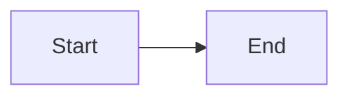

This is the **headless content repository** for the sauravgpt.in platform. It holds
the raw Markdown, media, and manifests for the **Learn** (`learn.sauravgpt.in`) and
**Blog** (`blog.sauravgpt.in`) sites.

The Next.js apps live in a **separate** private repo. They fetch this content **in the
browser at runtime** over the jsDelivr CDN. **Editing content here does NOT require
rebuilding or redeploying the apps** — pushing to `main` is enough (subject to CDN cache).

> Architecture pattern: The Odin Project style — application code and content are
> decoupled into two repositories.

---

## 1. Repository layout

```
/
├── course-manifest.json     # Learn: the source of truth for tracks → modules → lessons
├── blog-manifest.json       # Blog: the source of truth for posts
├── learn/                    # Learn Markdown, grouped by subject (track)
│   └── <track>/<module>/<lesson>.md
├── blogs/                    # Blog post Markdown
│   └── <post>.md
└── assets/                   # Media files; referenced by absolute https CDN URLs (not relative paths)
```

The apps read files via jsDelivr:

```
https://cdn.jsdelivr.net/gh/sauravgpt/sauravgptin-content@main/<path>
```

---

## 2. The golden rule — the manifest drives everything

Navigation, the landing page, and the curriculum are **built entirely from the
manifests**, NOT from directory listing (a CDN cannot list folders). Two consequences:

- A `.md` file that is **not** listed in the manifest is **invisible** in the UI
  (nothing links to it).
- The **folder and file names MUST match the manifest slugs**, because the app builds
  the fetch URL from the slugs (see §5, Mapping).

Always update the relevant manifest when you add or move content.

---

## 3. How to add a new SUBJECT (a "track", e.g. DSA)

A subject is a **track** — a sibling entry in `course-manifest.json` → `tracks[]`.
It appears automatically as a new card on the Learn landing page. **No app code change.**

**Step 1 — create the folders/files** under `learn/`:

```
learn/dsa/
├── module-1-arrays-and-strings/
│   ├── two-pointers.md
│   └── sliding-window.md
└── module-2-trees/
    └── binary-search-trees.md
```

**Step 2 — add a track object** to `course-manifest.json`:

```json
{
  "version": 1,
  "tracks": [
    { "slug": "system-design", "title": "System Design", "modules": [ /* ... */ ] },

    {
      "slug": "dsa",
      "title": "Data Structures & Algorithms",
      "description": "From arrays to graphs — interview-grade DSA.",
      "modules": [
        {
          "slug": "module-1-arrays-and-strings",
          "title": "Arrays & Strings",
          "order": 1,
          "lessons": [
            {
              "id": "dsa-m1-two-pointers",
              "slug": "two-pointers",
              "title": "Two Pointers Technique",
              "order": 1,
              "estimatedMinutes": 15,
              "path": "learn/dsa/module-1-arrays-and-strings/two-pointers.md"
            }
          ]
        }
      ]
    }
  ]
}
```

**Step 3 — push to `main`** and purge the CDN cache (see §8).

What you get automatically: a new track card on `/`, a curriculum page at `/dsa`, and
lesson pages at `/dsa/<module>/<lesson>`.

---

## 4. How to add a CHAPTER / TOPIC to an existing subject

- **New topic (lesson)** in an existing module:
  1. Add the `.md` file, e.g. `learn/system-design/module-1-foundations-of-system-design/backpressure.md`.
  2. Add a `lesson` object to that module's `lessons[]` in `course-manifest.json`
     (`id`, `slug`, `title`, `order`, `path`).

> **`id` convention:** the migration generator builds ids as `"<moduleSlug>-<lessonSlug>"`.
> Hand-authored ids don't have to follow that pattern — they only need to be unique across
> the manifest and match `^[a-z0-9-]+$`.
- **New chapter (module)** in an existing track:
  1. Create the module folder + its lesson `.md` files.
  2. Add a `module` object (with `slug`, `title`, `order`, `lessons[]`) to that
     track's `modules[]`.

Ordering is controlled by the `order` field (ascending; ties broken alphabetically by
slug) — NOT by file name or array position.

---

## 5. How mapping works (URL ↔ file ↔ manifest)

The URL slug segments map **directly** to the file path:

```
URL:   /system-design/module-1-foundations-of-system-design/caching
fetch: learn/system-design/module-1-foundations-of-system-design/caching.md
```

Rules:
- `track.slug`  = folder name under `learn/`
- `module.slug` = subfolder name
- `lesson.slug` = file name without `.md`
- `path`        = `learn/<track.slug>/<module.slug>/<lesson.slug>.md`

The app fetches by the track/module/lesson **slugs** (which must match the folder/file
names); `path` is descriptive metadata, not what the fetch URL is built from.

Resolution: the app requests `<...slug>.md` first, and falls back to
`<...slug>/index.md` if that 404s. So a folder can have an `index.md` for its own page,
but `index.md` files are **optional** — the landing/curriculum are built from the
manifest, not from `index.md`.

Blog mapping is flat: `/my-post` → `blogs/my-post.md`; `/tag/<tag>` filters posts by the
`tags` array in `blog-manifest.json` (blog routing is still being implemented — see §7).

---

## 6. Authoring a lesson `.md`

**Frontmatter** (YAML at the very top, between `---` fences):

```markdown
---
title: "Two Pointers Technique"      # REQUIRED
order: 1                              # controls sidebar/curriculum order
secondaryTitle: "Arrays & Strings"    # optional
description: "..."                    # optional
tags: ["arrays", "interview"]         # optional (0–20)
videoUrl: "https://youtu.be/xyz"      # optional, MUST be https
---
```

**Body** is standard Markdown (GitHub-flavored: tables, task lists, etc.). Code fences
are syntax-highlighted for registered languages (ts, js, python, bash, sql, json, yaml);
unknown languages render as plain preformatted text.

**Images & media** — reference them with absolute `https://` URLs. Store the files under
`assets/` in this repo, but link them by their full CDN URL:

```markdown

```

RELATIVE paths (`./diagram.png`, `/assets/diagram.png`, `assets/diagram.png`) are
**BLOCKED** and render a placeholder — the renderer's https-only guard rejects any URL
that isn't an absolute `https://` URL.

**Interactive blocks (Learn only)** — authored as fenced code blocks with a reserved
language tag and a **valid JSON** payload:

````markdown
```quiz
{ "question": "Best case for two pointers?", "options": ["Sorted array", "Hash map"], "correctAnswerIndex": 0, "explanation": "Sorted input lets pointers converge." }
```

```match
{ "question": "Match the term", "pairs": [ { "left": "O(1)", "right": "constant" } ] }
```

```callout
{ "type": "tip", "content": "Two pointers shine on sorted inputs." }
```



```lottie
{ "src": "https://cdn.jsdelivr.net/gh/sauravgpt/sauravgptin-content@main/assets/lottie/system-design/caching-strategies-layers.lottie", "loop": true, "autoplay": true, "speed": 1 }
```
````

- `type` for callout: `info | warning | tip | success`.
- `lottie` props: `src` (required, absolute `https://` URL to a `.lottie` or `.json`
  file), `loop` (boolean, default `true`), `autoplay` (boolean, default `true`), `speed`
  (positive number, default `1`). Supports both dotLottie (`.lottie`) and classic Lottie
  JSON (`.json`) formats.
- Payloads are parsed with `JSON.parse` only — they must be **strictly valid JSON**
  (double quotes, no trailing commas). An invalid payload is hidden in production and
  shown as an error card in development.
- `mermaid` and `lottie` work in both Learn and Blog. `quiz` / `match` / `callout` are
  **Learn-only** (in the Blog they render as plain code).

---

## 7. Blog posts (`blog-manifest.json`)

> **Status:** the Blog pipeline is mid-migration. The manifest shape below is final, but
> tag routing (`/tag/<tag>`), some views (not-found / empty states), and removal of the
> legacy pipeline are still being implemented. The Learn side is fully live.

```json
{
  "version": 1,
  "posts": [
    {
      "slug": "my-first-post",
      "title": "My First Post",
      "brief": "A short summary for cards.",
      "tags": ["nextjs", "cdn"],
      "publishedAt": "2026-01-15",
      "coverImage": "https://.../cover.png",
      "path": "blogs/my-first-post.md"
    }
  ]
}
```

- `publishedAt` is an ISO 8601 date; posts are shown newest-first.
- A post file lives at `blogs/<slug>.md`.

---

## 8. Publishing workflow

1. Add/edit the `.md` file(s) under `learn/` or `blogs/`.
2. Update the matching manifest (`course-manifest.json` / `blog-manifest.json`).
3. Validate the JSON (see §9) and commit.
4. Push to `main`.
5. Content goes live once the jsDelivr cache expires (a period that varies, roughly up to
   ~12h for a branch ref) **or**, deterministically, as soon as you purge it:
   ```
   https://purge.jsdelivr.net/gh/sauravgpt/sauravgptin-content@main/course-manifest.json
   https://purge.jsdelivr.net/gh/sauravgpt/sauravgptin-content@main/learn/<track>/<module>/<lesson>.md
   ```

**No app rebuild or redeploy is needed.**

---

## 9. Validation rules (manifests)

The apps validate the manifest on load; if it fails, the site shows a "Couldn't load"
panel instead of mis-rendering. Every entry must satisfy:

| Field                     | Rule                                             |
|---------------------------|--------------------------------------------------|
| `version`                 | must be `1`                                      |
| `slug`, `id`              | match `^[a-z0-9-]+$`, 1–128 chars, `id` unique   |
| `title`                   | 1–200 chars, required                            |
| `order`                   | integer 1–9999 (ties broken by slug)             |
| `estimatedMinutes`        | integer 1–1440 (optional)                        |
| `tags`                    | 0–20 strings                                     |
| `videoUrl`, media URLs    | absolute `https://` only                         |
| `path`                    | should mirror the real file location; used by tooling/humans, but the app fetches by the track/module/lesson **slugs** (which must match folder/file names), not by `path` |

---

## 10. Features

- **Zero-rebuild publishing** — content changes go live via the CDN without touching
  the apps.
- **Manifest-driven** — add a subject/module/lesson by editing content + manifest only.
- **Interactive lessons** — quizzes, match-the-following, callouts, Lottie animations,
  and Mermaid diagrams authored directly in Markdown.
- **Syntax highlighting** for common languages.
- **Fast & cheap** — static shells on Firebase Hosting + free jsDelivr CDN.

---

## 11. Limitations & gotchas

- **Not instant** — jsDelivr caches `@main` for a period that varies (roughly up to ~12h
  for a branch ref); purging is the deterministic way to force an immediate update.
- **Manifest is mandatory for visibility** — an unlisted `.md` won't appear in nav.
- **Names must match slugs** — folder/file names must equal the manifest slugs.
- **Strict JSON** in interactive blocks — invalid JSON is dropped (prod) / flagged (dev).
- **No raw HTML** — HTML embedded in Markdown is rendered as literal text (security).
  Use Markdown / the reserved blocks instead.
- **https-only media** — image/video URLs must be absolute `https://` URLs; relative
  paths and non-https URLs are blocked and show a placeholder.
- **SEO tradeoff** — content is fetched client-side, so it is not in the initial HTML;
  crawlers that execute JS will still see it.
- **Interactive blocks are Learn-only** — in the Blog, only `mermaid` + `lottie` + code +
  Markdown render; `quiz`/`match`/`callout` show as plain code.
- **A malformed manifest breaks the whole section** — validate before pushing.

---

## Quick checklists

**Add a subject:** create `learn/<subject>/…` → add a `track` to `course-manifest.json` → push → purge.

**Add a lesson:** create the `.md` → add a `lesson` to the module's `lessons[]` (with `path`, `slug`, `order`) → push → purge.

**Add a blog post:** create `blogs/<slug>.md` → add a `post` to `blog-manifest.json` → push → purge.

---

## 12. Generating Lottie animations (LottieFiles Creator MCP)

Animations in this repo are authored with the **LottieFiles Creator MCP**, which drives the
browser-based [LottieFiles Creator](https://creator.lottiefiles.com) editor
programmatically — scenes, layers, shapes, keyframes, easing.

> **Canonical style reference:**
> `assets/lottie/system-design/client-server-architecture-flow.lottie`.
> When in doubt about colors, sizes, timing, or layer naming, unzip that file and copy what
> it does. Consistency across animations matters more than any individual design choice.

```bash
# inspect the reference asset
unzip -l assets/lottie/system-design/client-server-architecture-flow.lottie
unzip -p assets/lottie/system-design/client-server-architecture-flow.lottie \
  a/client-server-architecture-flow.json | python3 -m json.tool | less
```

### Prerequisites

- **Node.js 18+** (for `npx`)
- **LottieFiles Creator** open in a browser tab with MCP enabled
  (**Settings → MCP Settings → Enable MCP**; Creator shows "Local MCP bridge connected")
- **Kiro CLI** (or any MCP-compatible AI client)

The MCP is registered in `~/.kiro/settings/mcp.json`:

```json
"lottiefiles-creator": {
  "command": "npx",
  "args": ["-y", "@lottiefiles/creator-mcp@latest"],
  "disabled": false
}
```

### End-to-end workflow

1. **Human** opens Creator and enables MCP.
2. **Agent** calls `get_rules` and `get_api_doc` (all pages) — required before any
   `run_script` call. But see the ordering correction below: **this file overrides
   `get_rules` where they disagree.**
3. **Agent** reads the canonical reference asset to pick up the house style.
4. **Agent** picks a canvas preset, plans the layout, and builds the scene with
   `run_script`.
5. **Agent** verifies by *reading values back* (it cannot see the canvas — see
   "Verifying without eyes").
6. **Human** eyeballs the animation in Creator, then **exports it manually** — the MCP has
   **no export method**, so the agent physically cannot finish this step.
7. **Agent** wires the `.lottie` into the lesson markdown, then push + purge.

### Sandbox gotchas

Things that will silently waste a cycle if you don't know them:

- **Layer order is PREPEND, not append.** `get_rules` claims new layers are appended and
  tells you to create foreground first. That is **wrong**. New layers land at the *front* of
  `scene.layers`, so the **last-created layer renders on top**. Therefore:
  **create background first, foreground last.** Always verify and correct:
  ```js
  console.log(scene.layers.map((l) => l.name)); // index 0 = topmost
  someLayer.bringToFront();                     // or moveBefore / moveAfter / sendToBack
  ```
- **No top-level `await`** — it's a syntax error in the sandbox.
- **`createTextLayer` mangles a computed `name` into the string `"NaN"`.** Passing a template
  literal or any non-literal expression as `name` silently produces a layer called `NaN`.
  `createShapeLayer` handles the same expression fine. Workaround — assign the name after
  creation:
  ```js
  const l = scene.createTextLayer({ text, position, /* ...no name... */ });
  l.name = `edgelabel-${side}-${i + 1}`; // this works
  ```
  Always log `scene.layers.map((l) => l.name)` after a build and check for `NaN`.
- **Async output is lost** — `console.log` inside a `.then()` callback is not captured, so
  `creator.getAvailableFonts()` is effectively unusable. Just hardcode the house font
  (`fontFamily: 'Cal Sans'`, `fontStyle: 'Regular'`).
- **No export API** — `ExportFormat` is declared in the types but no export method is
  exposed. A human must export from Creator's UI.
- **The agent cannot see the canvas** — no screenshot, no render.
- **One MCP client at a time.** On "bridge unavailable", close other editors (Cursor,
  VS Code, other Kiro sessions) running the same MCP.

### Canvas size standards

Lottie scales losslessly, so what matters is **aspect ratio** plus a shared working scale
so stroke widths, font sizes, and spacing stay uniform. Pick one preset — do **not** invent
new sizes:

| Preset | Size | Ratio | Use for |
|--------|------|-------|---------|
| `wide` | 1200 × 500 | 12:5 | Left-to-right pipelines and flow diagrams (e.g. client → server chains, request lifecycles) |
| `standard` | 1200 × 675 | 16:9 | General diagrams, layered architectures, sequence-style animations — the default when unsure |
| `tall` | 800 × 1000 | 4:5 | Vertical stacks (e.g. layered caches, protocol stacks, top-down hierarchies) |
| `square` | 600 × 600 | 1:1 | Icons, spinners, small inline illustrations (most `shared/` animations) |

- The app renders animations at the content column width, so `wide`/`standard` display near
  1:1; `tall` and `square` are constrained by height.
- Scene background must be **transparent** (`scene.backgroundColor = null`). It isn't
  exported either way, but keeping it null makes the Creator preview match reality.
- Keep ~**40 px** minimum padding between content and the canvas edges.
- **Centre the composition, and prove it by arithmetic.** Compute the real content bounds —
  including lifelines, container edges, and anything else that reads as an edge — then check
  that top padding equals bottom padding and left equals right. Eyeballed padding drifts:
  laying out downward from a comfortable top margin reliably leaves the whole diagram sitting
  low. Log it as part of the build:
  ```js
  const top = /* topmost edge */, bottom = /* bottommost edge */;
  console.log('centre', (top + bottom) / 2, 'vs', scene.size.height / 2,
              '| padding', top, '/', scene.size.height - bottom);
  ```

### Palette (light — the only palette currently shipped)

Indigo is the universal accent: it blends with all three app themes (zinc, fuchsia/violet,
Google-blue). These are the values actually used by the shipped assets — match them exactly.

| Role | Hex | RGB | Used for |
|------|-----|-----|----------|
| Node fill / accent | `#6366f1` | `99, 102, 241` | Node box fill (solid, **no stroke**) |
| Node label | `#ffffff` | `255, 255, 255` | Text inside node boxes |
| Connector line | `#64748b` | `100, 116, 139` | Connection lines, edge labels |
| Packet / data dot | `#f97316` | `249, 115, 22` | Animated dots travelling along lines |
| Panel fill | `#f4f4f5` | `244, 244, 245` | Container / group panel background |
| Panel border | `#cbd5e1` | `203, 213, 225` | Container / group panel stroke |
| Text | `#1e1b4b` | `30, 27, 75` | Group titles, any text outside a node box |
| Success | `#16a34a` | `22, 163, 74` | Healthy / success state |
| Error | `#dc2626` | `220, 38, 38` | Failed / timeout state |
| Surface | `#ffffff` | `255, 255, 255` | Reserved (light surfaces, if needed) |

> Note the distinction: **lines are `#64748b`**, **panel borders are `#cbd5e1`**. They are
> not interchangeable.

### Component spec

| Element | Spec |
|---------|------|
| Node box | Rectangle 160 × 60, roundness **12**, solid `#6366f1` fill, no stroke |
| Node box (wide variant) | Rectangle **240 × 60**, same fill/roundness — only when the label cannot fit 160 px |
| Node label | Cal Sans Regular, **17 px** (16 px for short labels), centered, `#ffffff` |
| Connector line | 2-point path, **3 px** stroke `#64748b`, revealed with a trim path |
| Packet / dot | Ellipse **16 × 16**, solid `#f97316` fill |
| Container / panel | Rectangle, roundness **16**, `#f4f4f5` fill + **2 px** `#cbd5e1` stroke |
| Group title | Cal Sans Regular **15 px**, centered, `#1e1b4b`, placed **inside** the container ~18 px below its top edge |
| Edge label | Cal Sans Regular **15 px**, centered, `#64748b`, offset clear of the line |
| Status badge | Cal Sans Regular **16 px**, centered, `#16a34a` / `#dc2626` |
| Branding watermark | Cal Sans Regular **14 px**, `#64748b` at **55 % opacity**, top-right — see below |

### Branding watermark (REQUIRED in every animation)

**Every animation must carry `learn.sauravgpt.in` in the top-right corner.** These assets are
served from a public CDN and get screenshotted and reshared, so the watermark travels with
them.

Spec:

- Text `learn.sauravgpt.in`, Cal Sans Regular **14 px**, `#64748b`, **55 % opacity** — legible
  but never competing with the diagram.
- **Topmost layer** (`bringToFront()`), named `branding-learn-sauravgpt-in`, so nothing can
  cover it.
- **40 px right margin**, baseline anchor at **y = 46**.
- Fades in with the containers (frames 0 → 14, to 55 not 100), then holds. **No ambient
  motion** — it must not draw the eye.
- Reserve the top-right corner for it: keep diagram content clear of that area.

Because labels are centre-aligned, the anchor x depends on the text width. At 14 px the string
is **114.5 px** wide, giving the values below — or run
`tools/measure-text.py --size 14 --canvas <w> --margin 40 "learn.sauravgpt.in"`:

| Canvas width | Centre-anchor x | Spans |
|--------------|-----------------|-------|
| 1200 (`wide`, `standard`) | `1102.8` | 1045.5 .. 1160.0 |
| 800 (`tall`) | `702.8` | 645.5 .. 760.0 |
| 600 (`square`) | `502.8` | 445.5 .. 560.0 |

```js
const brand = scene.createTextLayer({
  text: 'learn.sauravgpt.in',
  position: { x: 1102.8, y: 46 },            // 1200 - 40 - 114.5/2
  fontFamily: 'Cal Sans', fontStyle: 'Regular', fontSize: 14,
  alignment: 'center',
  fill: { type: 'SOLID', color: { r: 100, g: 116, b: 139 } },
});
brand.name = 'branding-learn-sauravgpt-in';
brand.opacity.addKeyframes([
  { frame: 0, value: 0, easing: ENTER },
  { frame: 14, value: 55 },
]);
brand.bringToFront();
```

On a `square` canvas (600 × 600 icons and spinners) the watermark can crowd the artwork — if
it genuinely doesn't fit, shrink the artwork rather than dropping the watermark.

**Known gap — four assets predate this rule** and still need the watermark retrofitted (each
means rebuilding the scene in Creator and re-exporting):
`client-server-architecture-flow`, `client-server-architecture-failover`,
`tcp-ip-http-basics-protocol-stack`, `tcp-ip-http-basics-keep-alive`. Until then
`tools/verify-lottie.py` reports exactly these four as failing, which is expected.

### Coordinate conventions

Non-obvious, and the easiest thing to get wrong:

- **Shape layers**: leave `layer.position` at `{ x: 0, y: 0 }` and give every *shape*
  **absolute canvas coordinates**. Do not offset via the layer transform.
- **Text layers**: the opposite — a text layer is placed via `layer.position`, and the value
  you set equals the render translation (verified via `getMatrix()`). Shape-style absolute
  coords don't apply.
- **Text vertical nudge**: for a label centered inside a node box, set
  `position.y = boxCenterY + 6`. The text anchor sits ~6 px above the optical center at
  17 px; this nudge matches the shipped asset. Labels *not* inside a box need no nudge.
- Use `alignment: 'center'` on every label so the x position is the visual center.
- **Measure long labels before choosing a layout** — don't guess, and don't discover the
  overflow by eye in Creator. Node text must clear its box with ≥10 px padding each side.
  Some source labels simply cannot fit 160 px, so use the **240 px wide box at 15 px** rather
  than truncating the label or shrinking type below 15 px.

  Use `tools/measure-text.py`, which reads the real glyph advances from the font embedded in
  any exported `.lottie`:

  ```bash
  # does it fit a node box?
  tools/measure-text.py --size 17 --box 160 "Client Device" "Load Balancer"
  #    99.1px @17  pad 30.5  OK       'Client Device'

  # find a size that fits (exits 1 if anything overflows)
  tools/measure-text.py --size 17 --size 16 --size 15 --box 160 "WebSocket Server"

  # does an edge label fit the gap between two nodes?
  tools/measure-text.py --size 15 --box 190 "Throughput: RPS"

  # centre-anchor x for a right-aligned item
  tools/measure-text.py --size 14 --canvas 1200 --margin 40 "learn.sauravgpt.in"
  ```

  Widths ignore kerning, so they are marginally conservative: anything reported as fitting
  will fit.

```js
// shape layer: layer stays at origin, shapes carry absolute coords
const box = scene.createShapeLayer({ name: 'box-lb' });
box.createRectangle({ position: { x: 470, y: 337 }, size: { width: 160, height: 60 }, roundness: 12 });
box.createFill({ type: 'SOLID', color: { r: 99, g: 102, b: 241 } });

// text layer: positioned via the layer, +6px optical nudge inside a box
scene.createTextLayer({
  name: 'label-Load Balancer', text: 'Load Balancer',
  position: { x: 470, y: 337 + 6 },
  fontFamily: 'Cal Sans', fontStyle: 'Regular', fontSize: 17, alignment: 'center',
  fill: { type: 'SOLID', color: { r: 255, g: 255, b: 255 } },
});
```

### Animation conventions

- **60 fps, 6 s, 360 frames, looping.** Both shipped assets are exactly `0..360`. Stick to
  this unless the animation genuinely needs a different length.
- **Every layer spans the full `0..360`.** Control visibility with **opacity keyframes**,
  not `startFrame` / `endFrame`.
- **Easing**: `{ type: 'CUBIC_BEZIER', x1: 0.42, y1: 0, x2: 0.58, y2: 1 }` for essentially
  everything; `LINEAR` only for continuous motion (constant rotation) and for the flat
  middle of a hold.
- **Reveal choreography** — staggered, outside-in:

  | Frames | What |
  |--------|------|
  | 0 → 14 | Containers + group titles fade in |
  | 8 → 22 | Node boxes + node labels fade in |
  | 22 → 50 | Connector lines draw in (trim path `end` 0 → 100) |
  | 30 → 42 | Edge labels fade in |
  | 55 → ~320 | Packets travel; state changes (success/error) fire |
  | → 348 | **All state reverted** to its frame-0 appearance |

- **Loop cleanliness is mandatory.** Anything you change mid-animation (box fill colors,
  badge opacity, packet visibility) must be animated back to its starting value before the
  loop point, or the loop visibly jumps.
- **Packet pattern**: fade in over 4 frames before the move, fade out over 4 frames after:
  `0 @ start-4 → 100 @ start → 100 @ end → 0 @ end+4`.
#### Keeping packets from merging

Two 16 px dots closer than ~16 px read as one blob. **Only mid-edge proximity is a defect** —
packets bunch up at junctions (node centres and routing waypoints) as a matter of course when
arriving, departing, handing off or fanning out, and that reads correctly as traffic at a node.
Check accordingly, or you will retime beats forever without fixing anything visible:

```js
const nearJunction = (p) => JUNCTIONS.some((j) => Math.hypot(p.x - j.x, p.y - j.y) < 45);
for (let f = 0; f <= 360; f++) {
  // for each visible pair: skip if distance < 2 (exact handoff) or either is nearJunction
  // everything left is mid-edge and must stay > 16px apart
}
```

Two fixes, by cause:

- **Opposite directions on the same edge → lane offsets.** Offset each packet **9 px
  perpendicular** to the edge by its direction of travel (horizontal edges shift in y,
  vertical in x), including at corner waypoints so it keeps its lane around bends. That holds
  opposing packets 18 px apart. Retiming cannot fix this case: two packets crossing in
  opposite directions on a shared path must meet somewhere unless fully separated in time,
  which throws away the simultaneity that makes full-duplex legible.
- **Same direction on the same edge → stagger by segment duration + 2.** Eased motion nearly
  stops each packet at every waypoint, so a trailing packet catches the leader right there —
  a 17-frame stagger on 30-frame hops closed to 12 px. A stagger of one full hop keeps each
  packet a segment ahead: when one decelerates into a node the other decelerates into a
  *different* node. (Measured: 12 px → 211 px.)

### Applying the motion-design skill

The [LottieFiles motion-design skill](https://github.com/LottieFiles/motion-design-skill) is
installed at `.kiro/skills/motion-design/` and loads automatically at session start. It is
written for **UI motion** (buttons, modals, page transitions). Our animations are **6-second
explainer diagram loops**, so parts of it do not transfer.

**Precedence:** for anything numeric and repo-specific — canvas presets, palette, component
sizes, frame budgets — **this file wins**. For craft principles this file doesn't cover —
choreography, Disney principles, motion layers, emotional intent — **follow the skill.**

#### Declared archetype: Corporate

Per the skill's "one archetype per project" rule, these diagrams are **Corporate /
Professional**: consistent timing, clear state transitions, functional motion, mostly
straight paths, **0% overshoot**, no squash-and-stretch. Do not borrow Playful bounce for
success states — a green fill and a `Success` badge is the whole celebration.

#### Duration palette (our scale, not the skill's)

The skill's duration table tops out at 600 ms because it assumes a user waiting on a UI
response. Nobody is waiting on a diagram; the viewer is *reading* it, so beats are paced for
comprehension. Only the skill's "dramatic reveal" tier (600–1200 ms) is in our range.

| Beat | Frames @60fps | ms | Notes |
|------|---------------|-----|-------|
| Fade in (container, box, label, badge) | 14–15 | ~240 | Corporate "quick" tier |
| Connector line draw-in (trim path) | 28 | ~470 | Corporate "slow" tier |
| State change (box fill flip) | 15 | ~250 | Paired with a badge, never color-only |
| Packet hop across one edge | 45 | ~750 | "Dramatic reveal" tier |
| Hold / read beat between steps | 30+ | 500+ | Give the viewer time to parse |

**Numbers in the skill that do NOT apply here:** the element-type duration table
(tooltip / button / card / modal / page transition), the **500 ms total stagger cap** — our
reveal choreography deliberately spans frames 0–50 (~830 ms) — and everything about hover,
press, and release feedback. There is no interaction to respond to.

#### Rules that DO apply — treat as binding

- **No linear easing on spatial movement.** Our exception list is narrow: constant rotation,
  and the flat middle of a hold. Everything that travels uses a bezier.
- **Never opacity-only for an important state change.** A server failing changes fill color
  *and* reveals a badge.
- **1/3 distance rule** — no unbroken motion across more than a third of the canvas. The
  response packet travels 750 → 250 px, so it gets an intermediate keyframe at the load
  balancer. Long hops need a waypoint.
- **1/3 density rule** — at most one packet in flight at a time. Sequential beats read;
  simultaneous ones don't.
- **Follow-through** — child elements trail their parent by 50–150 ms (3–9 frames). This is
  why boxes fade at 8–22 and not 0–14 with their container.
- **Readable at full speed**, and **appropriate on the 100th viewing** — these loop forever
  under a lesson.

#### Easing

Two curves, applied by role:

| Role | Curve | Why |
|------|-------|-----|
| Entrances (fades, trim draw-ins) | `(0.2, 0, 0, 1)` | Corporate signature easing; decelerating entrance per the skill's directional rule |
| On-screen travel, holds, reverts | `(0.42, 0, 0.58, 1)` | Symmetric ease-in-out — correct for motion that starts and ends on screen |

The already-shipped `client-server-architecture-flow.lottie` uses the symmetric curve
everywhere. **Don't retrofit it** — the difference is confined to entrances and is not
perceptible side by side.

#### Ambient layer (currently missing — fix in new animations)

The skill requires three motion layers, and our existing assets only have two: **primary**
(packets travelling) and **secondary** (state colors, badges). No **ambient** layer, which
the skill flags as a quality gap.

Recipe that fits our style without competing for attention:

- Breathe the container/panel opacity between **90 and 100** (or scale 0.99 → 1.01), sine-like
  ease-in-out, amplitude ≤20% of the primary motion's energy.
- **The cycle length must divide the loop exactly** — use **180 frames (2 cycles)** or
  **360 frames (1 cycle)**. Anything else visibly snaps at the loop point.
- If multiple ambient elements exist, give them different cycle lengths and offsets so they
  don't pulse in sync.
- Never animate node boxes, labels, or packets ambiently — the reading surface stays still.

#### Accessibility gap (app-side, not content)

The skill requires a `prefers-reduced-motion` alternative and that animations over 5 s be
pausable. Our `lottie` markdown block only exposes `loop` / `autoplay` / `speed`, so neither
is satisfiable from this repo — it needs handling in the `LottieAnimation` component. Keep
critical information **out of motion alone**: every animation must still make sense from a
single frozen frame, since that's what a reduced-motion viewer will get.

#### Pre-export quality gate

Before handing off for export, confirm: **branding watermark present as the topmost layer**,
composition centred (top padding == bottom padding,
left == right), archetype consistent, no linear spatial easing, no opacity-only state changes,
no unbroken motion past 1/3 of the canvas, one packet in flight at a time, all three motion
layers present, ambient cycle divides 360 evenly, every state reverted before the loop point,
no layer named `NaN`, and the animation readable at full speed.

### Internal layer naming

Prefix by role so later edits are scriptable. Final render order, **top → bottom**:

```
branding-learn-sauravgpt-in   (always topmost)
packet-*        (e.g. packet-request, packet-response, packet-retry-to-b)
badge-*         (e.g. badge-timeout, badge-success)
edgelabel-*     (e.g. edgelabel-request, edgelabel-retry)
label-<Node>    (e.g. label-Load Balancer)
box-*           (e.g. box-lb, box-server-a)
line-<a>-<b>    (e.g. line-client-lb, line-lb-server-a)
grouptitle-*    (e.g. grouptitle-server-pool)
container-*     (e.g. container-server-pool)
```

Because layers **prepend**, create them in the **reverse** of this list — containers first,
packets last — then assert the final order matches.

### Verifying without eyes

The agent can't render the canvas, so verification means reading state back:

```js
console.log(scene.layers.map((l) => l.name));                    // render order
console.log(box.fills[0].color.getValueAt(200));                 // color at a frame
console.log(packet.position.getValueAt(320));                    // motion endpoints
console.log(line.trimPaths[0].end.getValueAt(50));               // draw-in complete
console.log(layer.opacity.getValueAt(360), layer.startFrame, layer.endFrame);
```

Check at minimum: layer order, every state change *and* its revert, packet start/end
positions, and that opacity returns to its frame-0 value by the loop point. Then hand off to
a human for the visual check — flag label centering explicitly, since it's the most common
visual defect.

### Export and publish

The human exports; the agent wires it up.

1. **Before exporting**, set `scene.name` to the target file slug (e.g.
   `client-server-architecture-failover`). It becomes the animation id inside the container.
2. Export as **dotLottie (`.lottie`)**, not raw Lottie JSON.
   **Always export at 1x speed**, even if the lesson should play slower. Pace belongs in the
   markdown `speed` prop, not baked into the asset — that keeps every file at the canonical
   360 frames / 60 fps (so documented frame numbers still describe it), keeps the pace
   reversible without a re-export, and avoids Creator possibly implementing a slower export
   by dropping the framerate instead of extending the timeline.
3. Save to `assets/lottie/<track-slug>/<lesson-slug>-<descriptor>.lottie`.
4. Verify the container looks like the reference:
   ```
   my-animation.lottie
   ├── manifest.json                    { "version": "2", "animations": [{ "id": "<slug>" }], ... }
   ├── a/<slug>.json                    the animation
   └── f/Cal Sans Regular.ttf           fonts are embedded automatically
   ```
5. Add the `lottie` block to the lesson markdown (replacing the `mermaid` block it
   supersedes, if any).
6. **Do not push the markdown before the asset file exists** — that ships a dangling CDN
   reference that renders as a broken block.
7. Push to `main`, then purge:
   `https://purge.jsdelivr.net/gh/sauravgpt/sauravgptin-content@main/assets/lottie/<track>/<file>.lottie`

### Where to store exported animations

```
assets/
└── lottie/
    ├── system-design/
    │   ├── client-server-architecture-flow.lottie
    │   ├── client-server-architecture-failover.lottie
    │   ├── caching-strategies-layers.lottie
    │   └── ...
    ├── generative-artificial-intelligence/
    │   └── ...
    ├── data-structures-and-algorithms/
    │   └── ...
    └── shared/
        ├── loading-spinner.lottie
        └── success-checkmark.lottie
```

**Naming convention:** `<lesson-slug>-<descriptor>.lottie`

- Folder names mirror track slugs (same as `learn/` directories)
- File names start with the lesson slug, followed by a short descriptor
- `shared/` holds reusable animations used across multiple tracks
- If a lesson has multiple animations, each gets a distinct descriptor suffix

### Theming (planned — NOT implemented)

**Author with the light palette above. Do not attempt to embed themes yet.**

The intent is 2 embedded themes per `.lottie` (`light` and `dark`) that the app swaps at
runtime by passing `themeId`. It isn't wired up:

- No shipped asset contains a `themes/` (or `t/`) entry — the containers are
  `manifest.json` + `a/*.json` + `f/*.ttf` only.
- Real dotLottie theming needs `themes` declared in `manifest.json` **plus** slot ids
  (`sid`) on the themable properties inside the animation JSON. **Creator does not emit
  slots**, so a hand-written flat `{ "primary": "#6366f1" }` theme file does nothing.

`themeId` is accepted by the markdown block and is optional; with no embedded themes the
animation simply renders with its authored colors, which is the current behavior everywhere.

Dark-mode values reserved for when this is implemented:

| Role | Light | Dark |
|------|-------|------|
| Node fill / accent | `#6366f1` | `#a5b4fc` |
| Connector line / secondary | `#64748b` | `#94a3b8` |
| Panel fill | `#f4f4f5` | `#27272a` |
| Panel border | `#cbd5e1` | `#475569` |
| Surface | `#ffffff` | `#18181b` |
| Text | `#1e1b4b` | `#e0e7ff` |
| Success | `#16a34a` | `#4ade80` |
| Error | `#dc2626` | `#f87171` |
| Info / highlight | `#2563eb` | `#60a5fa` |

### Motion Design Skill (installed)

The skill is already installed and vendored at `.kiro/skills/motion-design/` (v1.0.0, from
[LottieFiles/motion-design-skill](https://github.com/LottieFiles/motion-design-skill)). Kiro
loads it automatically at session start. See "Applying the motion-design skill" above for how
its guidance maps onto this repo's explainer diagrams, and which of its numbers to ignore.

To reinstall or update it:

```bash
npx skills add LottieFiles/motion-design-skill
```

Two gotchas:

- It must live under **`.kiro/skills/`** for Kiro to discover it — discovery is a scan for
  `.kiro/skills/*/SKILL.md`. `npx skills add` may default to `.agents/skills/`, which Kiro
  does **not** scan; move it if so.
- The CLI also writes a `skills-lock.json` (source + content hash). Kiro doesn't read it and
  we don't keep it, since the skill files are vendored here directly. Delete it after
  installing, or keep it if you want upstream drift detection.
