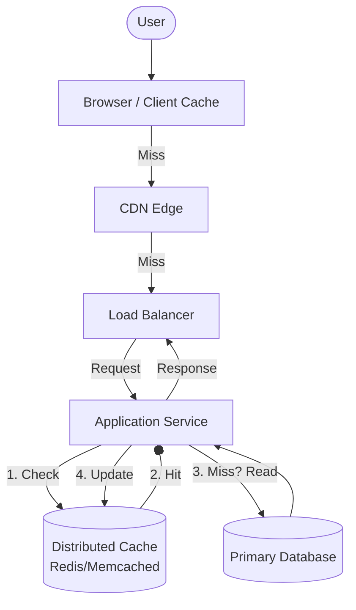
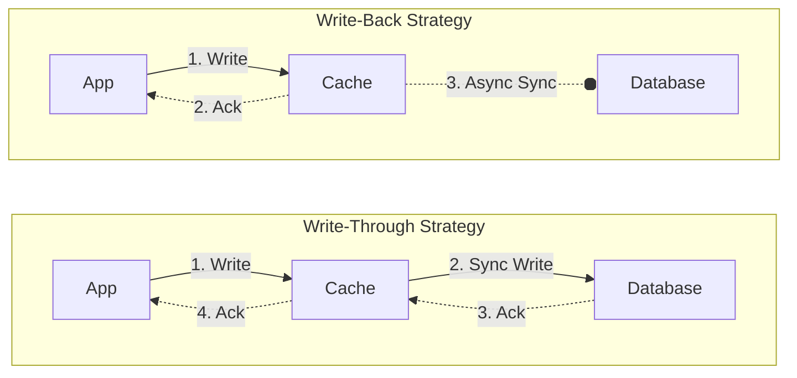

## Concept Overview

Caching is one of the most fundamental techniques in distributed systems for improving performance and scalability. At its core, a **cache** is a temporary high-speed storage layer that stores a subset of data so that future requests for that data can be served faster than is possible by accessing the data's primary storage location.

In large-scale systems, caching essentially trades **storage capacity** for **speed** (latency) and **throughput** (reducing load on backend systems).

## The Caching Landscape: Where Does It Fit?

Caching doesn't exist at a single layer; it is ubiquitous across the entire stack. From the end-user's browser down to the physical CPU cores processing your request, data is cached at multiple hops to minimize the distance it needs to travel.

### Common Caching Layers

1.  **Client-Side Caching**: Browser caches (HTTP headers like `Cache-Control`), local storage, or application-level state management (e.g., Redux, React Query).
2.  **CDN (Content Delivery Network)**: Caches static assets (images, CSS, JS) and videos at the "edge," geographically closer to the user.
3.  **Load Balancer / Reverse Proxy**: Tools like Nginx or Varnish can cache complete HTTP responses for short durations.
4.  **Application Caching**: In-memory caches (e.g., Redis, Memcached) typically situated before the database to offload read traffic.
5.  **Database Caching**: Databases themselves have internal buffer pools and query caches.



```callout
{
  "type": "info",
  "content": "**Locality of Reference**: Caching works because of the \"locality of reference\" principle. Data accessed recently is likely to be accessed again (temporal locality)."
}
```

---

### Quiz: Architecture & Concepts

```quiz
{
  "question": "Which of the following is the PRIMARY reason to introduce a distributed cache (like Redis) between your application service and database?",
  "options": [
    "To serve static assets like images and videos faster.",
    "To reduce the number of direct read operations on the database and lower response latency.",
    "To permanently store user data in case the database fails.",
    "To encrypt data before it reaches the database."
  ],
  "correctAnswerIndex": 1,
  "explanation": "The primary goal is to offload the database and serve frequent reads from faster in-memory storage."
}
```

```quiz
{
  "question": "What happens if a cache layer fails in a typical 'Cache-Aside' architecture?",
  "options": [
    "The entire system goes down immediately.",
    "Data is permanently lost.",
    "System latency increases as load falls back to the database, potentially causing a crash if the DB cannot handle the traffic.",
    "The load balancer automatically redirects traffic to a backup data center."
  ],
  "correctAnswerIndex": 2,
  "explanation": "This is a critical risk. If the cache fails, the 'thundering herd' of requests hits the database, which may cause a cascading failure."
}
```

---

## Real-World Use Cases

While generic "client-server" examples explain the *what*, let's look at specific production scenarios where caching is non-negotiable.

### 1. The "Hotspot" Problem (High Read Traffic)
**Scenario**: An e-commerce platform during a flash sale.
**Problem**: Millions of users refresh the product page for a specific gaming console simultaneously. If every request hits the SQL database to query `SELECT * FROM products WHERE id = 'console-x'`, the database will lock up or crash due to connection limits.
**Solution**: Cache the product details and inventory "availability status" in Redis. The application serves 99.9% of requests from the cache.

### 2. Expensive Computation (Memoization)
**Scenario**: A fraud detection system.
**Problem**: When a user makes a transaction, the system calculates a "risk score" based on 2 years of history, requiring complex aggregations that take 600ms.
**Solution**: Store the calculated risk score in a cache with a TTL (Time To Live) of 10 minutes. If the user makes another transaction shortly after, serve the pre-calculated score instantly from the cache, bypassing the expensive computation.

### 3. Session Management
**Scenario**: A distributed microservices architecture.
**Problem**: A user logs in via Service A. Their authentication token and session data need to be accessible by Service B and Service C without asking the user to log in again or querying the user table repeatedly.
**Solution**: Store the active session data (User ID, Roles, Permissions) in a centralized distributed cache accessible by all services.

---

## Read vs. Write Strategies

The biggest challenge in caching is **Data Consistency**. When you have a copy of the data in the cache and the original in the database, you have created two sources of truth. How do you keep them in sync when data changes?

### 1. Write-Through
The application writes data to the **cache** and the **database** typically synchronously.
*   **Pros**: High data consistency; data in the cache is never stale.
*   **Cons**: Higher write latency (must wait for two writes to complete).
*   **Best For**: Critical data that must be up-to-date and is read frequently (e.g., banking ledger top-ups).

### 2. Write-Back (Write-Behind)
The application writes data **only to the cache**. The cache acknowledges the write immediately. A background process asynchronously syncs the data to the database later.
*   **Pros**: Extremely fast write performance.
*   **Cons**: High risk of data loss if the cache node crashes before syncing to the database.
*   **Best For**: High-volume, non-critical write data (e.g., video view counts, analytics events).

### 3. Write-Around
The application writes directly to the **database**, bypassing the cache. Data is only loaded into the cache when it is read (Lazy Loading).
*   **Pros**: Prevents "cache pollution" (filling cache with data that isn't read often).
*   **Cons**: First read is always a "cache miss" (slower).
*   **Best For**: Archival data, logs, or "write-once-read-rarely" content.



### Comparison: Write Strategies

| Strategy | Write Latency | Read Consistency | Data Safety | Implementation Complexity |
| :--- | :--- | :--- | :--- | :--- |
| **Write-Through** | High (Slowest) | High (Strong) | High | Medium |
| **Write-Back** | Low (Fastest) | Medium (Eventual) | Low (Risk of Loss) | High |
| **Write-Around** | Medium | Medium (On Miss) | High | Low |

```match
{
  "question": "Match the Write Strategy to its mechanism",
  "pairs": [
    {
      "left": "Write-Through",
      "right": "Updates DB and Cache synchronously"
    },
    {
      "left": "Write-Back",
      "right": "Updates Cache first, DB asynchronously"
    },
    {
      "left": "Write-Around",
      "right": "Updates DB directly, lazy loads Cache"
    }
  ]
}
```

---

### Quiz: Design Decisions

```quiz
{
  "question": "You are designing a 'View Counter' for YouTube videos. It updates thousands of times per second. Exact accuracy isn't critical instantly, but speed is paramount. Which strategy fits best?",
  "options": [
    "Write-Through",
    "Write-Around",
    "Write-Back",
    "No Caching"
  ],
  "correctAnswerIndex": 2,
  "explanation": "Write-Back allows you to capture high-velocity writes quickly without bottlenecking on the DB. Losing a few view counts in a crash is an acceptable trade-off for performance."
}
```

```quiz
{
  "question": "Why might you choose 'Write-Around' for a system that logs daily audit trails?",
  "options": [
    "To ensure logs are never lost.",
    "Because audit logs are written once and rarely read immediately, so caching them wastes memory.",
    "Because it is the fastest write method.",
    "Because Redis doesn't support text logs."
  ],
  "correctAnswerIndex": 1,
  "explanation": "Caching useless data (cache pollution) evicts useful data. Write-Around prevents this for data that doesn't benefit from being hot."
}
```

---

## Failure & Scale Considerations

In sophisticated systems, caching introduces its own set of problems.

### 1. Cache Invalidation
"There are only two hard things in Computer Science: cache invalidation and naming things." - *Phil Karlton*.
Deciding *when* to remove items is difficult.
*   **TTL (Time To Live)**: Automatically expire items after X seconds. Simple but can serve stale data until expiration.
*   **Explicit Delete**: Application removes the cache entry when DB is updated. Complex to manage in distributed environments.

### 2. Eviction Policies
When the cache is full, what do we throw out?
*   **LRU (Least Recently Used)**: Discard items not accessed for the longest time. (Most common).
*   **LFU (Least Frequently Used)**: Discard items with the fewest total hits.
*   **FIFO**: First In, First Out (rarely efficient).

### 3. The Thundering Herd
If a popular cache item expires (or the cache node crashes), thousands of concurrent requests might notice the "miss" simultaneously and all try to query the database at once.
**Mitigation**: **Cache Stampede Protection** (e.g., using locks so only one process queries the DB, or "Probabilistic Early Expiration").

---

### Final Quiz: Advanced Concepts

```match
{
  "question": "Match the Term to its Definition",
  "pairs": [
    {
      "left": "Cache Invalidation",
      "right": "Removing data because it has changed (Consistency)"
    },
    {
      "left": "Cache Eviction",
      "right": "Removing data to free up memory (Capacity)"
    },
    {
      "left": "TTL (Time To Live)",
      "right": "Auto-expiry after a set duration"
    },
    {
      "left": "Thundering Herd",
      "right": "Spike in DB load when cache misses simultaneously"
    }
  ]
}
```

```quiz
{
  "question": "If your user base is globally distributed and experiencing high latency for static assets (images), which caching layer should you optimize first?",
  "options": [
    "Database Buffer Pool",
    "Application Local Cache",
    "CDN (Content Delivery Network)",
    "Redis Cluster"
  ],
  "correctAnswerIndex": 2,
  "explanation": "A CDN caches content at the 'edge' (PoPs) close to the user physically, drastically reducing network latency for static assets."
}
```
