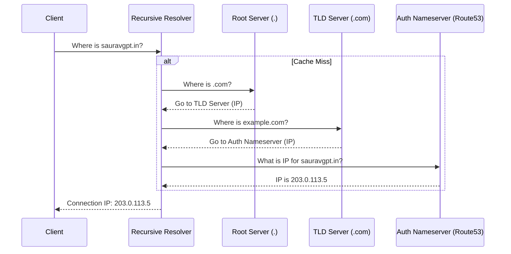

## Concept Overview

At its core, the **Domain Name System (DNS)** is a hierarchical, distributed database that maps human-readable identifiers (domain names like `sauravgpt.in`) to machine-readable network locations (IP addresses like `192.0.2.1`).

In large-scale distributed systems, DNS is far more than just a "phonebook." It is the **control plane for traffic routing**. It dictates which data center handles a user's request, enables seamless failover during outages, and allows for granular traffic shaping during deployments.

```callout
{
  "type": "info",
  "title": "Key Characteristics",
  "content": "*   **High Availability:** Designed to never go down; if a resolver fails, others take over.\n*   **Eventual Consistency:** Updates propagate slowly due to aggressive caching.\n*   **Read-Optimized:** Optimized for billions of lookups with infrequent updates."
}
```

---

## Where DNS Fits in the System

DNS resolution is the **precursor** to any network interaction. Before a client (browser, mobile app, or microservice) can open a TCP connection to your load balancer or API gateway, it must first resolve the destination IP. This process involves a chain of distributed servers.



1. **Recursive Resolution**
   The client delegates the "heavy lifting" to a Recursive Resolver (usually provided by the ISP or a public provider like Google 8.8.8.8). This resolver navigates the hierarchy on behalf of the client.
2. **Iterative Traversal**
   The resolver queries the **Root Nameservers**, then the **Top-Level Domain (TLD) Servers**, and finally the **Authoritative Nameservers** managed by your DNS provider (e.g., AWS Route53, Cloudflare).
3. **Caching**
   The result is cached at every layer (OS, Router, Recursive Resolver) for a duration defined by the **Time-To-Live (TTL)**.

---

## Real-World Use Cases

Modern systems leverage DNS for critical architectural patterns beyond simple resolution.

### 1. CDN Edge Selection
Content Delivery Networks (CDNs) use DNS to route users to the geographically closest edge server.
*   **Scenario:** A user in Singapore requests `static.netflix.com`.
*   **Mechanism:** The authoritative nameserver detects the user's recursive resolver IP (mapping it to Singapore) and returns the IP address of the Singapore Edge Node.
*   **Impact:** Minimizes latency and reduces backbone network costs.

### 2. Disaster Recovery (Active-Passive Failover)
DNS is the primary mechanism for region-level failover.
*   **Scenario:** An entire AWS Region (us-east-1) goes offline.
*   **Mechanism:** The DNS health checks detect endpoints in `us-east-1` are failing. The authoritative nameserver automatically updates the DNS record to point solely to the standby region (`us-west-2`).
*   **Caveat:** Failover is not instant; it depends on the TTL expiration.

### 3. Weighted Traffic Distribution (Canary Deployments)
Safely rolling out new features by controlling traffic percentage.
*   **Scenario:** Releasing a new version of the Payment Service.
*   **Mechanism:** Configure DNS to return the "New V2 Load Balancer" IP for 5% of queries and the "Stable V1 Load Balancer" IP for 95%.
*   **Impact:** If V2 has bugs, only a small fraction of traffic is affected.

---

```quiz
{
  "question": "You have set a DNS record with a TTL of 60 seconds. You update the record to point to a new server IP. After 5 minutes, some users are still hitting the old server. What is the most likely cause?",
  "options": [
    "The new server is rejecting connections",
    "Users' operating systems or local networks are ignoring the TTL",
    "The root nameservers have not updated yet",
    "The authoritative nameserver is down"
  ],
  "correctAnswerIndex": 1,
  "explanation": "While you control the TTL, you cannot force downstream clients to respect it. Some poorly behaved ISP resolvers, Java JVMs, or local router caches may cache records longer than the specified TTL, causing 'Java DNS caching' or 'Stale ISP cache' issues."
}
```

---

## Read vs Write Considerations

System design decisions often revolve around the read/write trade-off. DNS is the extreme example of a **Read-Heavy** system.

### Read Path (Lookups)
*   **Scale:** Billions of queries per second globally.
*   **Optimization:** Aggressive caching at multiple layers (Browser -> OS -> Router -> ISP -> Recursive Resolver).
*   **Performance:** Lookup times are typically sub-millisecond if cached, or 20-100ms if a full traversal is needed.

### Write Path (Updates)
*   **Scale:** Updates are rare (configuration changes, failovers).
*   **Propagation:** Updates are **not** instantaneous. They must propagate through the global caching layers.
*   **Trade-off:** Lower TTL allows faster updates (good for failover) but increases load on Authoritative Servers and latency for users (more frequent lookups).

```callout
{
  "type": "warning",
  "title": "Design Constraint",
  "content": "Do not use DNS for highly dynamic service discovery where endpoints change every few seconds (e.g., individual containers in Kubernetes). Use internal service discovery (like CoreDNS or Consul) or a Load Balancer for that."
}
```

---

## Design Strategies: Routing Policies

When configuring your Authoritative Nameserver (e.g., Route53), you choose a routing policy suitable for your goals.

| Strategy | Description | Best For | Trade-offs |
| :--- | :--- | :--- | :--- |
| **Simple / Round Robin** | Returns a list of IPs in rotation. | Basic Load Balancing across similar servers. | No intelligence; doesn't account for server load or health. |
| **Weighted** | Returns IPs based on assigned weights (e.g., 80% to A, 20% to B). | Canary deployments, A/B testing, gradual migration. | Requires careful weight management. |
| **Latency-Based** | Returns the IP with the lowest network latency from the user's perspective. | Performance-critical global applications (Gaming, Trading). | Requires constant latency measurement by the provider. |
| **Geolocation** | Returns an IP based on the geographic location of the query. | Compliance (GDPR), regional content restrictions. | Geo-IP mapping isn't always 100% accurate. |
| **Failover** | Returns a secondary IP only if the primary health check fails. | Disaster Recovery (DR), High Availability. | Dependent on TTL for recovery speed. |

---

```match
{
  "question": "Match the Routing Policy to its ideal use case",
  "pairs": [
    {
      "left": "Geolocation",
      "right": "Restricting betting app access by state/country"
    },
    {
      "left": "Weighted",
      "right": "Testing a new beta API with 1% of users"
    },
    {
      "left": "Latency-Based",
      "right": "Routing users to the fastest AWS region"
    },
    {
      "left": "Failover",
      "right": "Switching to a backup Data Center during an outage"
    }
  ]
}
```

---

## Failure & Scale Considerations

At global scale, rely on the resilience of the DNS protocol, but be aware of its vulnerabilities and limitations.

### 1. DNS Cache Poisoning
Attackers inject falsified records into a recursive resolver's cache, redirecting traffic to a malicious site.
*   **Solution:** **DNSSEC** (DNS Security Extensions). It adds cryptographic signatures to existing DNS records. Resolvers verify the signature to ensure the data originated from the true authoritative source and wasn't tampered with.

### 2. DDoS Attacks on Nameservers
If your Authoritative Nameserver is overwhelmed by a DDoS attack, your users cannot resolve your domain, effectively taking you offline.
*   **Strategy:** Use **Anycast Routing**. This allows multiple globally distributed servers to share a single IP address. Attack traffic is effectively diluted across the global network, preventing any single server from being overwhelmed.

### 3. Amplification Attacks
Attackers send small queries with a spoofed source IP (the victim's IP) to open DNS resolvers, asking for large responses (like all records in a zone). The resolvers send the massive response to the victim.
*   **Defense:** Rate limiting on resolvers and blocking spoofed packets at the ISP level (BCP38).

---

```quiz
{
  "question": "Why is DNS unsuitable for rapid, real-time service discovery within a microservices cluster?",
  "options": [
    "It uses UDP which is unreliable",
    "DNS records can be cached for too long (TTL), causing traffic to be sent to dead containers",
    "DNS servers cannot handle the throughput",
    "IP addresses are running out"
  ],
  "correctAnswerIndex": 1,
  "explanation": "The main issue is propagation delay. In a dynamic environment like Kubernetes, pods die and start in seconds. If a client has a cached DNS record for a pod that just died, requests will fail until the TTL expires. Internal service discovery usually relies on a distinct mechanism or extremely low TTLs combined with active health checking."
}
```
