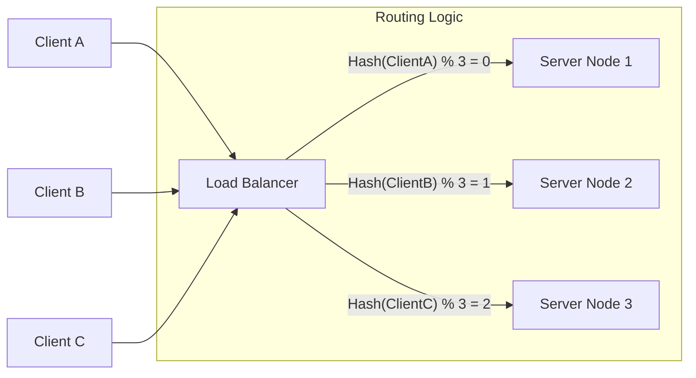

## Concept Overview

In large-scale distributed systems, efficiently distributing data and requests across multiple servers is a fundamental challenge. Hashing provides a deterministic mechanism to map arbitrary data (like a user ID or request IP) to a fixed range of values, enabling consistent routing and load distribution without a central registry.

At its core, a **hash function** transforms an input key into an integer value. In a distributed context, this integer determines which server node should handle a specific request.

```callout
{
  "type": "info",
  "title": "Deterministic Routing",
  "content": "Unlike random load balancing, hashing ensures that the same request (e.g., from User A) is always routed to the same server. This is critical for maximizing cache utilization and maintaining session state."
}
```

---

## Architecture: Where Hashing Fits

Hashing logic typically resides in the **Load Balancer** or the **Client SDK** (in smart client architectures). It acts as the decision engine for routing traffic to the backend server pool.



---

## Real-World Use Cases

Hashing is not just for security; it is a structural pillar of distributed architecture. Here are three distinct scenarios where hashing is non-negotiable:

### 1. Distributed Caching (e.g., Redis Cluster)
When your dataset exceeds the RAM of a single machine, you must partition the cache across multiple nodes.
*   **Challenge**: If you route requests randomly, you get `O(N)` cache misses because the data for a specific key could be on any node.
*   **Solution**: Hash the cache key (e.g., `user_profile_123`) to explicitly identify which node holds that data. This guarantees `O(1)` routing and high cache hit rates.

### 2. Database Sharding
For multi-terabyte databases (like valid User Tables in social networks), a single database instance cannot hold all data.
*   **Challenge**: How do you know which database shard contains User A's data without querying all of them?
*   **Solution**: Sharding based on a hash of the `UserID`. `Hash(UserID) % Shards` instantly tells the application which physical database server to query.

### 3. Session Affinity ("Sticky Sessions")
In real-time applications (like WebSocket chat servers or collaborative editing), a user maintains a persistent connection state on a specific server.
*   **Challenge**: A standard round-robin load balancer might send the next packet to a different server that doesn't know about the active WebSocket connection.
*   **Solution**: The load balancer hashes the Client IP or Session ID to ensure all packets from that session "stick" to the same specific server instance.

---

```quiz
{
  "question": "Why is Round-Robin load balancing often insufficient for distributed caching layers?",
  "options": [
    "It causes uneven traffic distribution across servers.",
    "It results in high cache miss rates because requests for the same key land on different servers.",
    "It requires computationally expensive hash functions.",
    "It cannot handle HTTP traffic effectively."
  ],
  "correctAnswerIndex": 1,
  "explanation": "Round-Robin blindly rotates requests. In a caching scenario, if 'User A' is routed to Node 1 then Node 2, Node 2 will face a cache miss, forcing a database fetch. Hashing ensures 'User A' always goes to Node 1, utilizing the cached data."
}
```

---

## The Modulo Hashing Strategy

The most common baseline approach for mapping requests to servers is **Modulo Hashing**.

The formula is simple:
```text
Target_Server_Index = Hash(Key) % Number_of_Servers
```

### How It Works
Let's assume we have **3 servers** logic (`N = 3`) and basic integer hash outputs:

| Client Request | Hash(Key) | Calculation | Target Server |
| :--- | :--- | :--- | :--- |
| **Client A** | 11 | `11 % 3` | **Server 2** (Remainder 2) |
| **Client B** | 12 | `12 % 3` | **Server 0** (Remainder 0) |
| **Client C** | 13 | `13 % 3` | **Server 1** (Remainder 1) |

This seemingly simple operation provides excellent UNIFORM distribution, assuming the hash function itself is uniform (like MD5, SHA-256, or MurmurHash).

### Comparison: Hashing vs Round-Robin

| Feature | Round-Robin | Modulo Hashing |
| :--- | :--- | :--- |
| **Distribution** | Perfectly Even (Cyclic) | Statistically Even (Dependent on Hash quality) |
| **State Awareness** | None (Stateless) | Context Aware (Key-based) |
| **Cache Efficiency** | Poor (Random hits) | Exact (Pinpoint precision) |
| **Use Case** | Stateless REST APIs | Stateful Caches, Databases, Sharding |

```callout
{
  "type": "warning",
  "title": "The Hot Key Problem",
  "content": "Even with perfect hashing, a real-world issue arises if one key is requested millions of times more than others (e.g., a celebrity's profile). This creates a \"Hot Shard\" or \"Hotspot,\" overloading a single server while others sit idle. Hashing alone cannot solve this; it requires specific \"Hot Key\" mitigation strategies."
}
```

---

## Failure & Scale Considerations

While Modulo Hashing works perfectly in a static environment, it suffers catastrohic failure in dynamic environments typical of cloud infrastructure.

### The Rebalancing Problem
What happens when you scale?
Suppose **Server 1 crashes** or you simply **add a new Server 4** to handle load. The divisor `N` changes from 3 to 4.

**The Math Breaks Down:**

| Client | Hash | Original (N=3) | **New (N=4)** | Result |
| :--- | :--- | :--- | :--- | :--- |
| Client A | 11 | Server 2 | **Server 3** | **Relocated** |
| Client B | 12 | Server 0 | **Server 0** | Stayed |
| Client C | 13 | Server 1 | **Server 1** | Stayed |
| Client D | 14 | Server 2 | **Server 2** | Stayed |
| Client E | 15 | Server 0 | **Server 3** | **Relocated** |

```callout
{
  "type": "warning",
  "title": "Cache Avalanche",
  "content": "When `N` changes, the modulo result changes for *almost all* keys, not just a few. In a distributed cache, this invalidates nearly ~100% of the cache entries instantly. Every request is now routed to a \"wrong\" server that has no data, triggering a massive spike in database load that can bring down the entire backend."
}
```

This extreme sensitivity to the number of nodes is why standard Modulo Hashing is often rejected for elastic (auto-scaling) systems in favor of **Consistent Hashing**, which we will explore in the next module.

---

```quiz
{
  "question": "In a system using 'Hash(Key) % N' routing, what is the primary negative consequence of adding a new server node?",
  "options": [
    "The has function becomes slower to compute.",
    "The load balancer CPU usage spikes.",
    "The majority of existing keys are re-mapped to different servers, effectively flushing the cache.",
    "The new server cannot accept traffic until a manual restart."
  ],
  "correctAnswerIndex": 2,
  "explanation": "Changing the divisor 'N' shifts the remainder for most integers. In a caching layer, this means requests go to new servers where the data doesn't exist (Cache Miss), causing a massive performance penalty known as a Cache Avalanche."
}
```

### Key Takeaways
*   **Hashing** enables deterministic routing, essential for stateful systems like caches and sharded DBs.
*   **Modulo Hashing** (`% N`) is simple and efficient for static clusters.
*   **Scaling Limit**: Modulo hashing fails in dynamic environments because changing `N` reshuffles the entire mapping, causing massive cache thrashing.
