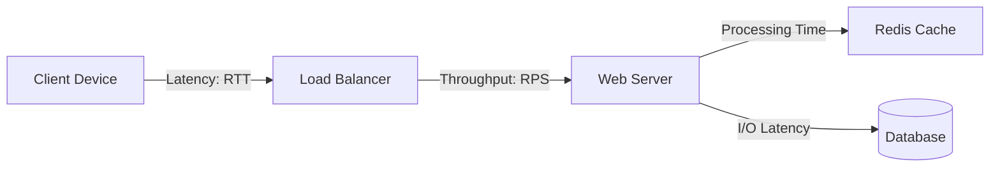

## Concept Overview

In distributed systems, **Latency** and **Throughput** are the two fundamental metrics that define performance. While they are often discussed together, they represent distinct properties of a system. Mixing them up specifically during system design interviews is a red flag that indicates a lack of experience with large-scale architecture.

This guide clarifies these concepts, explores their trade-offs, and provides strategies to optimize for each.

### What is Latency?
**Latency** is a measure of **time**. It answers the question: *"How long does it take for a single operation to complete?"*

In a client-server model, latency includes the time for:
1.  The request to travel from client to server (Network Propagation).
2.  The server to process the request (Processing Time).
3.  The response to travel back to the client.

It is typically measured in **milliseconds (ms)**.

### What is Throughput?
**Throughput** is a measure of **capacity** or **rate**. It answers the question: *"How much work can the system handle in a given unit of time?"*

It focuses on the volume of data or requests processed rather than the speed of individual requests.
*   For Web Servers: Measured in **Requests Per Second (RPS)** or **Queries Per Second (QPS)**.
*   For Data Pipelines: Measured in **Megabytes per second (MB/s)** or **Gigabytes per second (GB/s)**.

```callout
{
  "type": "info",
  "title": "The Highway Analogy",
  "content": "Think of a highway:\n*   **Latency** is how fast a single car drives from Point A to Point B (e.g., 60 minutes).\n*   **Throughput** is how many cars pass a specific checkpoint per hour (e.g., 1,000 cars/hour)."
}
```

### Where They Fit in a System

Latency and throughput manifest at every layer of a system. Understanding where bottlenecks occur is key to optimization.



---

## Real-World Use Cases

Different systems prioritize these metrics differently based on business requirements.

### 1. AdTech: Real-Time Bidding (Latency Critical)
In programmatic advertising, when a user loads a webpage, an auction happens in milliseconds to decide which ad to show.
*   **Requirement:** The entire auction must complete within **100ms**. If a bidder takes 200ms to respond, their bid is ignored.
*   **Focus:** **Ultra-low latency**. Throughput is important, but latency is a hard constraint.

### 2. Log Ingestion Pipeline (Throughput Critical)
Consider a system collecting logs from millions of devices (e.g., Datadog or Splunk).
*   **Requirement:** Ingest **terabytes of data** per hour. It doesn't matter if a specific log entry takes 2 seconds or 5 seconds to appear in the dashboard, as long as the system doesn't drop data under load.
*   **Focus:** **High Throughput**.

### 3. Video Streaming (Hybrid)
Netflix or YouTube needs to deliver high-quality video to millions of users.
*   **Latency:** Critical for the initial "Time to First Frame" (play start time).
*   **Throughput:** Critical for sustaining high-definition video data flow without buffering.

---

```quiz
{
  "question": "You are designing a payment gateway's core transaction engine. ACID compliance and avoiding double-charges is the top priority. What should be your primary optimization focus?",
  "options": [
    "Minimize Latency at all costs to ensure fast UI feedback",
    "Maximize Throughput to handle millions of concurrent payments",
    "Prioritize Data Consistency and Reliability, accepting higher latency if necessary",
    "Use UDP to reduce network overhead"
  ],
  "correctAnswerIndex": 2,
  "explanation": "Financial systems often trade off latency for strong consistency (ACID) to ensure correctness. While throughput is important, meaningful reliability cannot be sacrificed for raw speed."
}
```

---

## Read vs. Write Considerations

Optimizing for reads typically allows for lower latency compared to writes, which often require stronger consistency guarantees.

| Feature | Read-Heavy Systems | Write-Heavy Systems |
| :--- | :--- | :--- |
| **Primary Goal** | Fast retrieval, low latency. | High ingestion rate, reliable storage. |
| **Consistency** | Can often tolerate Eventual Consistency. | Often requires Strong Consistency or effective conflict resolution. |
| **Bottleneck** | Database connections, specific hot rows. | Disk I/O, database locks, index updates. |
| **Example** | X (Twitter) Timeline, News Site. | IoT Sensor Telemetry, Chat Messages. |

---

## Design Strategies

How do we manipulate latency and throughput? Often, improving one comes at the cost of the other.

### 1. Caching (Improves Latency, Improves Read Throughput)
 storing frequently accessed data in memory (Redis/Memcached) closer to the application eliminates slow database calls.
*   **Pros:** Drastically reduces read latency.
*   **Cons:** Cache invalidation complexity; Stale data.

### 2. Batching (Improves Throughput, Degrades Latency)
Instead of processing requests one by one, group them and process them together.
*   **Mechanism:** A database commit for 1 record takes 10ms. A commit for 100 records might take 20ms.
*   **Trade-off:** The first request in the batch waits for the last request to arrive before processing starts, increasing **latency** for the individual, but increasing the overall system **throughput**.

### 3. Asynchrony (Decouples Latency from Throughput)
Offload heavy work to background workers using message queues (Kafka, RabbitMQ).
*   **Scenario:** A user uploads a video.
*   **Sync:** User waits for encoding to finish (High Latency).
*   **Async:** Server acknowledges upload immediately (Low Latency), and queues encoding job (High Throughput processing in background).

```callout
{
  "type": "warning",
  "title": "The Serialization Trap",
  "content": "A common design flaw is processing requests serially on a single thread. This might yield low latency for one user, but destroys throughput. Concurrency (multithreading, event loops) is essential for throughput."
}
```

### Strategy Comparison Table

| Strategy | Impact on Latency | Impact on Throughput | Best For |
| :--- | :--- | :--- | :--- |
| **Vertical Scaling** | Neutral / Slight Improvement | Moderate Increase | Quick fix for unpredictable load. |
| **Horizontal Scaling** | Neutral | **Huge Increase** | Long-term growth; massive scale. |
| **Caching** | **Significant Decrease** | **Significant Increase** | Read-heavy workloads. |
| **Batching** | **Increase (Worse)** | **Significant Increase** | Write-heavy, non-interactive tasks. |
| **Compression** | **Increase (CPU overhead)** | **Increase (Network/Disk)** | Bandwidth-constrained environments. |

---

```quiz
{
  "question": "Why does Batching (e.g., sending 100 SQL inserts in one transaction) typically increase latency for the individual request?",
  "options": [
    "It requires more CPU cycles to process a batch",
    "The database rejects batched requests initially",
    "Requests must 'wait' in a buffer until the batch is full or a timer expires",
    "Batching actually decreases latency for everyone"
  ],
  "correctAnswerIndex": 2,
  "explanation": "Batching introduces an artificial delay to accumulate enough items. The first item in the batch sees a latency penalty equal to the collection time, but the system processes far more items per second overall."
}
```

---

## Failure & Scale Considerations

As systems scale, the relationship between latency and throughput becomes non-linear.

### The Knee of the Curve
Every system has a breaking point.
1.  **Low Load:** Latency is low and constant.
2.  **High Load:** Latency stays stable as throughput increases.
3.  **Saturation:** Once resources (CPU, DB connections) are exhausted, requests queue up. **Latency spikes exponentially**, and throughput levels off or crashes.

**Defense:** Implement **Rate Limiting** and **Load Shedding** to prevent your system from entering this failure state. It is better to reject 10% of requests (lower throughput) to keep latency acceptable for the remaining 90%.

### Consistency vs. Latency (CAP Theorem)
In a distributed database, if you want strong consistency (all nodes see the same data at once), you must wait for data to replicate to multiple nodes. This coordination takes time, increasing **latency**.
*   **Lower Latency:** Choose Eventual Consistency (AP systems).
*   **Stronger Consistency:** Architect for higher latency on writes (CP systems).

---

```quiz
{
  "question": "Your system is experiencing an exponential spike in latency while throughput has plateaued. What is the most likely cause?",
  "options": [
    "The network cable is unplugged",
    "Resource saturation (Queueing delay)",
    "The cache is too large",
    "Too many users are logging out"
  ],
  "correctAnswerIndex": 1,
  "explanation": "When a system reaches saturation (e.g., CPU 100%, Thread Pool exhausted), new requests sit in a queue waiting for service. This queue time adds directly to latency, causing it to skyrocket."
}
```
