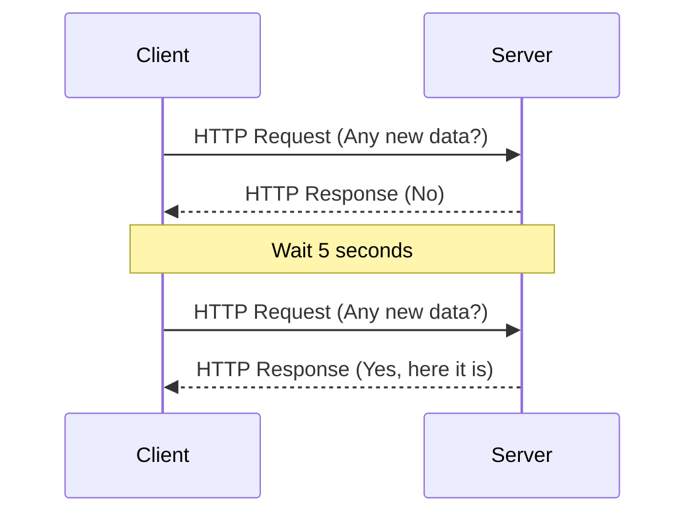
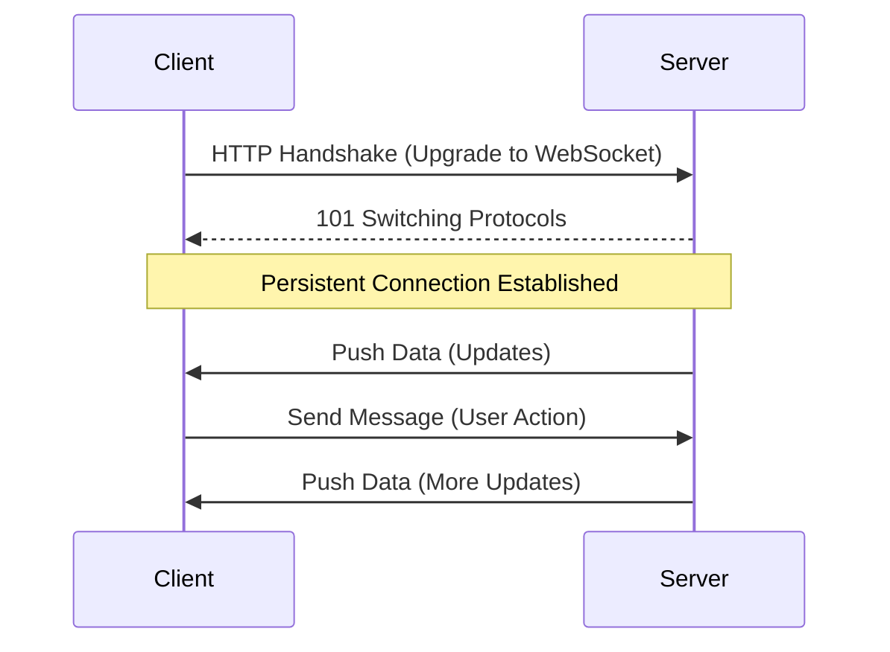
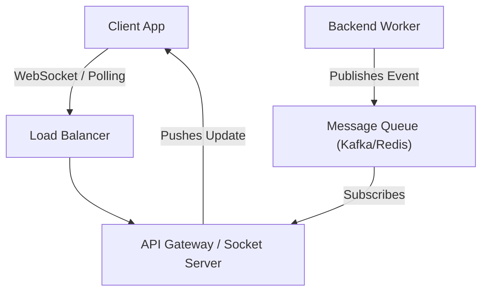

## Concept Overview

In the early days of the web, the interaction model was simple: a client requested a resource, and the server responded. This **Request-Response** cycle works perfectly for static content like blogs or e-commerce listings.

However, modern applications—ride-sharing trackers, stock tickers, collaborative documents—require **real-time** data. Users expect updates *instantly*, not when they next refresh the page.

To achieve this, we must move beyond the standard HTTP request cycle. There are two fundamental approaches to solving this: **Polling** (Client-Initiated) and **Streaming** (Server-Initiated).

---

## 1. The Polling Family (Client-Initiated)

Polling is the digital equivalent of a child asking, *"Are we there yet?"* repeatedly. The client periodically asks the server, *"Do you have new data?"*

### Short Polling
In Short Polling, the client sends a request at a fixed interval (e.g., every 5 seconds). Use cases include dashboards or status checks where "real-time" isn't critical.



*   **Pros**: Simple to implement; standard HTTP semantics.
*   **Cons**:
    *   **Latency**: Data is delayed by up to the polling interval.
    *   **Wasteful**: most requests return "empty," wasting bandwidth and server CPU.

### Long Polling
Long Polling attempts to reduce "empty" responses. The client sends a request, but the server **does not respond immediately** if it has no data. Instead, it "holds" the connection open until data becomes available or a timeout occurs.

1.  Client makes a request.
2.  Server holds the connection open.
3.  Data arrives -> Server responds immediately.
4.  Client processes data and *immediately* sends a new request.

*   **Pros**: massive reduction in empty requests; lower latency than short polling.
*   **Cons**: Still requires establishing new HTTP connections frequently; server must manage hanging connections.

---

## 2. The Streaming Family (Server-Initiated)

Streaming flips the model. Instead of the client asking for data, the client opens a **permanent channel**, and the server **pushes** data whenever it happens.

### Server-Sent Events (SSE)
SSE is a standard API allows servers to push updates to the client over a single HTTP connection. It is **mono-directional**: Server -> Client only.

*   **Ideal for**: News feeds, Stock tickers, Sport scores.
*   **Limitation**: Clients cannot send data back over the same connection (must use a separate HTTP request).

### WebSockets
WebSockets provide a **full-duplex** communication channel over a single TCP connection. Both client and server can send messages independently at any time.



*   **Ideal for**: Chat apps, Multiplayer games, Collaborative editing.
*   **Pros**: Lowest latency, bi-directional.
*   **Cons**: Complex to implement (requires stateful servers), custom protocol (ws://).

---

## Architecture: Where it Fits

These patterns typically sit at the **Gateway** or **BFF (Backend for Frontend)** layer.



---

## Real-World Use Cases

Let's look at three scenarios and choose the right tool.

### Scenario A: Generating a Large Export Report
**Context**: A user clicks "Export 1GB CSV". The server takes 5 minutes to generate it.
*   **Wrong Choice**: WebSockets (Overkill, keeping a connection open for 5 mins is fragile).
*   **Right Choice**: **Short Polling**. The client polls an endpoint `/api/jobs/123/status` every 10 seconds.
    *   *Why?* latency doesn't matter (10s delay on a 5min job is irrelevant).

### Scenario B: Live Sports Scores
**Context**: Millions of users watching the World Cup.
*   **Wrong Choice**: Short Polling (Millions of users * polling = DDoS attack on your own server).
*   **Right Choice**: **Server-Sent Events (SSE)**.
    *   *Why?* The flow is one-way (Game -> User). SSE is lighter than WebSockets and works over standard HTTP.

### Scenario C: Ride-Sharing (Uber/Lyft)
**Context**: You need to see the driver moving on map, and the driver needs to receive your pickup adjustments.
*   **Right Choice**: **WebSockets**.
    *   *Why?* High frequency updates, bi-directional (positions sent, status updates received), critical low latency.

---

```quiz
{
  "question": "You are building a real-time 'Breaking News' banner for a high-traffic news site. Updates happen infrequently (maybe once an hour), but when they do, they must appear instantly for millions of users. Which strategy is best?",
  "options": [
    "Short Polling every 1 second",
    "WebSockets",
    "Server-Sent Events (SSE)",
    "Long Polling"
  ],
  "correctAnswerIndex": 2,
  "explanation": "Short Polling every second for millions of users serves is a self-inflicted DDoS. WebSockets are overkill (bi-directional not needed). SSE is perfect: it maintains a lightweight connection for server-to-client pushes, handling the 'instant' requirement efficiently."
}
```

---

## Comparison Summary

| Feature | Short Polling | Long Polling | Server-Sent Events (SSE) | WebSockets |
| :--- | :--- | :--- | :--- | :--- |
| **Direction** | Client -> Server | Client -> Server | Server -> Client | Bi-directional |
| **Latency** | High (interval dependent) | Medium | Low | Lowest |
| **Connection** | Ephemeral | Ephemeral (re-established) | Persistent (HTTP) | Persistent (TCP) |
| **Server Load** | High (wasted requests) | Medium | Low | Low (but keeps state) |
| **Retries** | Built-in (just request again) | Client must reconnect | Auto-reconnect (browser) | Manual implementation |

---

## Failure & Scale Considerations

While Streaming sounds superior, it introduces **State**.

1.  **The "Max Connections" Problem**: A single server has a limit on open TCP ports (usually ~65k). If you have 100k users, you can't serve them from one machine. You need a **Distributed Socket Layer** (e.g., using Redis Pub/Sub to sync messages across server nodes).
2.  **Connection Flakiness**: Mobile networks drop connections constantly. Your client code **must** implement robust auto-reconnection logic (e.g., Exponential Backoff).
3.  **Battery Life**: Keeping a radio active for WebSockets drains mobile battery. For mobile apps, platform-native Push Notifications (APNs/FCM) are often preferred over background WebSockets.

---

```quiz
{
  "question": "Why is 'State' a challenge when scaling WebSocket servers compared to REST servers?",
  "options": [
    "WebSockets require more bandwidth.",
    "WebSockets are not supported by all browsers.",
    "Specific clients are tied to specific server nodes, making standard Round-Robin load balancing ineffective.",
    "WebSockets cannot use SSL/TLS."
  ],
  "correctAnswerIndex": 2,
  "explanation": "REST servers are stateless; any server can handle any request. WebSocket connections are persistent physical links between a client and a specific machine. If that machine dies, connections are lost. You need 'Sticky Sessions' or a pub/sub backplane to route messages to the correct server."
}
```

```callout
{
  "type": "tip",
  "title": "Hybrid Approaches",
  "content": "Real systems often mix these. Slack, for example, uses **WebSockets** for active messages but falls back to **Polling** if corporate firewalls block non-HTTP traffic."
}
```
