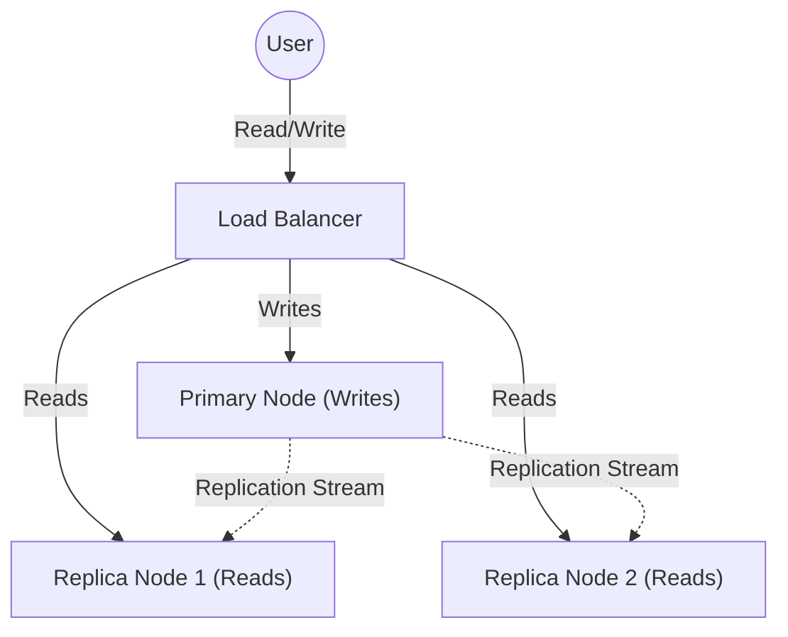
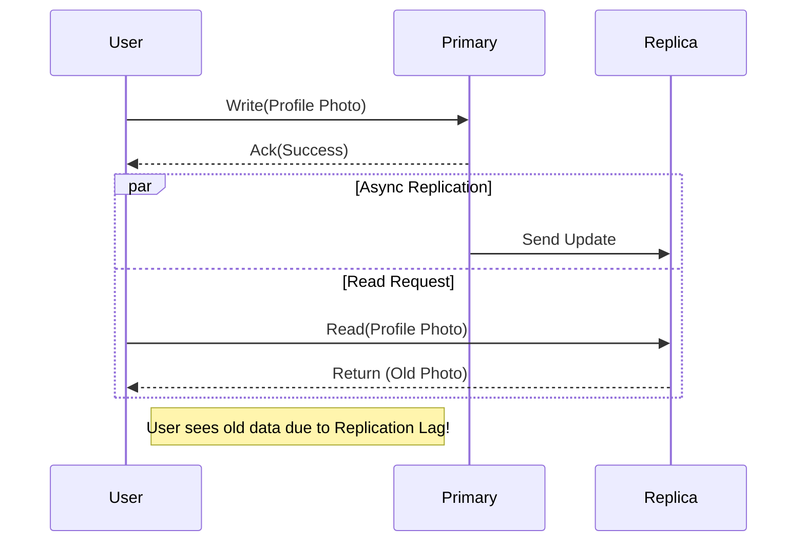

## Concept Overview

In distributed systems, **Replication** refers to the practice of storing multiple copies of the same data across different machines (nodes) connected via a network. It is a cornerstone of modern system design, ensuring that applications remain accessible and performant even when individual components fail.

## Why Replicate Data?

Replication isn't just about having a backup; it solves three critical engineering problems:

1.  **High Availability (HA):** If one database node goes down, others can take over, ensuring the system remains operational.
2.  **Reduced Latency:** By placing data geographically closer to users (e.g., US and India regions), we reduce the time data travels over the network.
3.  **Read Scalability:** A single machine has limits. Replication allows you to distribute read queries across multiple replicas, increasing total system throughput.



```callout
{
  "type": "info",
  "title": "Primary vs. Replica",
  "content": "In a **Single-Leader** architecture (the most common pattern), all writes go to the **Primary** (Leader) node. Data is then copied to **Replica** (Follower/Secondary) nodes, which usually handle read requests."
}
```

---

## Replication Strategies: Synchronous vs. Asynchronous

The defining characteristic of a replication system is *when* the primary node acknowledges a write to the client. Does it wait for replicas to catch up?

### 1. Synchronous Replication
The primary node waits for at least one replica to confirm it has received the write before sending a "Success" response to the user.

*   **Pros:** Strong consistency. Zero data loss if the primary fails immediately after confirmation.
*   **Cons:** Higher latency (write speed is limited by the slowest network/node). If a synchronous replica goes down, writes may block entirely.

### 2. Asynchronous Replication
The primary node responds "Success" to the user as soon as it saves the data locally. it propagates the changes to replicas in the background.

*   **Pros:** Low write latency. Highly robust; the system continues to accept writes even if replicas are down.
*   **Cons:** **Replication Lag**. There is a delay between a write and when it appears on replicas. If the primary crashes before propagating, data is permanently lost.

### Comparison Strategy

| Feature | Synchronous Replication | Asynchronous Replication |
| :--- | :--- | :--- |
| **Write Latency** | High (Wait for ACK) | Low (Immediate ACK) |
| **Data Consistency** | Strong (Immediate) | Eventual (Lag exists) |
| **Durability** | Very High (Data on multiple nodes) | Moderate (Risk of loss on Primary fail) |
| **Throughput** | Lower | Higher |

```quiz
{
  "question": "You are designing a payment processing system where zero data loss is non-negotiable. Which strategy is most appropriate?",
  "options": [
    "Fully Asynchronous Replication for maximum speed",
    "Synchronous Replication to at least one replica",
    "No replication to avoid complexity",
    "Cache-only storage with write-behind"
  ],
  "correctAnswerIndex": 1,
  "explanation": "For critical financial data, durability takes precedence over latency. Synchronous replication ensures that a transaction is not confirmed until it is safely stored on more than one node."
}
```

---

## Real-World Use Cases

Let's analyze how different industries apply these patterns.

### Scenario 1: Global Social Media Feed (Eventual Consistency)
*   **Requirement:** Users in Europe want to see posts from US celebrities quickly.
*   **Challenge:** Speed is more important than immediate accuracy. It’s okay if a post appears 2 seconds later in Europe.
*   **Architecture:** **Asynchronous Multi-Region Replication**. The US Primary accepts the post, and it is lazily replicated to the Europe Read-Replica.
*   **Result:** Users experience ultra-fast reads from their local region.

### Scenario 2: Banking Ledger (Strong Consistency)
*   **Requirement:** A user transfers $1,000. The balance must update immediately and reliably.
*   **Challenge:** You cannot afford to lose a transaction log if a server crashes.
*   **Architecture:** **Synchronous Replication** (often semi-synchronous: 1 sync, n-async). The transaction is not committed until the Primary *and* the Backup confirm safe storage.
*   **Result:** Higher latency per transaction, but guaranteed data integrity.

### Scenario 3: Collaborative Document Editing (Conflict Resolution)
*   **Requirement:** Two users edit the same document offline.
*   **Challenge:** "Split-brain" updates.
*   **Architecture:** **Multi-Leader Replication**. Both users write to local nodes, and the system merges changes later using conflict resolution algorithms (like Operational Transformation or CRDTs).

---

## Read vs. Write Challenges

### Example: The "Read-Your-Own-Writes" Problem
Imagine a user updates their profile picture.
1.  **Write:** Request goes to the Primary.
2.  **Read:** User immediately refreshes the page. The request goes to a Replica.
3.  **Issue:** If replication is asynchronous, the Replica might not have the new photo yet. The user thinks the upload failed.

**Solution:** **Read-Your-Own-Writes Consistency**.
Use session stickiness or logic that routes reads for *user-modified* content to the Primary for a short window after a write, while fetching other data from Replicas.



```callout
{
  "type": "warning",
  "title": "Replication Lag",
  "content": "In high-load systems, \"seconds\" of lag can turn into minutes. Always design your application UI to handle stale data gracefully (e.g., optimistic UI updates or specific consistency guarantees)."
}
```

---

## Failure & Scale Considerations

### 1. Leader Failure (Failover)
If the Primary node dies, the system must promote a Replica to be the new Primary. This process is called **Failover**.
*   **Automatic Failover:** fast but risky (can lead to "Split Brain" if two nodes think they are the leader).
*   **Manual Failover:** slower but safer, requiring human intervention.

### 2. Replication Topology
*   **Chain Replication:** A -> B -> C. Good for consistency, bad for write latency.
*   **Fan-out:** A -> B, A -> C, A -> D. Good for latency, puts load on the leader.

```quiz
{
  "question": "What is the primary risk of Automatic Failover in a distributed database?",
  "options": [
    "It requires too much CPU power",
    "Split Brain scenarios where two nodes accept writes simultaneously",
    "Replicas cannot handle read traffic",
    "It decreases the total storage capacity"
  ],
  "correctAnswerIndex": 1,
  "explanation": "If the network partitions, the original leader might still be active while the system promotes a new leader. Both might accept conflicting writes, leading to data corruption (Split Brain)."
}
```

---
