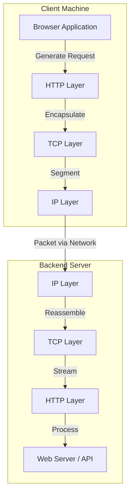
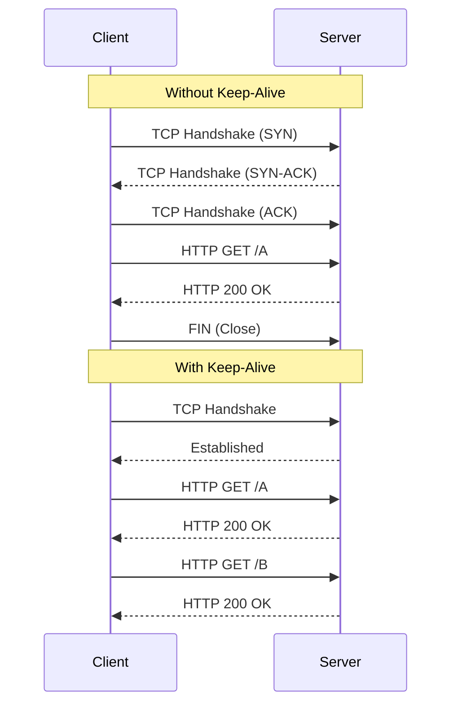

## Concept Overview

In large-scale distributed systems, distinct services must communicate reliably over a network. This communication relies on a stack of standardized protocols that govern how data is addressed, transported, and understood.

For any system design interview or senior engineering role, understanding the interplay between **IP (Internet Protocol)**, **TCP (Transmission Control Protocol)**, and **HTTP (Hypertext Transfer Protocol)** is non-negotiable. These protocols form the substrate upon which the modern web is built.

## Where These Protocols Fit

These protocols operate at different layers of the networking stack (often referenced via the OSI or TCP/IP models).



### 1. IP (Internet Protocol): The Addressing System
IP is responsible for **addressing and routing**. Just as a postal service needs a street address to deliver a letter, the Internet needs an IP address (e.g., `192.168.1.1` or `2001:db8::1`) to route packets from a source to a destination.
- **Unit of Data**: Packet.
- **Key Characteristic**: Connectionless and "Best Effort." IP does not guarantee that a packet will arrive, nor does it guarantee the order.

### 2. TCP (Transmission Control Protocol): The Reliability Layer
TCP builds on top of IP to provide **reliability and ordering**. It establishes a virtual connection between two endpoints before exchanging data.
- **Unit of Data**: Segment.
- **Key Characteristics**:
    - **Ordered Delivery**: Ensures packets typically arriving out-of-order are reassembled correctly.
    - **Error Checking**: Detects corruption and requests retransmission.
    - **Flow & Congestion Control**: Prevents overwhelming the receiver or the network.

### 3. HTTP (Hypertext Transfer Protocol): The Application Logic
HTTP is the **application layer** protocol. It defines the semantics of the conversation (requests and responses) so that clients and servers understand *what* to do with the data.
- **Unit of Data**: Request/Response Message.
- **Key Characteristics**: Stateless (by default), Request-Response model, rich semantics (Verbs like GET, POST; Status Codes like 200, 404, 500).

---

```quiz
{
  "question": "Which protocol is primarily responsible for ensuring that data packets are reassembled in the correct order?",
  "options": [
    "IP (Internet Protocol)",
    "TCP (Transmission Control Protocol)",
    "HTTP (Hypertext Transfer Protocol)",
    "DNS (Domain Name System)"
  ],
  "correctAnswerIndex": 1,
  "explanation": "TCP adds sequence numbers to segments, allowing the receiver to reorder them correctly even if the underlying IP packets arrived out of order. IP only handles addressing and routing."
}
```

---

## Real-World Use Cases

Understanding when and how these protocols are used distinguishes a junior engineer from a senior one.

### 1. Reliable Transactional Systems (Banking & Payments)
In a banking ledger system, data integrity is paramount. If a "transfer funds" request is comprised of multiple packets and one is lost, the entire transaction could be corrupted.
- **Role of TCP**: Guarantees that the entire request arrives intact. If a packet is dropped, TCP retransmits it automatically. The application logic (HTTP) never sees a "partial" request.
- **Role of HTTP**: Provides standard methods (POST/PUT) and status codes (200 OK, 409 Conflict) to handle the business logic of the transaction.

### 2. Static Content Delivery (CDNs)
When serving images or CSS files via a Content Delivery Network (CDN), latency is a key metric.
- **Optimization**: Modern HTTP versions (HTTP/2 and HTTP/3) optimize how these files are fetched over the underlying TCP (or UDP in HTTP/3) connections.
- **Mechanics**: Browsers use **persistent connections** (Reuse TCP connection) to avoid the overhead of establishing a new handshake for every single image on a page.

### 3. API Gateway Communication
In a microservices architecture, an API Gateway sits between clients and internal services.
- **Multiplexing**: Using HTTP/2, the Gateway can multiplex distinct requests from a client over a single TCP connection, reducing resource usage and latency compared to opening a new connection for every concurrent request.

---

## Read vs Write Considerations

Designing systems over these protocols requires handling reads and writes differently, especially regarding network failures.

| Feature | Read-Heavy (e.g., GET /products) | Write-Heavy (e.g., POST /orders) |
| :--- | :--- | :--- |
| **Idempotency** | **Safe**: Retrying a GET request by TCP retransmission or application logic effectively yields the same result. | **Risky**: Retrying a payment POST request due to a network timeout can result in double-charging if not handled with idempotency keys. |
| **Caching** | Highly cacheable at HTTP layer (Browser, CDN, Proxy). | Generally not cacheable; requires fresh consistency. |
| **Consistency** | Can often tolerate eventual consistency (stale data). | Often requires strong consistency to prevent data corruption. |

```callout
{
  "type": "warning",
  "title": "The Retry Problem",
  "content": "A common system design pitfall is assuming that a network timeout means the request failed. A timeout only means the *acknowledgment* didn't reach you. The server might have successfully processed the write. Always use **idempotency keys** for state-changing HTTP operations over unreliable networks."
}
```

---

## Design Strategies

### 1. Connection Pooling & Keep-Alive
Establishing a TCP connection involves a "3-Way Handshake" (SYN, SYN-ACK, ACK), which takes time (1.5x RTT).
*   **Naive Approach**: Open a new TCP connection for every HTTP request. (High Latency)
*   **Optimized Approach (Keep-Alive)**: Keep the TCP connection open and send multiple HTTP requests over it.
*   **System Design Tip**: Database clients and Service-to-Service clients should always use **Connection Pooling** to reuse established connections.



### 2. Multiplexing (HTTP/2)
In older HTTP/1.1, accessing resources was serial (Head-of-Line Blocking). HTTP/2 introduces **streams**, allowing multiple requests to be in flight simultaneously over a single TCP connection without waiting for the previous one to complete.

---

```match
{
  "question": "Match the protocol feature to its primary benefit",
  "pairs": [
    {
      "left": "TCP Retransmission",
      "right": "Recovers lost data packets automatically"
    },
    {
      "left": "HTTP Idempotency",
      "right": "Allows safe retries of API requests"
    },
    {
      "left": "Connection Pooling",
      "right": "Reduces overhead of frequent handshakes"
    },
    {
      "left": "IP Addressing",
      "right": "Enables routing packets across networks"
    }
  ]
}
```

---

## Failure & Scale Considerations

At scale, the abstractions provided by TCP and HTTP can become leaky.

### 1. Head-of-Line (HOL) Blocking
*   **TCP Level**: If one packet is lost, TCP pauses delivery of *all* subsequent packets in that stream until the lost packet is retransmitted to ensure order. This can cause latency spikes in real-time applications.
*   **HTTP Level**: In HTTP/1.1, a slow response blocks all other requests on that connection.

### 2. TCP Back pressure & Congestion
When a server is overloaded, its TCP receive buffer fills up. It signals the client (via Window Update frames) to stop sending data. This built-in **back pressure** is a crucial protection mechanism in distributed systems, preventing a fast client from drowning a slow server.

### 3. Ephemeral Port Exhaustion
Every TCP connection is identified by a 4-tuple (Source IP, Source Port, Dest IP, Dest Port). If you open and close connections too rapidly (e.g., serverless functions connecting to a DB without pooling), you may run out of available source ports on your machine, causing new connections to fail.

```callout
{
  "type": "tip",
  "title": "Pro Tip: HTTP/3",
  "content": "To solve TCP's Head-of-Line blocking, the industry is moving toward **HTTP/3**, which runs over **QUIC (based on UDP)**. It handles reliability at the stream level, so one lost packet only affects its own stream, not the entire connection."
}
```
