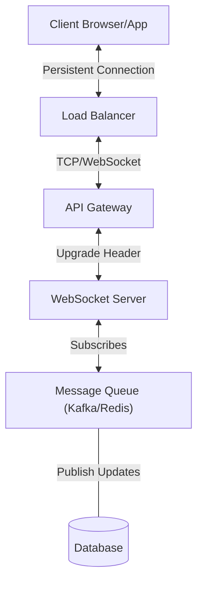

## Concept Overview

**Real-Time Communication** refers to the ability of a system to push data from a server to a client immediately as it becomes available, without the client explicitly having to request it repeatedly. In modern distributed systems, this is a fundamental requirement for interactive user experiences.

Traditionally, the web was built on a request-response model (HTTP). The client asks for data, and the server responds. However, this model breaks down when data changes frequently on the server side, leading to the evolution of techniques like Polling, Long Polling, Server-Sent Events (SSE), and ultimately, WebSockets.

### Why it Matters
In large-scale systems, the decision between "pulling" data (Polling) and "pushing" data (Streaming/sockets) dictates the system's **latency**, **server load**, and **scalability**. Making the wrong choice can lead to battery drain on mobile devices, network congestion, or stale data being displayed to users.

---

## Where the Concept Fits in a System

Real-time protocols sit at the **Application Layer**, managing how clients (browsers, mobile apps) maintain a persistent or semi-persistent link to the backend infrastructure.



```callout
{
  "type": "info",
  "title": "Stateful vs Stateless",
  "content": "HTTP is **stateless**; each request is independent. WebSockets are **stateful**; the connection remains open, and the server remembers the client. This introduces complexity in scaling, as load balancers must maintain \"sticky sessions\" or use a distributed pub/sub system to route messages correctly."
}
```

---

## Real-World Use Cases

Industry applications of real-time communication go far beyond simple chat apps.

### 1. Collaborative Editing (e.g., Figma, Google Docs)
*   **Scenario:** Multiple users editing a document simultaneously.
*   **Requirement:** Ultra-low latency for cursor movements and text updates. Conflict resolution (OT/CRDTs) is needed.
*   **Protocol:** **WebSockets** are essential here for full-duplex communication (sending edits and receiving updates simultaneously).

### 2. Live Sports Ticker / Stock Ticker
*   **Scenario:** Broadcasting live scores or stock prices to millions of viewers.
*   **Requirement:** High throughput broadcast, low latency. Data flows primarily one way (Server -> Client).
*   **Protocol:** **Server-Sent Events (SSE)** or **WebSockets**. SSE is often preferred for unidirectional data as it's simpler and works over standard HTTP.

### 3. Ride-Sharing Location Tracking (e.g., Uber, Lyft)
*   **Scenario:** User watching the driver's car move on a map.
*   **Requirement:** Continuous stream of geolocation updates.
*   **Protocol:** **WebSockets** (or MQTT for IoT devices) to handle the frequent, lightweight location packets efficiently without the overhead of establishing new HTTP connections.

---

## Read vs Write Considerations

When designing real-time systems, the flow of data impacts your architecture significantly.

| Aspect | Read-Heavy (Consumption) | Write-Heavy (Ingestion) |
| :--- | :--- | :--- |
| **Focus** | Fan-out efficiency. Broadcasting one update to millions of subscribers. | Ingestion speed. Handling millions of concurrent connections sending telemetry. |
| **Challenge** | Saturation of outbound network bandwidth. | Database write locking and processing latency. |
| **Strategy** | Use **Pub/Sub** (Redis, Kafka) to distribute messages to WebSocket server nodes. | Use **Buffering** or **Batching** before writing to the database to reduce I/O pressure. |

---

```quiz
{
  "question": "Why might a financial news site choose Server-Sent Events (SSE) over WebSockets for their live ticker?",
  "options": [
    "SSE supports bi-directional communication better than WebSockets",
    "SSE works natively over HTTP and is easier to firewall/proxy",
    "WebSockets cannot handle text data",
    "SSE has lower latency than WebSockets"
  ],
  "correctAnswerIndex": 1,
  "explanation": "SSE is a standard HTTP protocol for unidirectional server-to-client streaming. It is simpler to implement, works well with existing HTTP infrastructure (firewalls, load balancers), and acts as a standard HTTP response stream, which is ideal when data only needs to flow from server to client."
}
```

---

## Design Strategies

How do we move data? Let's look at the evolution of strategies.

### 1. Short Polling (The "Are we there yet?" Approach)
The client sends a request every $X$ seconds to check for data.
*   **Pros:** Simplest to implement. Standard HTTP.
*   **Cons:** Wastes resources/bandwidth if no data exists. High latency (average latency = interval / 2). "Chatty".

### 2. Long Polling (Hanging GET)
The client requests data; the server **holds** the connection open until data is available or a timeout occurs.
*   **Pros:** Better latency than short polling. Less "chatty".
*   **Cons:** Server consumes a thread/resource while waiting. Reconnecting overhead still exists.

### 3. WebSockets (True Real-Time)
A single TCP connection is established and upgraded. Both parties send data at will.
*   **Pros:** Lowest latency, lowest overhead (header is sent only once), Full Duplex.
*   **Cons:** Complex to implement (stateful implementation). Requires specialized load balancing.

### Protocol Comparison

| Feature | Short Polling | Long Polling | Server-Sent Events (SSE) | WebSockets |
| :--- | :--- | :--- | :--- | :--- |
| **Direction** | Client Pull | Client Pull (Hold) | Server Push (One-way) | Bi-directional (Full Duplex) |
| **Connection** | Ephemeral | semi-Persistent | Persistent | Persistent |
| **Latency** | High | Medium | Low | Lowest |
| **Use Case** | Dashboard Refreshes | Notifications | News Feeds, Tickers | Chat, Games, Collaboration |

---

## Failure & Scale Considerations

Scaling real-time systems introduces unique challenges:

### 1. The C10K Problem and Beyond
Handling 10,000 (or 10 million) concurrent connections requires non-blocking I/O architectures (like Node.js, Go routines, or Java Netty). Traditional thread-per-request models (like Apache/PHP) fail here because they run out of OS threads.

### 2. Connection State & Load Balancing
Because WebSocket connections are persistent, you cannot simply Round-Robin requests. If Client A connects to Server 1, Server 1 holds that state. If Server 1 dies, the connection is lost.
*   **Solution:** Clients must implement **reconnection logic** with exponential backoff.

### 3. Heartbeats
How do you know if a connection is dead? A TCP connection might stay "open" even if the wire is cut.
*   **Strategy:** Implement application-level **Heartbeats** (Ping/Pong frames). If the server doesn't hear a Pong within $N$ seconds, it closes the resource to prevent memory leaks.

```callout
{
  "type": "warning",
  "title": "Battery Drain",
  "content": "On mobile devices, keeping a radio active for a WebSocket connection consumes significant battery. For mobile apps, platform-specific Push Notifications (APNS/FCM) are often preferred for background updates over holding a permanent open socket."
}
```

---

```quiz
{
  "question": "You are designing a WhatsApp-like messaging app. You have 50 WebSocket servers. If User A is connected to Server 1 and User B is connected to Server 50, how does a message flow from A to B?",
  "options": [
    "Server 1 connects directly to Server 50 via HTTP",
    "User A sends to Server 1, Server 1 stores in DB, User B polls DB",
    "Server 1 publishes the message to a Pub/Sub system (e.g., Redis), which brodcasts it to Server 50",
    "The Load Balancer routes the internal traffic automatically"
  ],
  "correctAnswerIndex": 2,
  "explanation": "In a distributed WebSocket architecture, servers are unaware of each other's connections. A Pub/Sub mechanism (like Redis Pub/Sub) is the standard 'glue' layer. Server 1 publishes the message to a channel needed by User B, and Server 50—which subscribes to that channel—receives it and pushes it down the socket to User B."
}
```
