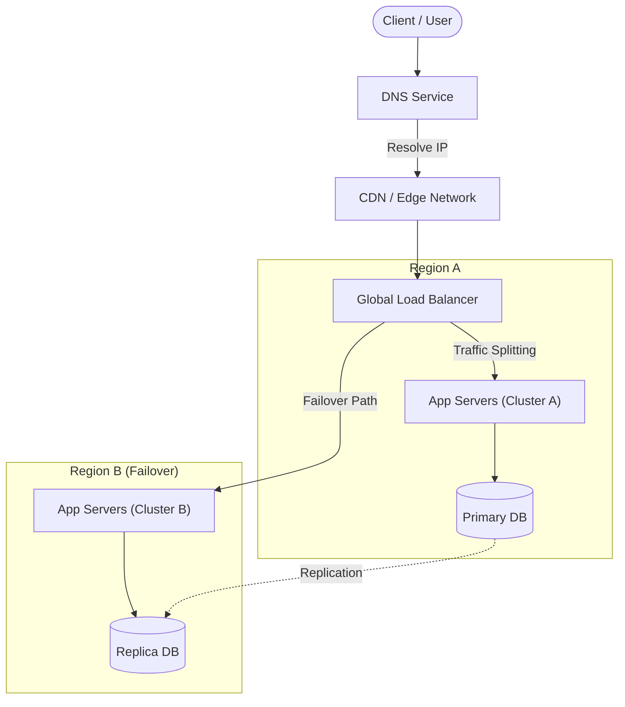

## Concept Overview

Availability is a quantitative measure of the percentage of time a system is fully operational and accessible to its users. In the context of large-scale distributed systems, it is arguably the most critical non-functional requirement. If your system is effectively "down," all other characteristics—latency, consistency, or scalability—become irrelevant because the service cannot be used.

Mathematically, availability is often expressed as:

**Formula:**
`Availability = Uptime / (Uptime + Downtime)`

While typically represented as a percentage (e.g., 99.9%), in engineering terms, availability equates to **resilience**. It defines how robust your system is against hardware failures, network partitions, software bugs, and traffic spikes.

```callout
{
  "type": "info",
  "title": "Availability vs. Reliability",
  "content": "While often used interchangeably, **Availability** focuses on \"is the system accessible right now?\", whereas **Reliability** is broader, asking \"does the system function correctly over a specific period without failure?\". A system can be available (responding to 500 errors) but not reliable."
}
```

### The "Nines" of Availability

Industry standards measure availability in "nines." Each additional "nine" represents an order-of-magnitude improvement in uptime but often requires an exponential increase in engineering cost and complexity.

| Availability | Downtime per Day | Downtime per Year | Typical Use Case |
| :--- | :--- | :--- | :--- |
| **99% (2 Nines)** | ~14.4 minutes | ~3.65 days | Internal tools, experimental features (MVP) |
| **99.9% (3 Nines)** | ~1.44 minutes | ~8.77 hours | Standard web applications, E-commerce |
| **99.99% (4 Nines)** | ~8.6 seconds | ~52.6 minutes | Critical services (Payment gateways, Enterprise SaaS) |
| **99.999% (5 Nines)** | ~0.86 seconds | ~5.26 minutes | Telecommunications, Emergency Systems, Infrastructure |

---

## Reliability Metrics: SLA, SLO, and SLI

To engineer for availability, you must distinguish between legal promises, internal goals, and actual measurements. This hierarchy is standard across major tech organizations (Google, AWS, Meta).

1. **SLI (Service Level Indicator)**
   *   *The "What".* The precise metric you measure.
   *   *Example:* The ratio of successful HTTP 200 responses to total requests.
2. **SLO (Service Level Objective)**
   *   *The "Goal".* Your internal target availability. SLOs should be stricter than SLAs to provide a safety buffer.
   *   *Example:* "We aim for 99.95% success rate internally."
3. **SLA (Service Level Agreement)**
   *   *The "Promise".* The legal contract with your paying customers, often involving penalties (refunds/credits) if breached.
   *   *Example:* "We guarantee 99.9% uptime or we refund 10% of monthly fees."

```quiz
{
  "question": "If your SLA guarantees 99.9% uptime (43m downtime/month), which internal SLO is the most appropriate to ensure you don't breach the contract?",
  "options": [
    "99.0% (Allowing ~7 hours downtime)",
    "99.9% (Matching the SLA exactly)",
    "99.95% (Targeting ~21 mins downtime to build a safety buffer)",
    "100% (Targeting zero downtime)"
  ],
  "correctAnswerIndex": 2,
  "explanation": "You explicitly want an SLO that is stricter than your SLA (Option C). This creates an 'Error Budget' that absorbs minor outages or safe deployments without triggering financial penalties. Targeting 100% is usually unrealistic and prohibitively expensive."
}
```

---

## Where Availability Fits in a System

Availability is not achieved by a single component; it is a property of the entire system architecture. A failure in any single layer—DNS, Load Balancer, Application Server, or Database—can render the system unavailable.

### Availability Architecture



**Key Failure Zones:**
1.  **Entry Points:** DNS outages or Load Balancer failures blocking all traffic.
2.  **Application Layer:** Bugs causing 500 errors or crash loops.
3.  **Data Layer:** Database unavailability (often the hardest to solve due to consistency requirements).
4.  **Infrastructure:** Entire zone or region failures (e.g., fiber cuts, power outages).

---

## Real-World Use Cases

Different industries require different availability architectures. One size does not fit all.

### 1. High-Frequency Trading Platform
*   **Requirement:** Extreme Availability & Low Latency.
*   **Context:** A stock exchange matching engine.
*   **Strategy:** Downtime means millions of dollars lost in seconds. The system uses volatile in-memory processing with synchronous redundant pairs. If the primary crashes, the hot standby takes over in microseconds.
*   **Trade-off:** High hardware cost and complex failover logic to prevent "split-brain" scenarios.

### 2. Emergency Dispatch System (911)
*   **Requirement:** Critical Availability (Life Safety).
*   **Context:** A system routing emergency calls to the nearest dispatch center.
*   **Strategy:** "Share-nothing" architecture. If a central database fails, local nodes must continue to operate independently (degraded mode) to route calls, syncing data later.
*   **Trade-off:** Strong consistency is sacrificed for uptime. It is better to have a duplicate dispatch record than for a call to fail.

### 3. Video Streaming Service (Metadata)
*   **Requirement:** High Availability (User Retention).
*   **Context:** Serving video titles, descriptions, and thumbnails to millions of users globally.
*   **Strategy:** Heavy use of CDNs and read-replicas. If the primary database is down, users can still read cached catalog data. Mutations (liking a video) can be queued.
*   **Trade-off:** Eventual consistency. A user might not see a new title immediately, but the site never goes "down."

---

## Read vs. Write Considerations

Achieving availability for **reads** is significantly easier than for **writes**.

### Read Availability
*   **Strategy:** Massive redundancy. You can spin up 100 read replicas of your database or cache data across 50 CDN regions. If 10 nodes fail, 90 are still serving traffic.
*   **Constraint:** Data freshness (replication lag).

### Write Availability
*   **Strategy:** Much harder. You usually need a single "source of truth" (Primary DB) to prevent data corruption. If the Primary fails, writes must stop until a new Primary is elected.
*   **Constraint:** The CAP Theorem limits us here. In the event of a network partition, you often have to choose between keeping the system writable (Availability) or preventing conflicting writes (Consistency).

```callout
{
  "type": "warning",
  "title": "The Single Point of Failure (SPOF) Trap",
  "content": "A common design flaw is having a highly redundant application tier (autoscaling to 1000 pods) but connecting them all to a single, non-redundant database instance. Your *system* availability is only equal to that single database's availability."
}
```

---

## Design Strategies for High Availability

To move from 99% to 99.99% availability, you must adopt specific redundancy patterns.

### 1. Active-Passive (Failover)
*   **How it works:** Traffic goes to the "Active" node. A "Passive" node is on standby, receiving data updates. A heartbeat monitor checks the Active node; if it dies, traffic switches to Passive.
*   **Pros:** Simpler data consistency (only one writer).
*   **Cons:** Downtime during switchover (can take minutes). Wasted resources (Passive node sits idle).

### 2. Active-Active
*   **How it works:** All nodes create a cluster and serve traffic simultaneously. A load balancer distributes requests.
*   **Pros:** Zero downtime failover (if one node dies, others absorb load immediately). Better resource utilization.
*   **Cons:** Complex to manage. Requires sophisticated conflict resolution for databases (multi-master).

### 3. Geographical Distribution (Multi-Region)
*   **How it works:** Deploying the full stack in multiple AWS/GCP regions (e.g., US-East, EU-West).
*   **Pros:** Survives catastrophic regional failures (earthquakes, massive power grid failure). Reduced latency for local users.
*   **Cons:** Exorbitant cost. Data replication across regions is slow and expensive (ingress/egress costs).

### Strategy Comparison

| Strategy | Cost | Complexity | Failover Speed | Ideal For |
| :--- | :--- | :--- | :--- | :--- |
| **Active-Passive** | Medium | Low | Slow (Minutes) | Internal Apps, MVP services |
| **Active-Active** | High | High | Fast (Seconds) | High-traffic User Apps |
| **Multi-Region** | Very High | Very High | Variable | Global critical platforms |

---

## Failure & Scale Considerations

As systems scale, failures change from "rare exceptions" to "daily occurrences."

### 1. Chaos Engineering
High-availability systems are tested by intentionally injecting failures. Tools like *Chaos Monkey* randomly terminate instances in production to ensure the auto-healing mechanisms work. If you haven't tested the failover, you cannot claim it works.

### 2. Cascading Failures
A small failure in one service can trigger a system-wide outage.
*   **Scenario:** Service A slows down -> Service B retries aggressively -> Service A gets overloaded and crashes -> Service B crashes waiting for A -> Database connection pool exhausts.
*   **Mitigation:** Implement **Circuit Breakers** and **Exponential Backoff**.

### 3. Consistency vs. Availability (CAP Theorem)
In a distributed system, when a network partition separates your nodes:
*   **CP (Consistency Priority):** The system returns an error to write requests to prevent data divergence. (e.g., Banking).
*   **AP (Availability Priority):** The system accepts writes on both sides of the partition, resolving conflicts later. (e.g., Facebook Feed).


---

```quiz
{
  "question": "You are designing a global e-commerce cart. During a region-wide outage in US-East, users in New York are routed to EU-West. They notice their cart is empty. What trade-off was likely made?",
  "options": [
    "The system prioritized Consistency over Availability (CP system)",
    "The system prioritized Availability over Consistency (AP system)",
    "The system failed to implement Circuit Breakers",
    "The system is using synchronous multi-region replication"
  ],
  "correctAnswerIndex": 1,
  "explanation": "This is a classic 'Eventual Consistency' scenario (AP). To keep the site 'Available' (users can access it), the system allowed routing to a healthy region. However, the cart data had not yet replicated from US-East to EU-West, resulting in a temporary data inconsistency (empty cart)."
}
```
