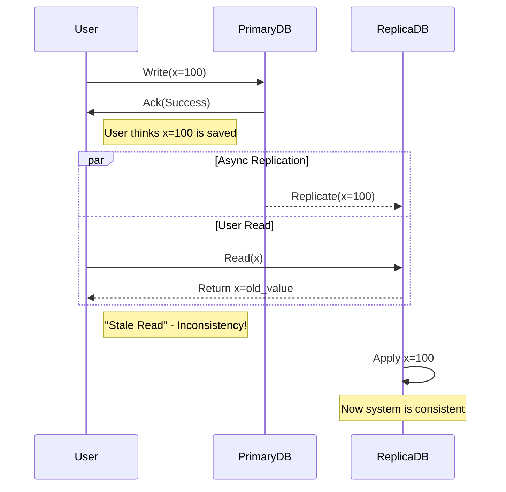

## Concept Overview

In a single-node database, consistency is straightforward: when you write data, it's immediately available to read. However, in distributed systems where data is replicated across multiple nodes for reliability and scale, **consistency** becomes a complex negotiation between correctness and performance.

Formally, consistency defines the rules for the visibility of updates. It answers the question: *After a write operation completes, when will subsequent read operations see that value?*

It is crucial to distinguish between two perspectives:

*   **Data-Centric Consistency (Server-side):** Do all replicas have the same data at the same time?
*   **Client-Centric Consistency (Client-side):** Does the user see a timeline of data that makes sense (e.g., seeing their own updates)?

```callout
{
  "type": "info",
  "title": "CAP Theorem Context",
  "content": "Consistency is the 'C' in the [CAP Theorem](/system-design/module-2-non-functional-requirements/cap-theorem). It states that in the event of a network partition ('P'), a system must choose between being Consistent ('C') or Available ('A'). You cannot have both perfectly."
}
```

---

## Where Consistency Fits in a System

Consistency logic typically resides in the **Data Layer** or **Middleware**. It is enforced by the database's replication protocol or by application-level locking and versioning mechanisms.

Below is a simplified view of how replication lag creates inconsistency windows in a primary-replica architecture.



---

## Real-World Use Cases

The level of consistency required depends entirely on the domain.

### 1. Financial Ledger (Strong Consistency)
**Scenario:** A bank processes a transfer of $5,000 between accounts.
**Requirement:** The system must strictly ensure transaction isolation. No user or process should ever see an intermediate state where money is deducted from one account but not credited to the other, or where a double-spend is possible.
**Choice:** **Strong Consistency (Linearizability)**. Availability is sacrificed during partitions to ensure data integrity.

### 2. Global Content Delivery (Eventual Consistency)
**Scenario:** A news site publishes a breaking article.
**Requirement:** The article is cached in edge locations worldwide. It is acceptable if users in Singapore see the article 30 seconds after users in New York. The priority is serving the content quickly to millions of concurrent users.
**Choice:** **Eventual Consistency**. High availability and low latency are prioritized over immediate global synchronization.

### 3. Collaborative Editing (Causal Consistency)
**Scenario:** A team edits a Google Doc.
**Requirement:** If User A comments on a paragraph, and User B replies to that comment, User C must see the comment *before* seeing the reply. The order of causally related events matters more than the exact wall-clock timing.
**Choice:** **Causal Consistency**. Ensures logical ordering of related operations.

---

## Read vs Write Considerations

Designing for consistency requires analyzing both read and write paths.

### Write Challenges
*   **Write Amplification:** Strong consistency often requires writing to a quorum of nodes (e.g., $W + R > N$), increasing latency.
*   **Conflict Resolution:** If multiple nodes accept writes (multi-leader), how do you resolve conflicting updates?

### Read Guarantees
Even in eventually consistent systems, we often need stronger guarantees for specific user experiences:

*   **Read-Your-Own-Writes:** A user should always see their last update immediately, even if other users don't. This is often achieved by sticky sessions or pinning a user to a specific replica.
*   **Monotonic Reads:** If a user reads version $V_2$ of a record, they should never subsequently read an older version $V_1$ (time should not move backward).

---

## Design Strategies & Trade-offs

Choosing a consistency model is a trade-off decision.

### Comparison of Models

| Feature | Strong Consistency (Linearizability) | Eventual Consistency | Causal Consistency |
| :--- | :--- | :--- | :--- |
| **Description** | System behaves as a single entity; all reads see the latest write. | Updates propagate in the background; reads may be stale. | Causally related operations are seen in order. |
| **Latency** | High (requires coordination). | Low (local reads/writes). | Moderate. |
| **Availability** | Lower (sensitive to partitions). | High (always writable). | High. |
| **Throughput** | Lower. | High. | Moderate to High. |
| **Complexity** | High infrastructure cost. | High application complexity (conflict resolution). | High implementation difficulty (vector clocks). |

### Implementation Strategies

1.  **Synchronous Replication:** The primary node creates a transaction that commits only when replicas acknowledge. Guarantees strong consistency but adds latency.
2.  **Asynchronous Replication:** The primary commits locally and streams updates to replicas. Fast but risks data loss on failure.
3.  **Quorum Reads/Writes:** Using typically $R + W > N$ (where $N$ is replica count) to ensure that a read always overlaps with the latest write group.

---

## Failure & Scale Considerations

At scale, network partitions and node failures are inevitable.

### Handling Network Partitions
When a cluster splits, you must choose:
*   **Fail writes (CP):** Return errors to the client to preserve data correctness.
*   **Allow writes (AP):** Accept writes on all sides of the partition, knowing they will conflict later.

### Conflict Resolution for Active-Active Replication
If you choose availability (AP), you must resolve the resulting data divergence:

*   **Last Write Wins (LWW):** Uses timestamps to overwrite "older" data. Simple, but can discard valid data if clocks are skewed.
*   **Vector Clocks:** Metadata sent with data to track version history and detect concurrent writes.
*   **CRDTs (Conflict-Free Replicated Data Types):** Data structures (like PN-Counters) designed to mathematically merge updates from different nodes without conflict.

```quiz
{
  "question": "Which consistency model is most appropriate for a specialized analytics dashboard where approximate values are acceptable but speed is critical?",
  "options": [
    "Strong Consistency (Linearizability)",
    "Eventual Consistency",
    "Causal Consistency",
    "Serializability"
  ],
  "correctAnswerIndex": 1,
  "explanation": "Eventual consistency allows for the highest availability and lowest latency, which fits the requirements of an analytics system where realtime exact precision is not as critical as responsiveness."
}
```

```match
{
  "question": "Match the scenario to the most suitable consistency model",
  "pairs": [
    {
      "left": "Stock Market Trading",
      "right": "Strong Consistency"
    },
    {
      "left": "Social Media Likes Count",
      "right": "Eventual Consistency"
    },
    {
      "left": "Multi-user Chat Application",
      "right": "Causal Consistency"
    }
  ]
}
```
