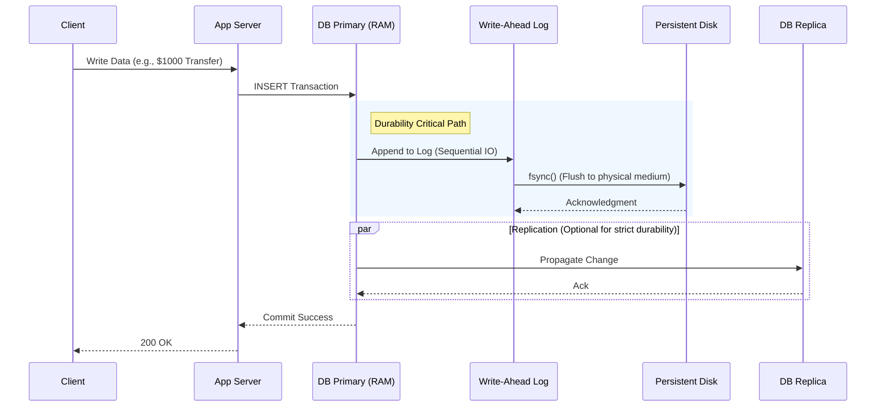

## Concept Overview

**Durability** is the guarantee that once a system acknowledges a write operation as successful, the data will survive permanent storage failures, power outages, and system crashes. It is the "D" in **ACID** properties.

In distributed systems, durability is not a binary property (saved vs. lost); it is a spectrum of guarantees. It ranges from "volatile in-memory storage" which vanishes on restart, to "geo-replicated persistence" which survives the destruction of entire data centers.

```callout
{
  "type": "info",
  "title": "Durability vs. Availability",
  "content": "While **Availability** ensures the system is up and responding, **Durability** ensures the data is safe. A system can be typically available but lose data (poor durability), or perfectly durable but offline (poor availability)."
}
```

## Where Durability Fits in the System

Durability mechanisms operate primarily at the **Data Layer** (Databases, Message Queues, Storage Systems). However, the *commitment* to durability starts from the moment the application server receives a write request.



1. **Write-Ahead Logging (WAL)**
   Before modifying the main data structures (B-Trees, Tables), databases append the change to a sequential log file. This is fast and ensures recovery if the system crashes mid-operation.
2. **OS-Level Flushing (fsync)**
   Writing to a file usually just buffers data in the OS Kernel (Page Cache). To guarantee durability, the database effectively calls `fsync()` to force the disk drive to physically store the bits.
3. **Replication**
   For resilience against hardware failure (disk rot, server fire), data is copied to other nodes. The write is only considered "durable" based on the replication strategy (Synchronous vs. Asynchronous).

## Real-World Use Cases

Durability requirements dictate the architecture. One size does not fit all.

### 1. Financial Ledger (Banking)
*   **Requirement:** **Zero Data Loss** (RPO = 0).
*   **Strategy:** Strict Durability.
    *   **Mechanism:** Synchronous replication to multiple Availability Zones (AZs). The transaction is not confirmed until it is written to disk on the Primary AND at least one Replica.
    *   **Trade-off:** High write latency (waiting for network round-trips and disk I/O).

### 2. User Session Store (Gaming / E-commerce)
*   **Requirement:** High Performance, Tolerable Loss.
*   **Strategy:** Ephemeral / Weak Durability.
    *   **Mechanism:** In-memory storage (e.g., Redis) with asynchronous snapshots (RDB) or infrequent append-only logs (AOF every second).
    *   **Impact:** If the cache node crashes, users might need to log in again, but the business impact is minimal compared to the performance gain.

### 3. Clickstream / Audit Logging (Big Data)
*   **Requirement:** Massive Throughput, Eventual Durability.
*   **Strategy:** Buffered Durability.
    *   **Mechanism:** Client-side batching or Kafka execution. Messages are acknowledged as soon as they reach the broker's memory or filesystem buffer, potentially before being fully flushed to infinite storage (S3/HDFS).
    *   **Trade-off:** Small risk of data loss during a catastrophic fleet-wide failure, acceptable for analytics trends.

---

```quiz
{
  "question": "Why might a high-performance database disable explicit 'fsync' on every write?",
  "options": [
    "To save disk space",
    "To improve write throughput by leveraging OS page cache buffering",
    "Because 'fsync' causes data corruption",
    "To prevent disk wear"
  ],
  "correctAnswerIndex": 1,
  "explanation": "fsync forces the physical disk controller to write data, which is an increasingly slow mechanical or electronic operation compared to writing to RAM. Disabling it allows the OS to batch writes, massively increasing speed but risking data loss if power fails before the flush."
}
```

---

## Read vs Write Considerations

Strengthening durability almost always impacts **Write** performance, whereas **Read** patterns are often unaffected or benefit from the replicas created for durability.

### Write Path Impact
*   **Latency Spikes:** Systems using Synchronous Replication for durability will see write latency defined by the *slowest* replica.
*   **Throughput Bottlenecks:** The physical limit of IOPS (Input/Output Operations Per Second) on the disk becomes the hard ceiling for transaction rates.

### Read Path Impact
*   **Consistency vs. Latency:** If you read from the Primary, you see the latest durable data (Strong Consistency). If you read from Replicas (created for durability), you might see stale data (Eventual Consistency) if replication is asynchronous.
*   **High Availability:** Durability replicas often double as read-replicas, allowing you to scale read throughput linearly.

## Design Strategies & Techniques

### 1. Write-Ahead Logging (WAL)
Instead of updating random parts of a massive database file (Random I/O, which is slow), the database appends the change to a compact log file (Sequential I/O, which is extremely fast). Checkpointing processes run in the background to apply these logs to the main data files.
*   **Benefit:** Durability without the cost of random disk seeks.

### 2. Replication Modes
*   **Synchronous:** Write Primary -> Write Replica -> Ack Client. Safe but slow.
*   **Asynchronous:** Write Primary -> Ack Client -> Backup to Replica. Fast but risks data loss if Primary dies immediately.
*   **Semi-Synchronous:** Ack after 1 replica confirms, but don't wait for all.

### 3. Checkpointing
To prevent the WAL from growing forever (which would make recovery take hours), the system periodically "Checkpoints." It flushes all modified "dirty pages" in memory to the main disk storage and truncates the WAL.

```callout
{
  "type": "warning",
  "title": "The Mechanics",
  "content": "Checkpointing can be I/O intensive. Poorly tuned databases often experience \"stop-the-world\" pauses or performance jitters during a massive checkpoint operation."
}
```

### Comparison of Durability Strategies

| Strategy | Durability Guarantee | Max Data Loss (RPO) | Write Performance | Typical Use Case |
| :--- | :--- | :--- | :--- | :--- |
| **In-Memory** | Process Survival | 100% on crash | Ultra High | Cache, Session State |
| **Async to Disk** | OS Crash Survival | Seconds (Flush interval) | High | Logs, Metrics, Analytics |
| **Sync to Disk (fsync)** | Power Failure Survival | 0 (post-ack) | Medium | Standard RDBMS |
| **Sync Replication** | Server Failure Survival | 0 (post-ack) | Low-Medium | Financial Transactions |
| **Geo-Replication** | Data Center Survival | 0 (post-ack) | Low (High Latency) | Core Banking, Identity Systems |

---

```match
{
  "question": "Match the mechanism to the failure it prevents",
  "pairs": [
    {
      "left": "fsync()",
      "right": "Data loss during power outage"
    },
    {
      "left": "Replication",
      "right": "Data loss during hard drive failure"
    },
    {
      "left": "Geo-Redundancy",
      "right": "Data loss during regional earthquake"
    },
    {
      "left": "Write-Ahead Log",
      "right": "Data corruption during process crash"
    }
  ]
}
```

---

## Failure & Scale Considerations

At scale, you negotiate the **CAP Theorem** (specifically Consistency vs. Availability in the presence of Network Partitions). Durability is heavily tied to Consistency.

### RPO and RTO
*   **RPO (Recovery Point Objective):** "How much data can we lose?" (e.g., 5 minutes of data). Lower RPO = Higher Durability costs.
*   **RTO (Recovery Time Objective):** "How fast must we be back up?" (e.g., 1 hour). Lower RTO = Hot Standby infrastructure costs.

### Corruption at Scale
In petabyte-scale systems, **Bit Rot** (silent data corruption on disk) is statistically inevitable. Standard durability (writing to disk) isn't enough.
*   **Solution:** Use checksums (like CRC32) on every block. Background processes ("scrubbers") constantly read data to verify checksums and repair corrupted blocks from healthy replicas.

```quiz
{
  "question": "You are designing a distributed message queue. You need 100,000 writes/sec, but can tolerate losing the last 1-2 seconds of messages in a total catastrophe. What is the best configuration?",
  "options": [
    "Synchronous replication to 3 nodes with fsync on every message",
    "Asynchronous replication with periodic disk flushing (every 1s)",
    "Write to a single node in memory only",
    "Write to a tape drive"
  ],
  "correctAnswerIndex": 1,
  "explanation": "Synchronous replication with fsync would unlikely sustain 100k writes/sec without massive hardware. Asynchronous replication provides high throughput, and the periodic flush meets the requirement of tolerating only a few seconds of data loss."
}
```
