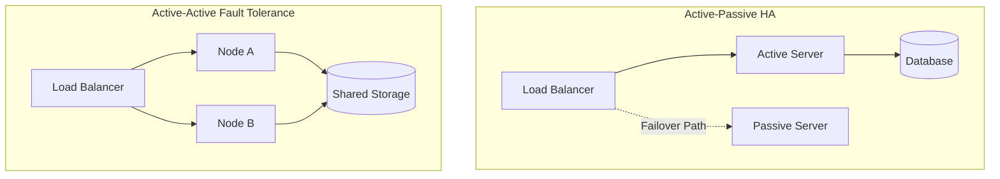

## Concept Overview

In system design, "staying online" is not a binary state. Engineers often conflate **High Availability (HA)**, **Fault Tolerance**, and **Resilience**, but they represent distinct guarantees with vastly different cost implications.

### 1. High Availability (HA)
**Goal:** Minimize downtime.
An HA system accepts that failures will occur but is designed to recover quickly. There is a brief period of disruption (seconds or minutes) while the system fails over to a backup.
*   *Analogy:* Getting a flat tire, but having a spare and the skills to change it in 10 minutes.

### 2. Fault Tolerance
**Goal:** Zero downtime.
A fault-tolerant system continues operating without *any* interruption when a component fails. This usually requires expensive, active-active redundancy where multiple components process the same task simultaneously.
*   *Analogy:* A twin-engine jet losing one engine but continuing to fly safely.

### 3. Resilience
**Goal:** Survive the unexpected.
While HA and Fault Tolerance handle *known* failures (disk crash, network cut), Resilience is about graceful degradation under *unknown* or catastrophic conditions (unexpected traffic spike, cascading dependency failure).

---

## Availability Metrics (The Nines)

Availability is mathematically defined as:

**Formula:**
```
Availability = MTBF / (MTBF + MTTR)
```

Where:
*   **MTBF (Mean Time Between Failures):** How long the system runs before failing.
*   **MTTR (Mean Time To Recovery):** How fast you fix it. (HA focuses heavily on shrinking this).

| Availability Level | Downtime per Year | Typical Use Case |
| :--- | :--- | :--- |
| **99% (2 Nines)** | 3 days, 15 hours | Internal admin tools, Batch jobs. |
| **99.9% (3 Nines)** | 8 hours, 45 mins | Standard web applications, e-commerce. |
| **99.99% (4 Nines)** | 52 minutes | Enterprise SaaS, Payment Gateways. |
| **99.999% (5 Nines)** | 5 minutes | Telecommunications, Critical Infrastructure. |

```callout
{
  "type": "info",
  "title": "The Cost of Nines",
  "content": "Moving from 4 nines to 5 nines often involves a 10x increase in cost and complexity. You stop fighting software bugs and start fighting physics (network speed, speed of light)."
}
```

---

## Architectural Patterns

### Redundancy
The core principle of HA is eliminating **Single Points of Failure (SPOF)**.

#### Active-Passive (Failover)
One node takes traffic (Active); the other waits (Passive).
*   **Pros:** Simple configuration. No data consistency issues locally.
*   **Cons:** Wasted resources (passive node sits idle). Failover takes time (downtime).

#### Active-Active
All nodes take traffic.
*   **Pros:** Zero downtime failover (fault tolerance). 100% resource utilization.
*   **Cons:** Complex consistency management. If one node dies, the other must handle 200% load.



### Failover Mechanisms
How does traffic move when a node dies?

1.  **DNS Failover:** Update DNS records to point to a new IP. (Slow: Depends on TTL).
2.  **Load Balancer Health Checks:** The LB detects a dead node and stops sending it traffic immediately. (Fast).
3.  **Floating IP / VIP:** A virtual IP address instantly rebinds to a healthy server. (Very fast).

### Resilience Patterns

*   **Circuit Breakers:** Stop calling a failing service to prevent cascading failures.
*   **Bulkheads:** Isolate resources so a crash in the "Image Processing" service doesn't take down the "User Login" service.
*   **Graceful Degradation:** If the "Recommendations" service fails, show a generic "Popular Item" list instead of a 500 error page.

---

## Comparisons & Trade-offs

| Feature | High Availability | Fault Tolerance |
| :--- | :--- | :--- |
| **Downtime** | Minimal (Seconds/Minutes). | Zero (Invisible to user). |
| **Cost** | Moderate ($$). | High ($$$$). |
| **Complexity** | Standard (Load Balancers, Auto-scaling). | Extreme (Consensus algorithms, Lock-step execution). |
| **Recovery** | Automated recovery script. | Redundant parallel processing. |

---

## Interactive Learning

```quiz
{
  "question": "You are designing a non-critical internal employee portal. Management asks for '5 Nines' (99.999%) availability. What is the most appropriate response?",
  "options": [
    "Agree immediately, as high availability is always better.",
    "Propose a Multi-Region Active-Active architecture to ensure zero downtime.",
    "Explain that 5 minutes of downtime/year is excessively expensive for an internal tool and propose 99.9% instead.",
    "Use a single server and hope it doesn't crash."
  ],
  "correctAnswerIndex": 2,
  "explanation": "Five nines is typically reserved for critical infrastructure (like 911 services or core banking). For an internal tool, the engineering cost to achieve 99.999% availability would vastly outweigh the business value of that uptime."
}
```

```match
{
  "question": "Match the concept to the strategy",
  "pairs": [
    {
      "left": "High Availability",
      "right": "Load Balancer + Active/Passive DB"
    },
    {
      "left": "Fault Tolerance",
      "right": "RAID 1 Mirroring / Dual Power Supplies"
    },
    {
      "left": "Resilience",
      "right": "Circuit Breakers & Graceful Degradation"
    }
  ]
}
```
