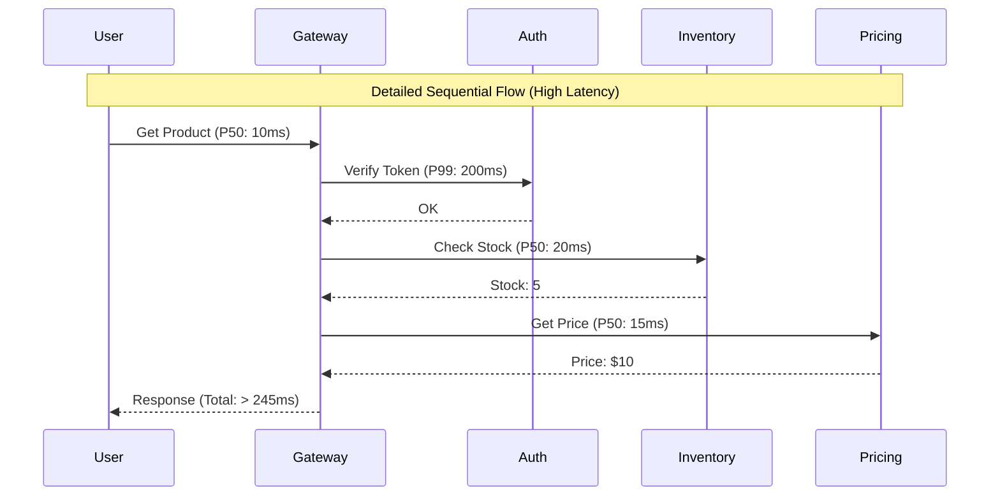

## Concept Overview

Latency is the duration of time it takes for a system to process a request and return a response to the user. While availability asks "Is the system up?", latency asks "**How fast** is the system?".

In distributed systems, latency is composed of multiple segments:
1.  **Network Propagation:** Time for data to travel through physical cables.
2.  **Processing Time:** Time for the CPU to execute logic.
3.  **I/O Wait:** Time waiting for disk reads or database queries.
4.  **Queueing Delay:** Time spent waiting in a backlog before processing begins.

Minimizing latency is crucial because it directly correlates with user engagement and revenue. Amazon found that every **100ms of latency cost them 1% in sales**, and Google saw a **20% traffic drop** for an extra 0.5s delay.

---

## Latency vs. Throughput vs. Bandwidth

These terms are often confused but measure different aspects of performance.

**Analogy: A Highway System**
*   **Latency:** The time it takes for a single car to drive from City A to City B (measured in minutes).
*   **Throughput:** The number of cars that arrive at City B per hour (measured in cars/hour).
*   **Bandwidth:** The width of the highway (number of lanes).

```callout
{
  "type": "info",
  "title": "Key Distinction",
  "content": "You can have a system with **high throughput** but **high latency** (e.g., a batch processing job that processes 1M records per hour but takes 10 minutes to start)."
}
```

---

## The "False God" of Averages

When measuring performance, **never use the specific average (mean)**. Averages hide outliers and give a false sense of security.

Instead, usage **Percentiles**:
*   **P50 (Median):** 50% of requests are faster than this. Measures the "typical" user experience.
*   **P95:** 95% of requests are faster than this. Exposes issues affecting 1 in 20 users.
*   **P99 (Tail Latency):** 99% of requests are faster than this. Critical for strict SLAs.

```quiz
{
  "question": "Your dashboard shows an average latency of 150ms. However, users are complaining about timeouts (errors > 5s). What is the most likely explanation?",
  "options": [
    "The metrics system is broken.",
    "The P99 (tail latency) is excessively high (e.g., 10s), pulling up the perceived wait time for some users without significantly moving the average.",
    "Users are imagining the slowness.",
    "The server clock is desynchronized."
  ],
  "correctAnswerIndex": 1,
  "explanation": "This is the classic 'Average vs. Tail' trap. A few requests taking 10 seconds (P99) can be completely hidden by thousands of fast requests (P50) when looking only at the average. Percentiles reveal these outliers."
}
```

---

## Latency Numbers Every Engineer Should Know

Jeff Dean (Google) famously popularized these numbers. While hardware improves, the *relative orders of magnitude* remain correct.

| Operation | Approximate Time |
| :--- | :--- |
| **L1 Cache Reference** | 0.5 ns |
| **Branch Mispredict** | 5 ns |
| **L2 Cache Reference** | 7 ns |
| **Mutex Lock/Unlock** | 100 ns |
| **Main Memory Reference** | 100 ns |
| **Read 1MB sequentially from Memory** | 250,000 ns (250 µs) |
| **Round trip in same datacenter** | 500,000 ns (0.5 ms) |
| **Disk Seek** | 10,000,000 ns (10 ms) |
| **Read 1MB sequentially from Network** | 10,000,000 ns (10 ms) |
| **Read 1MB sequentially from Disk** | 30,000,000 ns (30 ms) |
| **packet send CA->Netherlands->CA** | 150,000,000 ns (150 ms) |

```callout
{
  "type": "tip",
  "title": "Rule of Thumb",
  "content": "*   **Memory (RAM)** is fast (~nanoseconds).\n*   **Disk (SSD/HDD)** is slow (~milliseconds).\n*   **Network (Cross-Region)** is very slow (~hundreds of milliseconds).\nAvoid network calls in critical loops!"
}
```

---

## Real-World Use Cases & Strategies

### 1. Multiplayer FPS Game (e.g., Call of Duty)
*   **Requirement:** P99 Latency < 50ms (Real-time).
*   **Challenge:** If latency is high, players see "lag" (rubber-banding).
*   **Strategy:**
    *   **UDP instead of TCP:** Drop dropped packets rather than waiting for retransmission.
    *   **Edge Servers:** Match players to servers physically close to them.
    *   **Client-Side Prediction:** The game client simulates movement instantly before the server confirms it.

### 2. Global Search Engine (e.g., Google)
*   **Requirement:** P95 Latency < 500ms (Interactive).
*   **Challenge:** Searching billions of indexed pages instantly.
*   **Strategy:**
    *   **In-Memory Index:** Keep the most frequently accessed index data in RAM (Redis/Memcached).
    *   **Parallelization:** Scatter the query to 1000 nodes, gather results, and return the top 10. The latency is determined by the *slowest* node (straggler problem).

### 3. Background Image Processing
*   **Requirement:** Latency is irrelevant (Minutes/Hours).
*   **Challenge:** Processing terabytes of data efficiently.
*   **Strategy:**
    *   **Throughput Optimization:** Focus on processing as many images as possible per hour, not how fast one image finishes. Queueing is acceptable.

---

## Architecture: The Request Path

Every hop adds latency. Service-Oriented Architectures (Microservices) are inherently slower than Monoliths due to network overhead.

### Latency Compounds in Microservices



**Optimization:** Parallelize calls where possible! If Inventory and Pricing don't depend on each other, call them simultaneously.

`Total Latency = Max(Inventory, Pricing) + Auth` instead of `Sum(All)`.

---

## Optimization Strategies

| Strategy | Mechanism | Best For |
| :--- | :--- | :--- |
| **Caching** | Store computed results in RAM (Redis) to avoid slow DB/Disk access. | Read-heavy workloads (News feed, profiles). |
| **CDN (Content Delivery Network)** | Cache static assets (files, images) in servers geographically close to the user. | Static content serving. |
| **Compression** | Gzip/Brotli payload to reduce network transfer time. | Large JSON/HTML responses. |
| **Connection Pooling** | Reuse TCP connections to avoid the 3-way handshake overhead. | Database connections. |
| **Parallel Execution** | Execute independent tasks concurrently. | Aggregating data from multiple microservices. |

---

```quiz
{
  "question": "You are designing a notification service. You need to send emails to 1 million users. The email provider API takes 1 second per email. What is the most important metric to optimize?",
  "options": [
    "Latency (Time to send one email)",
    "Throughput (Emails sent per minute)",
    "Bandwidth (Size of average email)",
    "Jitter (Variance in latency)"
  ],
  "correctAnswerIndex": 1,
  "explanation": "In batch processing jobs like sending bulk emails, individual Latency (1s per email) is less critical than Throughput. If you send them sequentially, it takes 11 days. If you optimize Throughput to send 10,000 emails in parallel, you finish in minutes."
}
```
