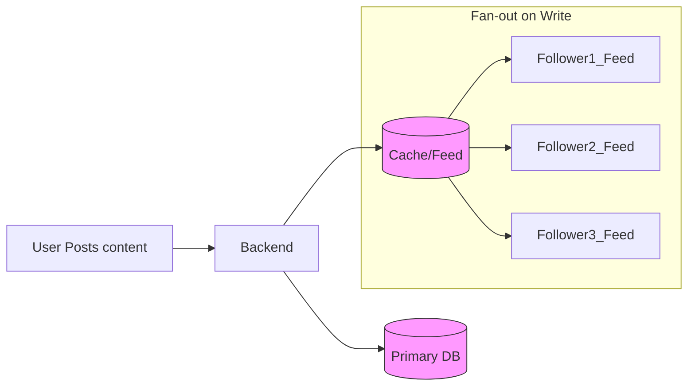
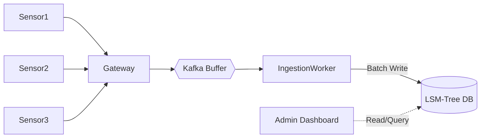

## Concept Overview

The **Read-Write Ratio** is a fundamental metric that quantifies the workload characteristics of a system. It is defined as the proportion of read operations relative to write operations over a given period.

Understanding this ratio is critical because optimizing for reads often comes at the expense of write performance, and vice versa. There is no "one-size-fits-all" architecture; a system designed for a 100:1 read-to-write ratio (like Twitter) looks radically different from one designed for a 1:1 ratio (like a chat app) or a 1:100 ratio (like IoT sensor logging).

*   **Read-Heavy:** High reading frequency, low writing frequency (e.g., Content Delivery Networks, Social Media Feeds).
*   **Write-Heavy:** High writing frequency, low or batch reading (e.g., Time-Series Logging, Clickstream Analytics).

---

## Storage Engine Implications

The read-write ratio directly influences the choice of the underlying storage engine.

### B-Trees (Read-Optimized)
Used by traditional relational databases like PostgreSQL and MySQL.
*   **Mechanism:** Data is stored in a balanced tree structure.
*   **Pros:** Extremely fast lookups (O(log n)) and supports efficient range queries.
*   **Cons:** Writes can be slower because they involve random disk I/O to rebalance the tree and update indexes.
*   **Best For:** Read-heavy workloads requiring strong consistency and complex queries.

### LSM Trees (Write-Optimized)
Used by NoSQL databases like Cassandra, RocksDB, and LevelDB.
*   **Mechanism:** Log-Structured Merge-trees append updates to a sequential log in memory (MemTable) and flush to disk (SSTables). Background compaction merges these files.
*   **Pros:** Blazing fast writes (sequential I/O).
*   **Cons:** Reads can be slower (might need to check multiple SSTables).
*   **Best For:** Write-heavy workloads, ingestion pipelines, and time-series data.

---

## Architectural Patterns by Ratio

### 1. Read-Heavy Architectures (e.g., 99:1)

When reads dominate, the goal is to offload the primary database and serve data as close to the user as possible.

*   **Caching Strategy:** Aggressive caching (CDNs, Redis). Use **Cache-Aside** or **Read-Through** patterns.
*   **Replication:** Use a single primary for writes and multiple read-replicas for scaling reads.
*   **Denormalization:** duplicate data to avoid expensive joins during reads.
*   **Fan-out on Write (Push Model):**
    Pre-compute the result when data is written so reads are O(1).
    *   *Example:* When a celebrity tweets, the system pushes that tweet into the dedicated feed timeline of all their followers. The write is expensive, but the millions of subsequent reads are instant.



### 2. Write-Heavy Architectures (e.g., 1:100)

When writes dominate, the goal is to ingest data rapidly without blocking.

*   **Buffering & Batching:** Use a message queue (Kafka, Pulsar) to decouple ingestion from storage. Writes are acknowledged immediately and processed in batches.
*   **Sharding:** Partition data based on the write key (e.g., Device ID) to distribute concurrent writes across nodes.
*   **Fan-out on Read (Pull Model):**
    Write data simply to a storage location. Do the heavy lifting (aggregation, filtering) only when requested.
    *   *Example:* In a logging system, logs are written sequentially. An admin dashboard queries (pulls) and aggregates this data only when the page loads.



---

## Comparisons & Trade-offs

| Feature | Read-Heavy Optimization | Write-Heavy Optimization |
| :--- | :--- | :--- |
| **Primary Goal** | Fast retrieval, low latency reads. | High ingestion throughput, non-blocking writes. |
| **Storage Engine** | B-Trees (SQL). | LSM Trees (NoSQL, Time-series). |
| **Caching** | Essential (Hit rate is critical). | Less critical (Data changes too fast). |
| **Normalization** | Denormalized (Read speed > Write complexity). | Normalized (Write speed > storage duplication). |
| **Replication** | Async Read Replicas. | Sharding / Partitioning. |
| **Bottleneck** | DB CPU/Memory (Complex queries). | Disk I/O, Network Bandwidth. |

```callout
{
  "type": "warning",
  "title": "Amplification Risks",
  "content": "*   **Write Amplification:** Adding indexes speeds up reads but slows down writes, as every write must update multiple index structures.\n*   **Read Amplification:** In write-optimized systems (LSM trees), a single logical read might require checking multiple physical files on disk."
}
```

---

## Interactive Learning

```quiz
{
  "question": "You are designing a notification system where millions of events are generated per second, but users only check their notification history occasionally. Which strategy is best?",
  "options": [
    "Fan-out on Write (Push to every user's history)",
    "Fan-out on Read (Pull from central store on demand)",
    "Synchronous replication to B-Tree database",
    "Cache-first architecture with large TTL"
  ],
  "correctAnswerIndex": 1,
  "explanation": "Since writes (events) vastly outnumber reads (history checks), 'Fan-out on Read' prevents wasted resources processing feeds that might never be viewed. A 'Fan-out on Write' approach would collapse under the write volume."
}
```

```match
{
  "question": "Match the workload to the ideal storage engine",
  "pairs": [
    {
      "left": "High-frequency Stock Ticks (Write-Heavy)",
      "right": "LSM Tree (e.g., Cassandra)"
    },
    {
      "left": "User Profiles & Auth (Read-Heavy)",
      "right": "B-Tree (e.g., PostgreSQL)"
    },
    {
      "left": "Complex Ad-hoc Reporting",
      "right": "Columnar Store (e.g., ClickHouse)"
    }
  ]
}
```
