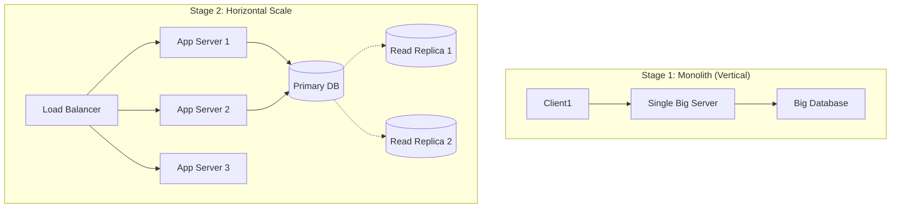

## Concept Overview

Scalability is the ability of a system to cope with increased load by adding resources. It is not just a single number; it is a multi-dimensional challenge. When an interviewer asks to "Design YouTube," the first question must always be: "**At what scale?**"

A system designed for **1,000 users** (MVP) looks fundamentally different from a system designed for **100 million users** (Enterprise).

### The Four Dimensions of Scale

1.  **User Scale:** Number of Daily Active Users (DAU). (e.g., 10k vs 1B users).
2.  **Request Scale:** Throughput in Requests Per Second (RPS). (e.g., 100 RPS vs 1M RPS).
3.  **Data Scale:** Volume of storage required. (e.g., 100 GB vs 10 PB).
4.  **Growth Rate:** How fast is the traffic increasing? (Linear growth vs. Viral spike).

```callout
{
  "type": "info",
  "title": "Scale Multipliers",
  "content": "Inefficiencies multiply at scale. A wasted 10ms database query is negligible at 1 RPS. At 100,000 RPS, that same inefficiency burns through 1,000 CPU cores of computing power constantly."
}
```

---

## Vertical vs. Horizontal Scaling

There are two fundamental ways to scale any system.

### Vertical Scaling (Scaling Up)
Adding more power (CPU, RAM, Disk) to an **existing single server**.
*   **Analogy:** Upgrading from a Toyota Corolla to a Ferrari.
*   **Pros:** Simple. No code changes required.
*   **Cons:** Expensive (Diminishing returns). Has a hard hardware limit (e.g., 128 cores is the max). Single point of failure.

### Horizontal Scaling (Scaling Out)
Adding **more servers** to a pool of resources.
*   **Analogy:** Replacing a Ferrari with 100 Toyota Corollas to transport more people.
*   **Pros:** Limitless theoretical scale. Uses commodity hardware (cheaper). Built-in redundancy.
*   **Cons:** Complex. Requires load balancing, data partitioning (sharding), and distributed coordination.

### Comparison Matrix

| Feature | Vertical Scaling | Horizontal Scaling |
| :--- | :--- | :--- |
| **Complexity** | Low (Plug & Play) | High (Distributed Systems) |
| **Cost** | Exponentially High | Linear / Cost-Effective |
| **Limit** | Hardware Ceiling | Virtually Unlimited |
| **Failure Impact** | High (Single Machine Down) | Low (One node of many) |

---

## Architecting for Scale

As you move from Startup Scale to Hyperscalable, your architecture must evolve.

### Evolution of a System



### 1. Database Strategy (The Bottleneck)
The application layer is stateless and easy to scale (just add more servers). The **database (stateful)** is the hardest part to scale.
*   **Read Scaling:** Use **Read Replicas**. One Primary accepts writes, multiple Replicas serve reads.
*   **Write Scaling:** Use **Sharding (Partitioning)**. Split data across multiple database nodes based on a key (e.g., `user_id`). Or use NoSQL (DynamoDB/Cassandra) which shards automatically.

### 2. Caching Strategy
At scale, the "fastest query is the one you don't make."
*   **Cache Hit Ratio:** Aim for >95%. If 100M users hit the DB directly, it will crash.
*   **Layers:** Browser Cache -> CDN (Edge) -> API Gateway Cache -> Application Cache (Redis).

### 3. Asynchronous Processing
Synchronous operations block resources. At scale, move heavy lifting to the background.
*   **Pattern:** Instead of processing a video upload immediately (Client waits for 5 mins), upload to S3, push a message to a **Queue (Kafka/SQS)**, and let a Worker pool process it later.

---

## Real-World Scaling Scenarios

### Scenario A: Viral Social App (High Read/Write)
*   **Scale:** 10M DAU, generic text/image posts.
*   **Constraint:** Rapid growth, unpredictable spikes.
*   **Design:**
    *   **Datastore:** NoSQL (Cassandra/DynamoDB) for infinite horizontal write scaling.
    *   **Compute:** Serverless (AWS Lambda) or Kubernetes Autoscaling to handle viral spikes instantly.

### Scenario B: Payment Processing (High Consistency)
*   **Scale:** 1M Transactions/sec.
*   **Constraint:** Zero data loss, Strong Consistency.
*   **Design:**
    *   **Datastore:** Sharded SQL (MySQL/PostgreSQL) or NewSQL (Spanner). We cannot trade consistency for scale here. Use "Sticky Sessions" or "Consistent Hashing" to route users to specific shards.

---

```quiz
{
  "question": "You have a system handling 50k requests per second. The CPU usage on your database primary is at 100%, causing timeouts. The application servers are at 10% CPU. What is the most effective immediate step to scale?",
  "options": [
    "Add more application servers (Scale Out App Layer)",
    "Upgrade the application servers to larger instances (Scale Up App Layer)",
    "Implement Read Replicas to offload read traffic from the Primary DB",
    "Switch all code to C++ for better performance"
  ],
  "correctAnswerIndex": 2,
  "explanation": "The bottleneck is explicitly the DATABASE Primary. Adding more app servers (A) or making them faster (B) will only generate MORE load on the struggling database. Offloading reads to Replicas (C) immediately reduces load on the Primary."
}
```

---

## Common Scaling Mistakes

1.  **Premature Optimization:** Building complex sharding for a startup with 100 users. Start Monolithic, then refactor.
2.  **Ignoring Data Archival:** Keeping 10 years of logs in your "Hot" database. Move old data to "Cold" storage (S3/Glacier) to keep indexes small and fast.
3.  **The "All Scale is Equal" Fallacy:** 100M IoT devices sending 1-byte heartbeats is arguably easier to handle than 1M users uploading 4K video. **Data Volume** vs **Count** matters.

```quiz
{
  "question": "A photo-sharing app is growing fast. Users complain that uploading photos is becoming slower and slower. You check the logs and see the 'Image Resize' function is taking 5+ seconds and blocking the main server thread. What is the best architectural fix?",
  "options": [
    "Buy a bigger server with a faster CPU (Vertical Scale)",
    "Decouple the resize operation using a Message Queue (Async Processing)",
    "Shack the database to distribute photo metadata",
    "Use a CDN to serve the photos"
  ],
  "correctAnswerIndex": 1,
  "explanation": "This is a classic 'Synchronous Blocking' problem. Vertically scaling (A) is a temporary band-aid. The correct scalable fix is (B): Upload the raw image, return 'Success' immediately to the user, and process the heavy resize operation asynchronously in a background worker."
}
```
