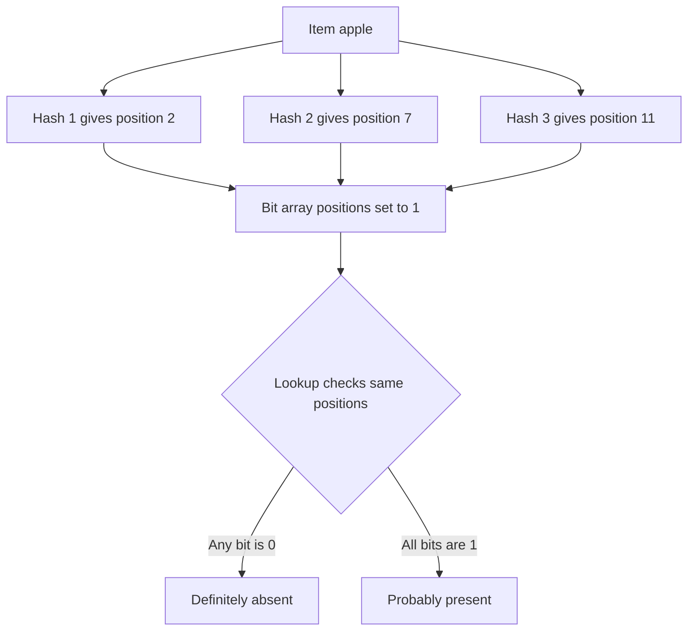

## Concept Overview

A **Bloom filter** is a probabilistic data structure that answers one question — "have I seen this item before?" — using a fraction of the memory an exact set would need. The price of that compression is precision: a Bloom filter can say **possibly yes** when the answer is actually no, but it will **never** say no when the answer is yes.

That asymmetry is the entire value proposition:

- **False positives are possible**: the filter may claim an item is present when it is not.
- **False negatives are impossible**: if the filter says an item is absent, it is definitely absent.

This makes Bloom filters ideal as a **cheap gate in front of an expensive operation**. If the filter says "not there," you skip the disk read, the database query, or the network call with complete confidence. If it says "maybe there," you pay for the real lookup — and only occasionally is that trip wasted.

A filter holding 10 million items at a 1% false-positive rate needs roughly 12 megabytes. The equivalent exact hash set of strings would need hundreds of megabytes.

---

## The Mechanism: Bit Array Plus Hash Functions

A Bloom filter is just a **bit array of m bits** (all starting at 0) and **k independent hash functions**, each mapping an item to a position in the array.

**Insert**: hash the item with all k functions and set each of the k resulting bit positions to 1.

**Lookup**: hash the item with the same k functions and check the k positions.
- If **any** bit is 0, the item was never inserted — definite no.
- If **all** bits are 1, the item was **probably** inserted — but those bits might have been set by other items colliding on the same positions. That collision is exactly what a false positive is.



### Tuning Intuition

Three knobs control the false-positive rate, and the intuition is plain:

- **Bigger bit array (m)**: more room means fewer collisions, so a lower false-positive rate — at the cost of memory.
- **More hash functions (k)**: more bits must all collide for a false positive, which helps — until the array gets so densely set that extra hashes hurt. There is a sweet spot: the optimal k is roughly m divided by n times 0.693, where n is the number of items.
- **More items (n)**: as you insert more items into a fixed array, bits fill up and the false-positive rate climbs. A rough guide: about 9.6 bits per item yields a 1% false-positive rate, and every additional 4.8 bits per item cuts that rate by another factor of ten.

Both insert and lookup are **O(k)** — constant time, independent of how many items are stored.

### Why You Cannot Delete

Clearing an item's k bits is unsafe because **other items may share those bits** — zeroing them would create false negatives, breaking the filter's one hard guarantee. Standard Bloom filters are therefore insert-only. The common workaround is the **counting Bloom filter**: each position holds a small counter instead of a bit; inserts increment, deletes decrement. That restores deletion at the cost of several times the memory.

```callout
{
  "type": "info",
  "content": "Remember the one-way guarantee: a Bloom filter's no is a real no, its yes is only a maybe. Every correct use of a Bloom filter is built on trusting the no and verifying the yes."
}
```

---

### Quiz: The Mechanism

```quiz
{
  "question": "A Bloom filter lookup finds that one of the k bit positions for a key is 0. What can you conclude?",
  "options": [
    "The key is probably absent but might be present",
    "The key was definitely never inserted",
    "The key was inserted and later deleted",
    "The filter is corrupted"
  ],
  "correctAnswerIndex": 1,
  "explanation": "Inserting a key sets all k of its bits to 1, and bits are never cleared. If even one bit is 0, that insert never happened. This is the false-negatives-impossible guarantee."
}
```

```quiz
{
  "question": "Why do standard Bloom filters not support deletion?",
  "options": [
    "Deletion would be too slow at O(n)",
    "The hash functions are one-way and cannot be reversed",
    "Clearing a key's bits could zero bits shared with other keys, creating false negatives",
    "The bit array is stored on immutable disk segments"
  ],
  "correctAnswerIndex": 2,
  "explanation": "Bits are shared between items. Zeroing them on delete would make other, still-present items look absent — violating the core guarantee. Counting Bloom filters fix this with per-position counters at a memory cost."
}
```

---

## Real-World Use Cases

### 1. Cache Penetration Defense
**Scenario**: A product API sits behind Redis and a relational database. Attackers (or buggy clients) request millions of random, nonexistent product ids.
**Problem**: Nonexistent keys are never in the cache, so every request falls through to the database — the cache provides zero protection exactly when load is highest.
**Solution**: A Bloom filter of all valid product ids sits in front of the cache. A lookup for an id the filter rejects is answered immediately with not-found, never touching Redis or the database. Only the roughly 1% false positives cost a wasted database query.

### 2. LSM-Tree Storage Engines
**Scenario**: Databases like Cassandra, HBase, and RocksDB store data in many immutable sorted files (SSTables) on disk. A read may need to consult several files to find a key.
**Problem**: Checking every SSTable means multiple disk reads per lookup, most of which find nothing.
**Solution**: Each SSTable keeps an in-memory Bloom filter of its keys. Before reading a file, the engine asks the filter; a no skips the file entirely. Since immutable files never need deletions, this is a perfect Bloom filter fit — reads touch only the one or two files that probably contain the key.

### 3. Username Availability and Crawler Dedup
**Scenario**: A signup flow checks whether a username is taken; a web crawler decides whether it has already visited a URL among billions.
**Problem**: An exact lookup against the full dataset for every check is expensive at this scale.
**Solution**: A Bloom filter of existing usernames answers most availability checks instantly ("definitely available" needs no database trip). The crawler keeps a Bloom filter of visited URLs in memory; a false positive merely skips re-crawling one page, an acceptable loss for fitting billions of URLs in a few gigabytes.

---

## Design Strategies & Trade-offs

| Configuration | Memory | False-Positive Rate | Hash Cost per Op |
| :--- | :--- | :--- | :--- |
| ~5 bits per item, k=3 | Tiny | ~10% | Low |
| ~10 bits per item, k=7 | Small | ~1% | Medium |
| ~14 bits per item, k=10 | Moderate | ~0.1% | Higher |
| Exact hash set | 10x to 50x larger | 0% | One hash, plus key storage |

The engineering decision is a three-way balance: **memory vs false-positive rate vs hash cost**. Driving the error rate down costs bits per item and CPU per operation; at some point an exact structure becomes the honest choice.

### When NOT to Use a Bloom Filter

- **You need deletions** and cannot afford a counting filter's memory multiplier, or the set churns constantly.
- **You need exact answers** — billing, authorization, anything where a false positive has a real cost. A filter that says "maybe present" cannot authorize a payment.
- **You need to list the members.** A Bloom filter stores no keys; it can never enumerate what is inside it or return the associated values.
- **The set is small.** A few thousand entries fit in an exact hash set; the probabilistic complexity buys nothing.

---

## Failure & Scale Considerations

- **Filters fill up.** The false-positive rate is designed for an expected n. Insert 10x more items than planned and the array saturates — nearly every lookup returns maybe, and the filter silently degrades into dead weight. Monitor fill ratio and rebuild when it drifts.
- **No resizing in place.** You cannot grow a Bloom filter, because items cannot be re-hashed out of it (the originals were never stored). Scaling up means rebuilding from the source of truth, or using a scalable-Bloom-filter scheme that chains progressively larger filters.
- **Rebuilds need the source data.** Since the filter is derived state, treat it like a cache: after a crash or corruption, repopulate it by scanning the authoritative store. Until the rebuild finishes, either fail open (let all lookups through) or serve from a stale snapshot.
- **Distributed drift.** If each API node builds its own filter of valid keys, nodes can disagree with the database after writes. Common patterns: rebuild on a schedule, or stream new inserts to all nodes (remembering that deletes cannot be streamed into a standard filter).

---

### Final Match & Quiz

```match
{
  "question": "Match the Bloom filter concept to its meaning",
  "pairs": [
    {
      "left": "False positive",
      "right": "Filter says present but the item was never inserted"
    },
    {
      "left": "False negative",
      "right": "Impossible in a standard Bloom filter"
    },
    {
      "left": "Counting Bloom filter",
      "right": "Counters per position enable deletion at extra memory cost"
    },
    {
      "left": "Bits per item",
      "right": "The knob that trades memory for accuracy"
    }
  ]
}
```

```quiz
{
  "question": "An LSM-tree database keeps a Bloom filter per SSTable. A read for key X gets a maybe from the filter, but the SSTable does not contain X. What happened, and what did it cost?",
  "options": [
    "A false negative occurred, costing data loss",
    "A false positive occurred, costing one wasted disk read",
    "The filter is broken and must be rebuilt immediately",
    "The key was deleted from the SSTable after the filter was built"
  ],
  "correctAnswerIndex": 1,
  "explanation": "This is the expected, budgeted cost of a Bloom filter: an occasional false positive triggers one unnecessary file read. SSTables are immutable, so the filter cannot be stale, and correctness is unaffected."
}
```
