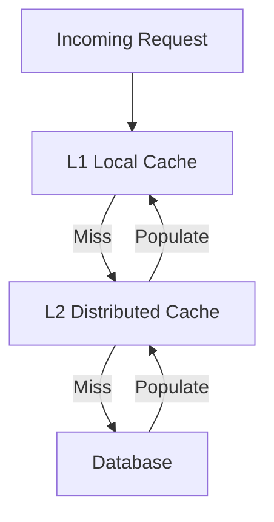

## Concept Overview

The fundamentals — cache layers, write-through vs write-back vs write-around, eviction policies, and TTLs — are covered in [Advanced Caching Strategies in Distributed Systems](/system-design/module-1-foundations-of-system-design/caching). This lesson assumes that foundation and goes deeper: what happens when caching meets serious scale.

At scale, the cache stops being a simple performance optimization and becomes **load-bearing infrastructure**. If your database can handle 5,000 queries per second and your cache absorbs 495,000, the cache is not optional; the system's survival depends on it. That dependency creates a new class of failure modes with their own names: **hot keys**, **cache penetration**, **cache avalanche**, and **cache stampede**. Interviewers love these because they separate people who have run caches in production from people who have only drawn them on whiteboards.

## Cache Architecture at Scale: Tiers and Shards

### L1/L2 Tiered Caching

A **local in-process cache** (a map inside your application, like Caffeine on the JVM) offers nanosecond reads and zero network cost, but each server holds its own copy and invalidation across the fleet is hard. A **distributed cache** (Redis, Memcached) offers one shared, consistent view at the cost of a network round trip.

Production systems often combine them into tiers:

- **L1 (local)**: Tiny, very short TTLs (seconds), holds only the hottest entries.
- **L2 (distributed)**: Large, longer TTLs, shared by the fleet, shields the database.



The L1 tier's short TTL bounds staleness: a value updated elsewhere is at most a few seconds out of date on any given server. That bounded inconsistency is the price of eliminating a network hop for the hottest reads.

### Sharding the Cache Cluster

One cache node has finite memory and throughput, so clusters **shard** the keyspace across nodes, each key living on exactly one node. Naive sharding with hash of key mod N reshuffles nearly every key when N changes; production clusters use **consistent hashing** so resizing moves only a small fraction of keys — the same technique discussed in [Load Balancing: Distributing Traffic at Scale](/system-design/module-3-core-building-blocks/load-balancing).

---

### Quiz: Architecture

```quiz
{
  "question": "Why do tiered caches keep L1 TTLs very short, often just a few seconds?",
  "options": [
    "Local memory is too expensive for longer storage",
    "Short TTLs bound how stale each server's local copy can be, since cross-fleet invalidation of in-process caches is impractical",
    "The JVM garbage collector requires it",
    "L2 caches reject entries older than a few seconds"
  ],
  "correctAnswerIndex": 1,
  "explanation": "There is no cheap way to invalidate a value inside every server's process memory when it changes. A short TTL guarantees staleness is bounded by the TTL, making the inconsistency window acceptable."
}
```

---

## Real-World Use Cases

### 1. The Celebrity Post (Hot Key)
**Scenario**: A social platform caches each post's metadata under one key. A celebrity posts and 50 million users load it within minutes.
**Problem**: All that traffic hashes to a single cache shard. One node melts at a few hundred thousand operations per second while the rest of the cluster idles.
**Solution**: **Key replication** — write the hot value under several keys like `post123#1` through `post123#8`, spread across shards, and have readers pick one at random. Combine with a short-TTL L1 cache so each app server answers most reads locally.

### 2. The Malicious Miss Storm (Penetration)
**Scenario**: An attacker floods an e-commerce API with lookups for product IDs that do not exist.
**Problem**: Nonexistent items are never cached, so every request is a guaranteed cache miss that hits the database, bypassing the cache entirely.
**Solution**: **Negative caching** — store a "not found" marker with a short TTL so repeated misses for the same ID are absorbed by the cache. For huge sparse ID spaces, add a Bloom filter in front to reject IDs that definitely do not exist without touching cache or database.

### 3. The Midnight Expiry (Avalanche)
**Scenario**: A batch job warms one million cache entries nightly, all with a 24-hour TTL.
**Problem**: Every entry expires at the same instant the next day. The database receives the fleet's entire read load at once and falls over, which then fails requests, which triggers retries, making it worse.
**Solution**: **TTL jitter** — set each TTL to base plus a random offset, for example 24 hours plus up to 2 hours, so expirations spread smoothly over a window instead of spiking.

---

## Stampede Protection in Depth

Module 1 introduced the **thundering herd**: one popular key expires, and thousands of concurrent requests all miss and hit the database together. Three production-grade defenses, often layered:

1. **Mutex lock (single-flight)**: On a miss, a request must acquire a per-key lock (for example a Redis `SET key NX` with expiry) before recomputing. The one winner queries the database and repopulates; everyone else waits briefly and retries the cache, or is served the stale value. One database query instead of thousands.
2. **Probabilistic early expiration**: Each reader treats the entry as expired slightly before its real TTL, with a probability that rises as expiry approaches. Statistically, one request refreshes the value early while the rest keep reading the still-valid entry. No lock, no coordinated miss.
3. **Request coalescing**: The application or cache client deduplicates concurrent fetches for the same key into a single in-flight backend call whose result is fanned out to all waiters. This helps at the app layer and at CDN edges alike.

```callout
{
  "type": "warning",
  "content": "Stampede defenses matter most for expensive values: a query that takes 800ms to compute and receives 10,000 concurrent requests will generate 10,000 overlapping expensive queries in the miss window unless coalesced. Cheap values rarely need this machinery."
}
```

### Cache Warming

A cold cache after a deploy, region failover, or cluster restart is itself a stampede in disguise: hit ratio near zero means the database briefly takes full traffic. **Cache warming** pre-populates critical keys before serving traffic — replaying recent access logs, iterating known-hot entities, or gradually ramping traffic into the new cluster so it fills organically without overwhelming the origin.

---

### Quiz: Failure Modes

```quiz
{
  "question": "Which pairing of problem and mitigation is correct?",
  "options": [
    "Hot key mitigated by TTL jitter",
    "Cache avalanche mitigated by negative caching",
    "Cache penetration mitigated by key replication",
    "Cache stampede mitigated by a per-key mutex so only one request recomputes the value"
  ],
  "correctAnswerIndex": 3,
  "explanation": "Stampedes are many concurrent misses on one key; a per-key lock collapses them into a single recomputation. Jitter addresses avalanches, negative caching addresses penetration, and replication addresses hot keys."
}
```

```quiz
{
  "question": "Requests for nonexistent IDs keep reaching your database despite a healthy cache. Why does the cache not help?",
  "options": [
    "The cache is too small to hold the missing IDs",
    "Nonexistent values are never stored, so every lookup for them is a miss that falls through to the database",
    "The TTL on those entries is too long",
    "The database is faster than the cache for missing rows"
  ],
  "correctAnswerIndex": 1,
  "explanation": "This is cache penetration: a cache can only absorb reads for values it stores. Caching a short-lived not-found marker, or screening IDs with a Bloom filter, closes the gap."
}
```

---

## Design Strategies & Trade-offs: Cache-Database Consistency

Keeping cache and database in sync during writes is where most subtle production bugs live. The main strategies:

| Strategy | Mechanism | Staleness Risk | Key Pitfall |
| :--- | :--- | :--- | :--- |
| **Invalidate on write** | Update DB, then delete cache key | Low; next read repopulates | Delete can fail or race with a concurrent read |
| **Update on write** | Update DB, then write new value to cache | Low if ordering holds | Two concurrent writes can land in cache in the wrong order, persisting a stale value |
| **TTL only** | Never invalidate; wait for expiry | Bounded by TTL | Simple but stale for up to a full TTL |
| **Double delete** | Delete cache, update DB, delete cache again after a short delay | Very low | Extra complexity; delay must exceed the read-repopulate window |

**Invalidation usually beats update.** Deleting is idempotent and immune to write-ordering races; the next reader repopulates from the freshest database state.

The classic ordering pitfall: reader A misses the cache and reads the old value from the database. Before A writes it to the cache, writer B updates the database and invalidates the (empty) key. A then populates the cache with the stale value it read earlier — and it sticks until TTL. The **double-delete pattern** exists exactly for this: the second, delayed delete clears any stale entry planted by an in-flight reader. A TTL as a backstop is non-negotiable either way.

```callout
{
  "type": "tip",
  "content": "Always set a TTL even when you invalidate explicitly. Invalidation messages get lost, deletes fail, and races happen; the TTL is the self-healing mechanism that bounds how long any bug can serve stale data."
}
```

---

## Failure & Scale Considerations

- **Cache dependency is a liability**: If steady-state hit ratio is 99%, the database is sized for 1% of traffic. A cache cluster outage multiplies database load a hundredfold instantly. Plan for it: replicas for the cache tier, load shedding at the application, and warming procedures for recovery.
- **Failover amplification**: When a cache shard dies and its keys rehash to neighbors, those neighbors absorb both the extra traffic and the miss storm for keys they do not yet hold. Consistent hashing with replicas softens this.
- **Monitoring**: Track hit ratio, per-shard operation rates (hot key detection), and key-level miss spikes. A slowly degrading hit ratio is the early warning before a database incident.

---

### Final Review

```match
{
  "question": "Match the failure mode to its primary mitigation",
  "pairs": [
    {
      "left": "Hot key",
      "right": "Replicate the key across shards and cache locally"
    },
    {
      "left": "Cache penetration",
      "right": "Negative caching of not-found results"
    },
    {
      "left": "Cache avalanche",
      "right": "Add random jitter to TTLs"
    },
    {
      "left": "Cache stampede",
      "right": "Mutex or probabilistic early refresh"
    }
  ]
}
```

```quiz
{
  "question": "In the double-delete pattern, why is the second delete delayed rather than immediate?",
  "options": [
    "To reduce load on the cache cluster",
    "To give replicas time to sync the first delete",
    "So it fires after any in-flight reader that fetched the old database value has had time to write that stale value into the cache",
    "Because cache deletes are only allowed once per second per key"
  ],
  "correctAnswerIndex": 2,
  "explanation": "The race is a reader that read the old value before the write and populates the cache after the first delete. The delayed second delete sweeps away exactly that stale entry."
}
```
