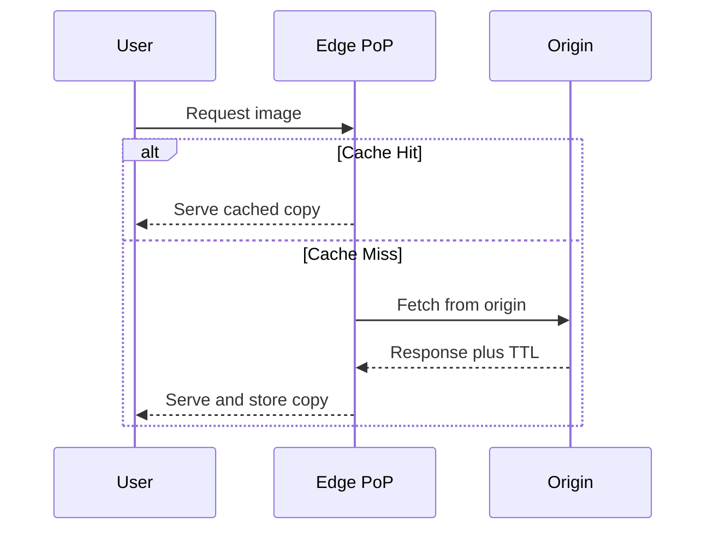

## Concept Overview

Light in fiber travels fast, but not fast enough. A round trip from Mumbai to a data center in Virginia costs 200ms or more before your server does any work. A **Content Delivery Network (CDN)** attacks this problem by caching content in **edge locations** — data centers spread across the globe, called **Points of Presence (PoPs)** — so users fetch content from a server that is physically nearby.

The mental model: your **origin** server remains the source of truth, but the CDN keeps copies of responses at hundreds of edge locations. Most requests never reach the origin at all. This buys you three things at once: lower **latency** for users, dramatic **origin offload**, and a shock absorber for **traffic spikes**.

CDNs began as static-file caches (images, CSS, JavaScript, video) but modern CDNs also accelerate dynamic content and sit in front of entire applications.

## Request Flow: Edge, Hit, and Miss

When a user requests a file, DNS resolves the domain to the nearest PoP. What happens next depends on whether the edge already has the content.



- **Cache hit**: The edge serves the stored copy immediately. Latency is a few milliseconds; the origin sees nothing.
- **Cache miss**: The edge fetches from the origin, stores the response according to its **TTL**, and serves the user. The first user in each region pays the miss penalty; everyone after benefits.

The fraction of requests served from the edge is your **cache-hit ratio**, the single most important CDN metric. A 95% hit ratio means the origin handles only 5% of traffic.

```callout
{
  "type": "info",
  "content": "Many CDNs use tiered caching: edge PoPs that miss first check a regional shield cache before hitting the origin. This collapses many edge misses into one origin fetch and protects the origin further."
}
```

---

### Quiz: Request Flow

```quiz
{
  "question": "A user in Singapore requests an image that no one in Asia has requested before. What happens?",
  "options": [
    "The request fails because the edge has no copy",
    "The edge fetches the image from the origin, caches it, and serves it, so this user pays the miss latency",
    "The user is redirected to the origin server directly",
    "The CDN serves a lower quality placeholder until the image arrives"
  ],
  "correctAnswerIndex": 1,
  "explanation": "On a cache miss the edge acts as a proxy: it fetches from the origin, stores the response per its TTL, and serves it. Subsequent users in that region get fast cache hits."
}
```

```quiz
{
  "question": "Your CDN cache-hit ratio drops from 95% to 60%. What is the most direct consequence?",
  "options": [
    "Users are served stale content more often",
    "Origin traffic roughly increases eightfold, risking origin overload and higher latency for missed requests",
    "The CDN starts rejecting requests",
    "DNS resolution slows down globally"
  ],
  "correctAnswerIndex": 1,
  "explanation": "Origin load is proportional to the miss ratio. Going from 5% misses to 40% misses means 8x more requests reach the origin, which may not be provisioned for that."
}
```

---

## Real-World Use Cases

### 1. Global Product Launch
**Scenario**: A phone maker livestreams a launch event and publishes new product pages to a worldwide audience.
**Problem**: Tens of millions of users hit the site within minutes. The origin, sized for normal traffic, would collapse under the spike, and users far from the origin would see multi-second load times.
**Solution**: All static assets and the video stream are served from edge PoPs. The origin only renders a small set of pages that the CDN caches with short TTLs, so it sees a tiny fraction of the load regardless of audience size.

### 2. Video Streaming Platform
**Scenario**: A streaming service serves the same popular episodes to millions of viewers.
**Problem**: Video is enormous; serving every stream from central data centers would saturate backbone links and cost a fortune in egress bandwidth.
**Solution**: Video segments are cached at edge PoPs near viewers. Popular content achieves near-total hit ratios, keeping backbone traffic and origin egress minimal while startup latency stays low.

### 3. Absorbing a Traffic Attack
**Scenario**: A ticketing site is targeted by a volumetric DDoS attack ahead of a major sale.
**Problem**: The attack traffic would saturate the origin's network links long before the application even sees the requests.
**Solution**: Because the CDN is the public entry point, attack traffic lands on a globally distributed edge with massive aggregate capacity. Edges absorb and filter the flood; the origin, reachable only by the CDN, stays healthy.

---

## Pull vs Push CDNs

How does content get to the edge in the first place?

- **Pull (origin pull)**: The edge fetches content from the origin lazily, on first request. You change nothing about your publishing flow; the CDN populates itself.
- **Push**: You proactively upload content to the CDN's storage before anyone requests it. The origin may not even be involved at serve time.

| Dimension | Pull CDN | Push CDN |
| :--- | :--- | :--- |
| **Population** | Lazy, on first request | Proactive, at publish time |
| **First request latency** | Miss penalty for first user per PoP | Fast everywhere from the start |
| **Operational effort** | Minimal, just set cache headers | Must manage uploads and cleanup |
| **Best for** | Large or long-tail catalogs, frequently changing sites | Predictable releases like game patches or video launches |
| **Storage cost** | Only hot content stored at edges | Pay to store everything pushed |

Pull is the default for most websites. Push earns its complexity when you know exactly what will be hot, such as a game update that millions will download in the first hour.

## TTLs, Invalidation, and Cache Keys

### TTL and Purging
Each cached object carries a **TTL** set via `Cache-Control` headers. Long TTLs maximize hit ratio but risk serving **stale content** after a change. Two complementary tactics:

- **Versioned URLs**: Fingerprint assets like `app.3f9a2c.js` and cache them effectively forever. Deploying new code changes the URL, so there is nothing to invalidate.
- **Purging**: Explicitly tell the CDN to drop an object or a tagged group of objects. Essential for content that must change under a stable URL, like a corrected news article.

### Cache Keys and Normalization
The **cache key** decides which requests count as the same object, typically the URL plus selected headers or query parameters. Poorly chosen keys destroy hit ratios: if irrelevant query parameters like tracking tags are part of the key, one logical object fragments into thousands of cache entries. **Normalization** strips or sorts parameters and headers so equivalent requests share one entry.

```callout
{
  "type": "warning",
  "content": "Never let user-specific responses get cached under a shared key. If a page containing personal data is cached at the edge without proper cache key separation or private markers, one user's data can be served to another. Cache poisoning of this kind is a recurring production incident pattern."
}
```

### Dynamic Content Acceleration
Uncacheable responses like personalized API results still benefit from a CDN. Edges terminate TLS close to the user, keep warm, optimized connections to the origin, and route over the provider's private backbone. This routinely cuts hundreds of milliseconds even when nothing is cached.

---

## Design Strategies & Trade-offs

Deciding what to serve through the CDN and how aggressively to cache it is a trade-off exercise:

- **Long TTL vs freshness**: Fingerprinted assets get year-long TTLs; HTML gets seconds-to-minutes TTLs or explicit purge-on-publish.
- **Hit ratio vs granularity**: More precise cache keys mean more correct but more fragmented caching. Normalize aggressively, vary only on what changes the response.
- **Cost vs offload**: CDN egress costs money too, but usually less than origin bandwidth plus the servers needed to handle full load. Watch for surprises with huge, rarely reused objects where you pay CDN rates without hit-ratio benefits.
- **Availability**: Many CDNs can serve stale content when the origin is down, turning a full outage into a degraded-freshness event.

---

## Failure & Scale Considerations

- **Stale content incidents**: The classic CDN bug is a purge that did not propagate, leaving some PoPs serving old content. Prefer versioned URLs so correctness never depends on purge timing.
- **Low hit ratio traps**: Highly personalized responses, unnormalized query strings, or `Set-Cookie` headers on cacheable responses silently push traffic back to the origin. Monitor hit ratio per content type, not just globally.
- **Origin thundering herd**: When a popular object expires everywhere at once, thousands of edge misses can hit the origin simultaneously. Request coalescing at the edge and shield tiers mitigate this; the same failure family is covered in depth in [Advanced Caching: Patterns, Pitfalls & Scale](/system-design/module-3-core-building-blocks/caching-advanced).
- **Config blast radius**: A bad CDN configuration deploys globally in minutes. Treat CDN config like code: version it, canary it, and be able to roll back fast.

---

### Final Review

```match
{
  "question": "Match the CDN concept to its description",
  "pairs": [
    {
      "left": "PoP",
      "right": "Edge data center close to users"
    },
    {
      "left": "Cache-hit ratio",
      "right": "Fraction of requests served without touching the origin"
    },
    {
      "left": "Purge",
      "right": "Explicitly removing cached objects from edges"
    },
    {
      "left": "Cache key normalization",
      "right": "Making equivalent requests share one cache entry"
    }
  ]
}
```

```quiz
{
  "question": "A news site must update a breaking story instantly while keeping its images and CSS cached for months. Which combination achieves this?",
  "options": [
    "Short TTL on everything so all content stays fresh",
    "Long TTL on everything and purge the whole cache on each edit",
    "Fingerprinted URLs with long TTLs for assets, plus short TTLs or targeted purging for article HTML",
    "Push CDN for articles and pull CDN for images"
  ],
  "correctAnswerIndex": 2,
  "explanation": "Versioned asset URLs make long TTLs safe because a change produces a new URL. Article HTML lives at a stable URL, so it needs short TTLs or explicit purges to update quickly."
}
```
