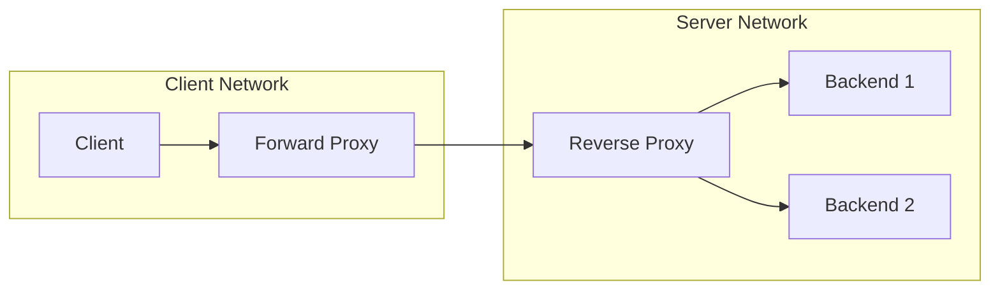

## Concept Overview

A **proxy** is an intermediary that sits in the request path and forwards traffic on behalf of someone else. Nearly every production request passes through at least one. The two kinds are distinguished by a single question: **whose side is the proxy on?**

- A **forward proxy** acts on behalf of **clients**. The client knows about the proxy and sends requests through it; the destination server sees the proxy, not the client. The forward proxy **hides the client**.
- A **reverse proxy** acts on behalf of **servers**. The client thinks it is talking to the real server, but is actually talking to the proxy, which forwards to backend servers of its choosing. The reverse proxy **hides the servers**.

One sentence to lock it in: a forward proxy is deployed by the client's organization to control outbound traffic; a reverse proxy is deployed by the server's organization to control inbound traffic.

## The Two Request Paths



In this picture the origin server never learns the client's identity (the forward proxy replaced it), and the client never learns which backend served it or how many exist (the reverse proxy concealed them). Both can be present on the same request, each serving its own side.

```callout
{
  "type": "info",
  "content": "Memory hook: forward proxies hide who is asking; reverse proxies hide who is answering. Every proxy interview question reduces to identifying which party the intermediary represents."
}
```

---

### Quiz: The Core Distinction

```quiz
{
  "question": "Which statement correctly captures the difference between a forward and a reverse proxy?",
  "options": [
    "A forward proxy handles HTTP while a reverse proxy handles TCP",
    "A forward proxy acts for clients and hides them from servers; a reverse proxy acts for servers and hides them from clients",
    "A forward proxy is hardware while a reverse proxy is software",
    "A forward proxy caches content while a reverse proxy cannot"
  ],
  "correctAnswerIndex": 1,
  "explanation": "The distinction is about representation, not protocol or technology. Both kinds can cache, filter, and operate at multiple layers; what differs is whose behalf they act on."
}
```

```quiz
{
  "question": "From the origin server's perspective, what does a forward proxy change about incoming requests?",
  "options": [
    "Requests arrive encrypted when they otherwise would not be",
    "Requests appear to come from the proxy's address rather than the individual clients behind it",
    "Requests arrive faster because the proxy is closer",
    "Nothing; forward proxies are invisible to servers"
  ],
  "correctAnswerIndex": 1,
  "explanation": "The forward proxy originates the outbound connection, so the server sees the proxy's identity. Many distinct clients behind one corporate proxy all appear as a single source."
}
```

---

## Real-World Use Cases

### 1. Corporate Egress Control (Forward Proxy)
**Scenario**: A bank must ensure its 10,000 employees and thousands of internal services only reach approved external destinations.
**Problem**: Regulations demand auditable outbound traffic, malware inside the network must be blocked from calling home, and data exfiltration must be detectable. Uncontrolled direct internet access makes all of this impossible.
**Solution**: All outbound traffic is forced through a fleet of forward proxies. The proxies enforce a destination allowlist, log every request for audit, scan content, and cache common downloads. Firewall rules block any direct egress that bypasses them.

### 2. TLS Termination and Routing at the Edge (Reverse Proxy)
**Scenario**: A SaaS platform runs 40 microservices but exposes one public domain.
**Problem**: Each service managing its own certificates, compression, and public exposure would multiply operational burden and attack surface; clients cannot be expected to know internal topology.
**Solution**: An Nginx reverse proxy tier terminates TLS once with centrally managed certificates, compresses responses, applies security filtering, and routes by path to internal services. Backends stay on a private network, unreachable from the internet.

### 3. Shielding During a Product Launch (Reverse Proxy)
**Scenario**: A gaming company launches a title and its store API gets hammered.
**Problem**: Much of the traffic is identical catalog reads; letting every request reach the application fleet would require massive overprovisioning for a one-week spike.
**Solution**: The reverse proxy caches catalog responses for a few seconds and coalesces concurrent identical requests, absorbing the bulk of the read load before it touches application servers.

---

## What Each Proxy Is Used For

### Forward Proxy Duties
- **Egress control**: Allowlist or denylist which external destinations internal clients may reach.
- **Anonymity**: The destination sees the proxy, not the individual client.
- **Content filtering**: Block malicious or non-compliant destinations and inspect outbound payloads.
- **Caching**: Repeated external fetches (package downloads, common assets) are served locally, saving bandwidth.

### Reverse Proxy Duties
- **Load balancing**: Distributing inbound requests across backends is itself a reverse proxy function; a load balancer is a reverse proxy specialized for distribution, covered in [Load Balancing: Distributing Traffic at Scale](/system-design/module-3-core-building-blocks/load-balancing).
- **TLS termination**: Decrypt once at the edge so backends handle plain traffic and certificates are managed in one place.
- **Compression and caching**: Offload CPU-heavy response compression and serve repeated responses without touching backends.
- **Security filtering**: Hide internal topology, drop malformed requests, apply firewall rules and rate limits before traffic reaches applications, as discussed in [Rate Limiting: Protecting Systems from Overload](/system-design/module-3-core-building-blocks/rate-limiting).

### Relationship to API Gateways and Load Balancers
Both are specializations of the reverse proxy pattern. A **load balancer** is a reverse proxy focused on distribution and health. An **API gateway** is a reverse proxy enriched with API-level concerns: authentication, per-key rate limiting, request transformation, and routing to many services behind one API. A CDN edge server, likewise, is a caching reverse proxy deployed globally. When you name any of these in a design, you are placing a reverse proxy with a particular job description.

---

## Design Strategies & Trade-offs

| Dimension | Forward Proxy | Reverse Proxy |
| :--- | :--- | :--- |
| **Acts on behalf of** | Clients | Servers |
| **Hides** | Client identity from servers | Server topology from clients |
| **Deployed by** | The client's organization | The server's organization |
| **Client awareness** | Client is configured to use it | Client is unaware, sees one endpoint |
| **Primary jobs** | Egress control, filtering, anonymity, caching | Load balancing, TLS termination, caching, security |
| **Typical software** | Squid, corporate secure web gateways | Nginx, HAProxy, Envoy |

Introducing either proxy buys capability at a cost:

- **Extra hop latency**: Every proxy adds a network hop and processing time, typically single-digit milliseconds, usually repaid many times over by caching and connection reuse, but real on latency-critical paths.
- **Single point of failure**: A proxy that all traffic traverses can take everything down with it. Redundant instances and health-checked failover are mandatory, exactly as with load balancers.
- **Operational complexity**: Another tier to configure, patch, monitor, and debug. Misconfigured routing or header handling at the proxy produces failures that look like application bugs.
- **Visibility shift**: Backends behind a reverse proxy see the proxy's address as the source unless forwarding headers convey the original client, which downstream logging and rate limiting must be taught to trust carefully.

```callout
{
  "type": "warning",
  "content": "Client-address forwarding headers can be spoofed by anyone who can reach your backends directly. Only trust them when set by your own proxy tier, and strip any client-supplied values at the edge, or rate limiting and audit logs become trivially forgeable."
}
```

---

## Failure & Scale Considerations

- **Redundancy first**: Run proxies in pairs or fleets behind a shared virtual IP or DNS entries. A single proxy instance in the critical path is an outage waiting for a reboot.
- **Scaling the tier**: Reverse proxies doing TLS termination and compression are CPU-bound and scale horizontally like any stateless fleet. Forward proxies with large caches benefit from consistent-hash-based cache affinity so each cached object lives on a predictable node.
- **Blast radius of config**: Proxy configuration changes affect all traffic at once. Version configs, validate before reload, and roll out canary-first.
- **Debugging through layers**: Each proxy hop rewrites connection metadata. Propagating request IDs at the first proxy and logging them at every tier is what keeps multi-hop request tracing possible.

---

### Final Review

```match
{
  "question": "Match the function to the proxy type that typically performs it",
  "pairs": [
    {
      "left": "Blocking employees from unapproved external sites",
      "right": "Forward proxy"
    },
    {
      "left": "Terminating TLS for a fleet of backends",
      "right": "Reverse proxy"
    },
    {
      "left": "Hiding which internal server handled a request",
      "right": "Reverse proxy"
    },
    {
      "left": "Making all outbound traffic appear to come from one address",
      "right": "Forward proxy"
    }
  ]
}
```

```quiz
{
  "question": "An architect says: our API gateway already does authentication, rate limiting, and routing, so it must be something fundamentally different from a reverse proxy. What is the accurate response?",
  "options": [
    "Correct, API gateways operate at a different network layer than proxies",
    "Correct, reverse proxies cannot route requests",
    "Incorrect, an API gateway is a reverse proxy specialized with API-level features layered on the same intermediary pattern",
    "Incorrect, an API gateway is actually a forward proxy for clients"
  ],
  "correctAnswerIndex": 2,
  "explanation": "The gateway receives requests on behalf of backend services and forwards them, which is exactly the reverse proxy pattern. Authentication, per-key limits, and transformation are features built on top, not a different architecture."
}
```
