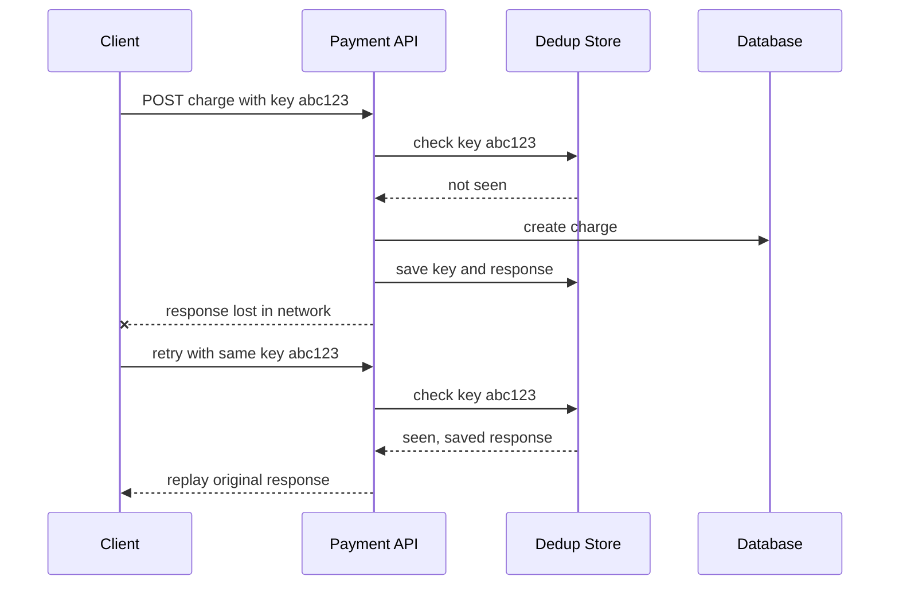

## Concept Overview

An operation is **idempotent** if applying it multiple times produces the same result as applying it once. `SET balance = 100` is idempotent; `balance = balance + 100` is not.

Why does this matter so much? Because in a distributed system, **retries are unavoidable**. When a client sends a request and the connection times out, it faces the **unknown-outcome problem**: did the server process the request and the response got lost, or did the request never arrive? The client cannot tell the difference. Its only options are to give up (risking a lost operation) or retry (risking a duplicate).

Idempotency resolves this dilemma: if the operation is safe to repeat, the client can always retry. This is why idempotency is a cornerstone of reliable APIs, payment systems, and message-driven architectures.

### Where Duplicates Come From

- **Timeouts with unknown outcomes**: the response is lost after the server did the work.
- **At-least-once delivery**: message brokers redeliver messages that were not acknowledged in time.
- **Client retries**: mobile apps on flaky networks, impatient users double-clicking Pay.
- **Network partitions**: a proxy retries a request the origin already handled.

---

## The Request Path: Where Idempotency Lives



### HTTP Method Semantics

HTTP bakes idempotency into its contract:

- **GET, HEAD**: safe and idempotent — reads change nothing.
- **PUT**: idempotent by contract — it replaces the resource with the given state; replaying a PUT leaves the same state.
- **DELETE**: idempotent — deleting an already-deleted resource is still deleted (the status code may differ, but the state does not).
- **POST**: **not** idempotent — two POSTs to a create endpoint mean two resources, two charges, two emails. This is why POST endpoints need explicit idempotency machinery.

```callout
{
  "type": "warning",
  "content": "Idempotent by contract does not mean idempotent by implementation. If your PUT handler also appends an audit event or increments a counter, replaying it is no longer harmless. The contract is a promise you must implement."
}
```

---

### Quiz: Foundations

```quiz
{
  "question": "A client sends a payment request and the connection times out before any response arrives. What does the client actually know?",
  "options": [
    "The payment definitely failed and can be safely resent",
    "The payment definitely succeeded and must not be resent",
    "Nothing certain, the request may or may not have been processed",
    "The server has crashed"
  ],
  "correctAnswerIndex": 2,
  "explanation": "This is the unknown-outcome problem. A timeout tells the client nothing about server-side state. Idempotency is what makes the retry option safe."
}
```

```quiz
{
  "question": "Which HTTP method is NOT idempotent by contract?",
  "options": [
    "PUT",
    "DELETE",
    "POST",
    "GET"
  ],
  "correctAnswerIndex": 2,
  "explanation": "POST typically creates a new resource per call, so replaying it duplicates the effect. GET reads, PUT replaces to a fixed state, and DELETE converges to the deleted state."
}
```

---

## Real-World Use Cases

### 1. The Double-Charge at Checkout
**Scenario**: An e-commerce checkout calls a payment provider to charge a card. The provider processes the charge, but the response times out on the way back.
**Problem**: The checkout service retries. Without protection, the customer is charged twice — a support ticket, a refund, and lost trust.
**Solution**: The checkout service generates an **idempotency key** (a UUID) per payment attempt and sends it in a header. The provider stores the key with the charge result; the retry with the same key returns the original result instead of charging again.

### 2. At-Least-Once Order Events
**Scenario**: An order pipeline consumes order-placed events from Kafka to reserve inventory.
**Problem**: A consumer crashes after reserving inventory but before committing its offset. On restart, the broker redelivers the event, and inventory would be reserved twice.
**Solution**: The consumer records processed event ids in the same database transaction as the inventory change. On redelivery, the id is already present and the event is skipped — **at-least-once delivery plus idempotent processing**.

### 3. Infrastructure Provisioning
**Scenario**: A deployment tool creates cloud resources via API calls that occasionally time out.
**Problem**: Retrying create calls could spawn duplicate servers, load balancers, and bills.
**Solution**: Every create call carries a client token. The cloud API deduplicates on the token, so the retry returns the already-created resource instead of a clone.

---

## Mechanics: Idempotency Keys

The general-purpose pattern for non-idempotent operations like POST:

1. **Client generates the key** — a UUID per logical operation (per payment attempt, not per HTTP request). Retries reuse the key; a genuinely new operation gets a new key.
2. **Server checks a dedup store** — before executing, look up the key in a fast store (Redis or a database table with a unique index on the key).
3. **Execute and record atomically** — perform the operation and persist the key together, so a crash between the two cannot leave them inconsistent.
4. **Replay the response** — on a duplicate, return the **stored original response** (same status, same body), so the client cannot tell it was a retry.
5. **Expire keys with a TTL** — keys typically live 24 to 72 hours, long enough to cover realistic retry windows without growing the store forever.

### Concurrent Duplicates

A user double-clicks Pay and two requests with the same key arrive **at the same time** — both check the store, both see nothing, both charge. The fix is to **lock on the key**: the first request atomically inserts the key in a pending state (an INSERT hitting a unique constraint, or a Redis SET with NX). The second request fails the insert and either waits for the result or returns a request-in-progress response.

## Mechanics: Database-Level Techniques

Sometimes the database itself can enforce idempotency without a separate dedup store:

- **Unique constraints**: a unique index on order id in the payments table means a duplicate insert fails loudly instead of double-charging. The application catches the violation and treats it as already done.
- **Upserts**: insert-or-update semantics converge to the same final row no matter how many times they run, ideal for set-this-value operations.
- **Conditional writes (compare-and-swap)**: update only if the record is still in the expected state, for example update status to SHIPPED only where status equals PAID. A replay finds the condition false and changes nothing. DynamoDB conditional writes and SQL WHERE clauses on the previous state both implement this.

### Why Exactly-Once Delivery Is a Myth

No network protocol can guarantee a message is **delivered and processed exactly once** across machines that can crash and links that can fail — an acknowledgment can always be lost after processing, forcing a resend. What production systems achieve instead is **at-least-once delivery plus idempotent processing**, which yields **effectively-once outcomes**. The duplicates still arrive; they just stop mattering.

---

## Design Strategies & Trade-offs

| Technique | Where Enforced | Best For | Cost |
| :--- | :--- | :--- | :--- |
| **Idempotency keys** | API layer plus dedup store | POST endpoints, payments, external APIs | Extra store, key lifecycle, response persistence |
| **Unique constraints** | Database | Create-once records with a natural id | Must handle violation errors gracefully |
| **Upserts** | Database | Set-state operations, config, profiles | Wrong for increments or append-style logic |
| **Conditional writes** | Database | State machines, status transitions | Requires modeling valid state transitions |
| **Processed-event table** | Consumer plus database | Message and event consumers | One extra write per event, table growth |

---

## Failure & Scale Considerations

- **The dedup store is a dependency.** If Redis holding your keys goes down, you must choose: fail closed (reject requests, safe but unavailable) or fail open (process without dedup, available but risking duplicates). Payments fail closed.
- **TTL versus retry window.** If keys expire after 24 hours but a batch job retries a stuck payment after 3 days, the key is gone and the duplicate goes through. Align TTLs with the longest realistic retry horizon.
- **Same key, different payload.** A client bug may reuse a key with a changed amount. Store a hash of the request and reject mismatches instead of silently replaying the old response.
- **Idempotency is per boundary.** An idempotent API that sends a non-idempotent email on every attempt still spams users on retries. Every side effect needs its own dedup story.

---

### Final Match & Quiz

```match
{
  "question": "Match the mechanism to its role in safe retries",
  "pairs": [
    {
      "left": "Idempotency key",
      "right": "Client-generated id that lets the server dedup requests"
    },
    {
      "left": "Response replay",
      "right": "Returning the stored original result on a duplicate"
    },
    {
      "left": "Conditional write",
      "right": "Update only if the record is in the expected state"
    },
    {
      "left": "Key TTL",
      "right": "Bounds how long dedup memory is kept"
    }
  ]
}
```

```quiz
{
  "question": "Two requests with the same idempotency key arrive simultaneously. Both check the dedup store before either has written. What prevents a double execution?",
  "options": [
    "TTL expiry on the key",
    "Atomically claiming the key first, via a unique-constraint insert or Redis SET with NX, so the loser backs off",
    "Returning HTTP 429 to all duplicate requests",
    "Using GET instead of POST"
  ],
  "correctAnswerIndex": 1,
  "explanation": "Check-then-act is a race. The claim on the key must be a single atomic operation; the request that loses the race waits for or reads the winner's result instead of executing again."
}
```
