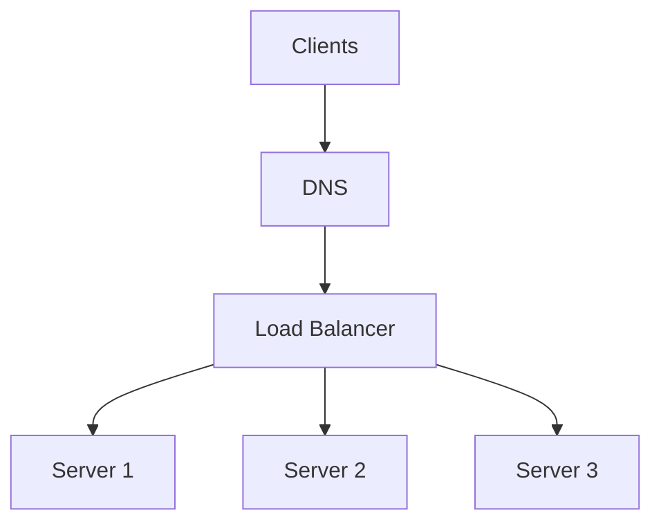

## Concept Overview

A single server, no matter how powerful, has a ceiling. When traffic outgrows one machine, you scale **horizontally** by adding more servers, and immediately face a new question: which server should handle each incoming request? A **load balancer** answers that question. It sits in front of a fleet of servers and distributes incoming traffic across them.

Load balancing delivers three core benefits:

1. **Scalability**: Add servers to the pool and the balancer spreads traffic across them, letting capacity grow linearly with the fleet.
2. **Availability**: If a server dies, the balancer detects the failure and routes around it. Users never see the dead node.
3. **Zero-downtime deploys**: Drain traffic from one server, deploy new code, add it back, repeat. Rolling deployments are only possible because a balancer controls who receives traffic.

The load balancer becomes the single **entry point** for clients, decoupling the public address of your service from the private, ever-changing set of machines behind it.

## Where the Load Balancer Sits



### Layer 4 vs Layer 7

Load balancers operate at different layers of the network stack, and the layer determines what information they can use to route.

- **L4 (Transport layer)**: Routes based on IP addresses and TCP/UDP ports only. It never inspects the request content. Extremely fast, low overhead, but blind to what the request actually is.
- **L7 (Application layer)**: Terminates the HTTP connection and inspects the request itself — URL path, headers, cookies, method. This enables smart routing (send `/video` requests to the video fleet, `/api` to the API fleet), but costs more CPU per request.

Most production stacks use both: an L4 balancer at the edge for raw throughput, and L7 balancers (like Nginx or Envoy) closer to the services for content-aware routing.

```callout
{
  "type": "tip",
  "content": "In interviews, mention the L4 vs L7 distinction early. It signals you understand that 'load balancer' is not one thing: routing on TCP tuples and routing on HTTP paths are different tools with different costs."
}
```

---

### Quiz: Fundamentals

```quiz
{
  "question": "Which capability requires an L7 load balancer rather than an L4 load balancer?",
  "options": [
    "Distributing TCP connections evenly across servers",
    "Routing requests to different server pools based on the URL path",
    "Detecting that a server has stopped accepting connections",
    "Forwarding UDP packets to healthy backends"
  ],
  "correctAnswerIndex": 1,
  "explanation": "Path-based routing requires inspecting HTTP content, which only happens at Layer 7. L4 balancers see only IPs and ports."
}
```

```quiz
{
  "question": "A team wants to deploy new code with zero downtime. How does a load balancer make this possible?",
  "options": [
    "It caches responses so servers can restart unnoticed",
    "It compresses traffic so deployments finish faster",
    "It drains traffic from one server at a time so each can be updated while others serve requests",
    "It duplicates every request to both old and new versions"
  ],
  "correctAnswerIndex": 2,
  "explanation": "Rolling deployments work by removing servers from the pool, updating them, and re-adding them, while the balancer keeps sending traffic only to in-service nodes."
}
```

---

## Real-World Use Cases

### 1. Flash Sale Traffic Surge
**Scenario**: An e-commerce site expects 20x normal traffic during a flash sale.
**Problem**: A single application server handles roughly 5,000 requests per second; the sale will drive 80,000 per second. Vertical scaling cannot close that gap in time.
**Solution**: Scale the fleet to 20+ servers behind an L7 load balancer using **least connections**, so slower checkout requests do not pile up on unlucky servers. Auto-scaling adds servers as connection counts rise.

### 2. Regional Outage Failover
**Scenario**: A SaaS product runs in two regions for disaster recovery.
**Problem**: When the primary region degrades, users must be redirected within minutes, not hours, without anyone updating client configuration.
**Solution**: **DNS-level global load balancing** with health checks. When the primary region fails its checks, DNS answers begin pointing at the secondary region, and regional L4/L7 balancers handle distribution inside each region.

### 3. Mixed Workload Routing
**Scenario**: A video platform serves both lightweight API calls and heavy video uploads through one public domain.
**Problem**: Uploads hold connections open for minutes and starve the API fleet if both share servers.
**Solution**: An L7 balancer routes `/upload` traffic to a dedicated upload fleet and everything else to the API fleet, so the two workloads scale and fail independently.

---

## Load Balancing Algorithms

The algorithm decides which backend receives the next request. There is no universally best choice; each trades simplicity against awareness of real server load.

| Algorithm | How It Works | Strengths | Weaknesses |
| :--- | :--- | :--- | :--- |
| **Round Robin** | Rotate through servers in order | Simple, fair when servers and requests are uniform | Ignores server load and capacity differences |
| **Weighted Round Robin** | Rotate, but stronger servers get more turns | Handles heterogeneous fleets | Static weights go stale as load shifts |
| **Least Connections** | Send to the server with fewest active connections | Adapts to slow or long-lived requests | Needs connection tracking; connection count is a proxy, not true load |
| **Least Response Time** | Send to the server responding fastest | Reacts to real performance degradation | Requires continuous latency measurement |
| **IP Hash** | Hash the client IP to pick a server | Same client lands on the same server | Uneven distribution; breaks badly when servers change |
| **Consistent Hashing** | Hash keys onto a ring of servers | Adding or removing a server remaps only a small fraction of keys | More complex; still needs virtual nodes to balance well |

**Round robin** is the default for stateless, uniform workloads. **Least connections** wins when request durations vary widely. **Consistent hashing** matters when backends hold per-key state, such as caches, because it minimizes reshuffling when the fleet changes size — see [Hashing](/system-design/module-1-foundations-of-system-design/hashing) for the underlying mechanics.

## Health Checks: Knowing Who Is Alive

A balancer is only useful if it stops sending traffic to dead servers.

- **Active health checks**: The balancer periodically probes each backend, for example sending a request to a `/health` endpoint every few seconds. A server failing N consecutive checks is removed; passing M checks re-adds it.
- **Passive health checks**: The balancer watches real traffic. If a server starts returning errors or timing out on live requests, it is ejected. No extra probe traffic, but a real user must hit the failure first.

Production systems typically combine both: active checks catch total failures quickly, passive checks catch partial degradation that a shallow `/health` endpoint misses.

```callout
{
  "type": "warning",
  "content": "A shallow health check that only confirms the process is running can mark a server healthy while its database connections are exhausted. Deep health checks that verify critical dependencies catch this, but must be cheap enough to run every few seconds."
}
```

---

## Sticky Sessions and Their Downsides

**Sticky sessions** (session affinity) pin a client to one server, usually via a cookie or IP hash, so in-memory session state stays valid across requests.

The costs are significant:

- **Uneven load**: A few heavy clients can hotspot one server while others idle.
- **Fragile failover**: If the pinned server dies, that user's session is lost.
- **Blocked scaling**: Draining a server for deployment now destroys live sessions.

The stronger design is to make servers **stateless** and externalize session data to a shared store like Redis, as covered in [Advanced Caching Strategies in Distributed Systems](/system-design/module-1-foundations-of-system-design/caching). Reserve stickiness for legacy applications that cannot be changed.

---

## Failure & Scale Considerations

### The Balancer as a Single Point of Failure

Putting all traffic through one box creates an obvious risk: if the balancer dies, everything dies. Mitigations, in increasing scope:

1. **Redundant pairs**: Run two balancer instances in an active-passive or active-active pair sharing a virtual IP. If the active node fails, the standby takes over the IP within seconds.
2. **Fleet of balancers**: Run several balancer instances and distribute clients across them using DNS with multiple records.
3. **DNS-level and global load balancing**: Route users across regions based on health and geography, so even a full regional balancer outage redirects traffic elsewhere. Slower to converge because of DNS caching and TTLs — see [DNS](/system-design/module-1-foundations-of-system-design/dns).

### Capacity of the Balancer Itself

L7 balancers do real work per request: TLS termination, header parsing, routing rules. At very high throughput the balancer tier itself must be scaled horizontally and monitored like any other fleet. A common pattern is L4 at the edge fanning out to a horizontally scaled L7 tier.

---

### Final Review

```match
{
  "question": "Match the load balancing concept to its description",
  "pairs": [
    {
      "left": "Least Connections",
      "right": "Routes to the server with fewest active requests"
    },
    {
      "left": "Consistent Hashing",
      "right": "Minimizes key remapping when servers change"
    },
    {
      "left": "Passive Health Check",
      "right": "Detects failures by observing real traffic"
    },
    {
      "left": "Sticky Sessions",
      "right": "Pins a client to one server, hurting failover"
    }
  ]
}
```

```quiz
{
  "question": "Your load balancer fronts a fleet of cache servers where each key lives on exactly one node. You need to add capacity without invalidating most of the cache. Which routing approach fits best?",
  "options": [
    "Round robin, because it spreads load most evenly",
    "Least response time, because caches should be fast",
    "Consistent hashing, because adding a node remaps only a small fraction of keys",
    "IP hash, because clients should stick to one cache node"
  ],
  "correctAnswerIndex": 2,
  "explanation": "With consistent hashing, adding a node only moves the keys that now belong to it, preserving the vast majority of cached entries. A plain modulo or round robin scheme would scatter nearly every key."
}
```
