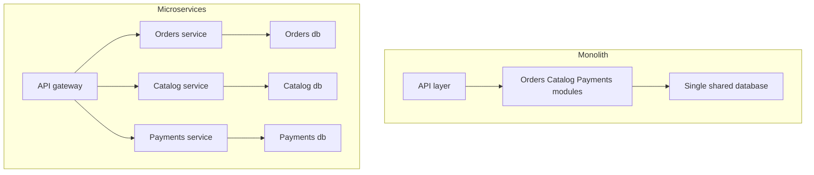

## Concept Overview

A **monolith** is an application built and deployed as a single unit: one codebase, one build, one deployable artifact, typically one database. **Microservices** split the system into independently deployable services, each owning a business capability and its own data, communicating over the network.

The interview trap is treating this as a maturity ladder — monolith for beginners, microservices for real engineers. It is not. It is a trade: microservices exchange **code complexity** for **distributed-systems complexity**, and that trade only pays off under specific conditions of team size, scale, and operational maturity. Many successful large systems are monoliths; many failed ones are microservices adopted too early.

There is also a middle ground that interviews reward you for knowing: the **modular monolith** — a single deployable with strictly enforced internal module boundaries (separate packages, no reaching into another module's tables, communication through defined interfaces). It captures much of the organizational discipline of microservices while keeping deployment and transactions simple, and it leaves clean seams to extract services from later.

---

## The Structural Difference



### What the Monolith Does Well

- **Simple deploys**: one artifact, one pipeline, one thing to roll back.
- **Easy refactoring**: moving a function across module boundaries is an IDE operation, not a cross-team API migration. Boundaries can be discovered and corrected cheaply — invaluable when the domain is still being learned.
- **No network between modules**: a module call is a function call — nanoseconds, no timeouts, no retries, no partial failure.
- **Cheap transactions**: one database means one ACID transaction can update orders, inventory, and payments atomically. In microservices that same operation becomes a distributed coordination problem.
- **Simple debugging**: one process, one log stream, one stack trace end to end.

### What Microservices Buy You

- **Independent scaling**: scale only the hot service — this is the Y-axis of [The Scale Cube: Three Dimensions of Scaling](/system-design/module-3-core-building-blocks/scale-cube). The search service gets 50 instances while billing keeps 3.
- **Independent deployment**: a team ships its service daily without coordinating a company-wide release train.
- **Team autonomy**: small teams own a service end to end — code, data, on-call — with the API as the contract between teams.
- **Fault isolation**: a memory leak in recommendations crashes recommendations, not checkout — if the boundaries and timeouts are done right.
- **Tech heterogeneity**: the ML service can be Python, the streaming pipeline JVM, the edge API Go — each choosing the right tool and upgrading on its own schedule.

```callout
{
  "type": "warning",
  "content": "The worst outcome is the distributed monolith: services that must be deployed together, share a database, and call each other synchronously in long chains. It combines the coupling of a monolith with the failure modes and operational cost of a distributed system, and it is where premature decomposition usually lands."
}
```

---

### Quiz: The Core Trade

```quiz
{
  "question": "A checkout must atomically update the order, the inventory, and the payment record. Why is this fundamentally easier in a monolith?",
  "options": [
    "Monoliths have faster CPUs available to them",
    "All three updates share one database, so a single ACID transaction covers them",
    "Monoliths do not need to validate input",
    "Microservices cannot write to databases directly"
  ],
  "correctAnswerIndex": 1,
  "explanation": "One database means one transaction with automatic all-or-nothing semantics. Once the data is split across services, you need sagas with compensating actions, and the failure modes multiply."
}
```

```quiz
{
  "question": "Which situation most strongly justifies paying the microservices complexity cost?",
  "options": [
    "A 6-person startup still discovering its product domain",
    "A 200-engineer organization where teams block each other on a shared release train and features have wildly different scaling needs",
    "A system whose modules are tangled and poorly understood",
    "A desire to put modern architecture on the engineering blog"
  ],
  "correctAnswerIndex": 1,
  "explanation": "Microservices are chiefly an organizational scaling tool. Many teams needing independent deploys, plus divergent scaling requirements, is the textbook justification. Small teams and unclear domains argue for a modular monolith."
}
```

---

## Real-World Use Cases

### 1. The Startup That Decomposed Too Early
**Scenario**: A 8-engineer fintech startup launches with 14 microservices because that is how big companies do it.
**Problem**: Every feature touches 4 services, so every engineer works across 4 repos, 4 pipelines, and a local docker-compose that takes 20 minutes to boot. Domain boundaries guessed on day one turn out wrong, and moving logic between services is a multi-week API migration. Velocity collapses.
**Solution**: Consolidate into a modular monolith with enforced module boundaries. Deploys drop to one pipeline, refactoring across boundaries becomes cheap again, and the module seams remain as future extraction points once team size actually demands it.

### 2. The Release Train at Breaking Point
**Scenario**: A retail platform's monolith is worked on by 150 engineers across 12 teams.
**Problem**: A single weekly release train means one team's failed migration rolls back everyone's work. Search needs 10x the compute of admin tooling but everything scales together. Incident blast radius is the whole business.
**Solution**: Extract services along team boundaries — search, checkout, catalog — using the strangler fig approach. Each team gains its own deploy cadence and scaling profile; checkout gets the strictest SLO and its own on-call.

### 3. The Strangler Fig Migration
**Scenario**: An insurance company must modernize a 15-year-old policy monolith that cannot be rewritten big-bang without existential risk.
**Problem**: A full rewrite would freeze features for two years, and history says big-bang rewrites routinely fail.
**Solution**: The **strangler fig** approach: place a routing facade in front of the monolith, build the new quoting service alongside it, and shift quoting traffic to the new service route by route. Each increment ships to production and can be rolled back. Over two years the monolith shrinks until only stable legacy paths remain — no freeze, no big bang.

---

## The Price of Microservices

The costs are systemic, and interviews reward naming them precisely:

- **Network failure modes**: every function call that becomes a network call gains latency, timeouts, retries, and partial failure. Deep synchronous call chains multiply tail latency and make availability the product of every hop.
- **Distributed transactions**: cross-service consistency requires **sagas** — sequences of local transactions with compensating actions to undo earlier steps when a later one fails. Correct compensation logic is genuinely hard.
- **Observability burden**: a single request now spans 8 services. Without distributed tracing, correlation ids, and centralized logging, debugging is guesswork. This tooling is a prerequisite, not a nice-to-have.
- **Operational overhead**: dozens of pipelines, dashboards, alert sets, and on-call rotations. Kubernetes, service discovery, and service mesh expertise become table stakes.
- **Data duplication**: services own their data and cache copies of each other's (often via events), so the same fact lives in several places, eventually consistent and occasionally contradictory.

---

## Design Strategies & Trade-offs

| Dimension | Monolith | Modular Monolith | Microservices |
| :--- | :--- | :--- | :--- |
| **Deployment** | One unit, simplest | One unit, simple | Many independent pipelines |
| **Refactoring across boundaries** | Trivial | Easy, boundaries enforced | Expensive API migrations |
| **Transactions** | Single ACID | Single ACID | Sagas, eventual consistency |
| **Scaling granularity** | Whole app | Whole app | Per service |
| **Team autonomy** | Low at scale | Medium | High |
| **Fault isolation** | Process-wide | Process-wide | Per service, if done right |
| **Ops maturity required** | Low | Low | High |

### Decision Framework

- **Team size**: under roughly 20 engineers, a modular monolith almost always wins — the coordination overhead microservices solve does not exist yet. Well beyond that, independent deploys start paying for their cost.
- **Domain clarity**: service boundaries are expensive to move. If the domain is still being discovered, keep boundaries cheap (modules); decompose once they have proven stable.
- **Scale requirements**: genuinely divergent scaling or isolation needs (a component needing 100x the compute, or a strict availability tier) justify extraction — of that component, not necessarily everything.
- **Operational maturity**: without CI/CD, tracing, and on-call discipline already in place, microservices will amplify weaknesses rather than scale strengths.

The pragmatic default: **start with a modular monolith, extract services when a specific team, scaling, or isolation pressure demands it, and use the strangler fig approach to get there incrementally.**

---

### Final Match & Quiz

```match
{
  "question": "Match the architecture concept to its description",
  "pairs": [
    {
      "left": "Modular monolith",
      "right": "Single deployable with enforced internal boundaries"
    },
    {
      "left": "Distributed monolith",
      "right": "Separate services still coupled in deploys and data"
    },
    {
      "left": "Strangler fig",
      "right": "Incrementally route traffic from legacy to new services"
    },
    {
      "left": "Saga",
      "right": "Local transactions with compensating actions across services"
    }
  ]
}
```

```quiz
{
  "question": "A company split its monolith into 20 services, but all 20 share one database and must be released together every two weeks. What have they built?",
  "options": [
    "A well-factored microservices architecture",
    "A modular monolith",
    "A distributed monolith, gaining network failure modes without gaining independent deployability",
    "An event-driven architecture"
  ],
  "correctAnswerIndex": 2,
  "explanation": "Shared data and lockstep releases mean the coupling of a monolith remains, while every internal call now crosses a network. This anti-pattern carries the costs of both styles and the benefits of neither."
}
```
