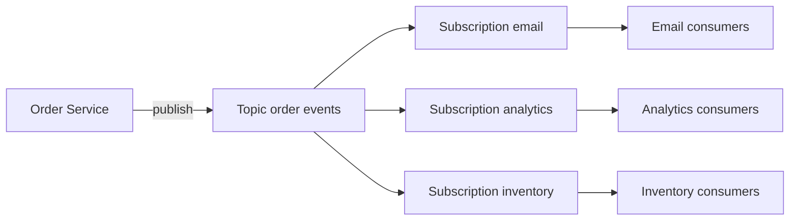

## Concept Overview

In synchronous **request-response**, a caller invokes a service and blocks until it answers. The caller must know who to call, the callee must be up right now, and the caller's latency includes everyone downstream. Chain five services together and your availability is the product of all five.

**Asynchronous messaging** breaks that coupling. A producer emits a message to an intermediary — a **broker** — and moves on. Consumers process it when they are ready. Producer and consumer no longer need to know each other, be online at the same time, or run at the same speed. The broker absorbs bursts, and a slow consumer no longer slows the producer.

**Publish-subscribe (pub/sub)** is the messaging pattern where producers publish events to a named **topic** and every interested subscriber receives its own copy. Compare that with a **point-to-point queue**, where each message is consumed by exactly one worker:

| Aspect | Point-to-Point Queue | Pub/Sub Topic |
| :--- | :--- | :--- |
| **Delivery** | Each message to exactly one consumer | Each message to every subscription |
| **Purpose** | Distribute work among workers | Broadcast events to many systems |
| **Adding a consumer** | Splits the work further | Adds a new independent copy of the stream |
| **Coupling** | Producer knows a work queue exists | Producer knows nothing about subscribers |
| **Typical example** | Image-resize job queue | Order-placed event feeding email, analytics, inventory |

---

## Core Components



- **Publishers** emit events to a topic without knowing who listens.
- **Topics** are named channels managed by the **broker** (Kafka, RabbitMQ, Google Pub/Sub, Amazon SNS with SQS).
- **Subscriptions** give each downstream system its own cursor into the stream — email, analytics, and inventory each get every order event.
- **Consumer groups** let one subscription scale out: multiple instances of the inventory service share a group, and the broker splits the topic's partitions among them so each event is processed once **within** the group while every group still gets the full stream.

### Delivery Semantics

- **At-most-once**: fire and forget. No retries, so no duplicates — but messages can vanish. Acceptable for metrics ticks, disastrous for orders.
- **At-least-once**: the broker redelivers until a consumer acknowledges. Nothing is lost, but crashes between processing and acknowledging produce **duplicates**. This is the practical default.
- **Exactly-once**: every message processed once, no loss, no duplicates. Genuinely hard across process boundaries, because an acknowledgment can always be lost after the work was done, forcing a redelivery. Broker features can get close within their own ecosystem, but the moment a consumer touches an external system, the robust answer is **at-least-once delivery plus idempotent consumers** — dedup on an event id so redeliveries are harmless. See [Idempotency: Designing Safe Retries](/system-design/module-3-core-building-blocks/idempotency).

```callout
{
  "type": "warning",
  "content": "Design every consumer as if it will receive duplicates, because under at-least-once delivery it eventually will. Idempotent processing is not an optimization in event-driven systems, it is a correctness requirement."
}
```

---

### Quiz: Foundations

```quiz
{
  "question": "Three teams need to react to an order-placed event: email, analytics, and inventory. Which setup ensures all three receive every event?",
  "options": [
    "One shared queue that all three services consume from",
    "A pub/sub topic with a separate subscription per team",
    "Three synchronous API calls from the order service",
    "A single consumer group containing all three services"
  ],
  "correctAnswerIndex": 1,
  "explanation": "A shared queue or a single consumer group would split messages among consumers, so each event reaches only one team. Separate subscriptions each get a full copy of the stream. Synchronous calls would couple order placement to all three systems' availability."
}
```

```quiz
{
  "question": "Why is exactly-once processing across a broker and an external database so difficult?",
  "options": [
    "Brokers cannot store messages durably",
    "The acknowledgment can be lost after the work is done, so the broker must redeliver, creating a potential duplicate",
    "Consumers cannot read messages in order",
    "Topics do not support more than one subscription"
  ],
  "correctAnswerIndex": 1,
  "explanation": "If a consumer writes to the database and crashes before acknowledging, the broker cannot know the work happened and redelivers. The practical fix is at-least-once delivery combined with idempotent consumers that dedup on an event id."
}
```

---

## Real-World Use Cases

### 1. Order Processing Pipeline
**Scenario**: An e-commerce checkout must trigger payment capture, inventory reservation, a confirmation email, and fraud scoring.
**Problem**: Calling all four synchronously makes checkout latency the sum of every step and its availability the product of every dependency — the email service having a bad day blocks purchases.
**Solution**: Checkout publishes a single order-placed event and returns immediately. Each downstream system consumes from its own subscription at its own pace. An outage in fraud scoring delays fraud scores, not orders; events queue up and are processed on recovery.

### 2. Fan-Out Notifications
**Scenario**: A social platform must notify millions of followers when a celebrity posts.
**Problem**: Writing millions of notification rows synchronously in the post request would take minutes and time out.
**Solution**: The post service publishes one post-created event. A fleet of notification workers in a consumer group consumes it, fans out to follower shards, and pushes notifications over minutes — while the author saw their post go live instantly.

### 3. Analytics Ingestion
**Scenario**: Every service in a company emits click, view, and transaction events for the data warehouse.
**Problem**: Point-to-point integrations from every service to the warehouse (and later to the ML platform, and the audit system) create an N-times-M integration mess.
**Solution**: All services publish to Kafka topics. The warehouse, the ML feature pipeline, and the audit system each subscribe independently. Adding a new consumer requires zero changes to any producer.

---

## Ordering, Failures, and Flow Control

### Message Ordering and Partitions

A high-throughput topic is split into **partitions**; the broker guarantees order only **within a partition**, not across the topic. The design lever is the **partition key**: route all events for one entity (one order id, one user id) to the same partition, and that entity's events stay in order while the topic scales horizontally. A poorly chosen key creates a hot partition — one shard doing all the work.

### Dead Letter Queues and Poison Messages

A **poison message** is one a consumer can never process — malformed payload, code bug, an entity that no longer exists. Under at-least-once delivery it is redelivered forever, blocking the partition and burning CPU. The standard defense is a **dead letter queue (DLQ)**: after N failed attempts, the broker shunts the message to a side channel for inspection, alerting, and replay after a fix. A growing DLQ is one of the most useful health signals an event-driven system has.

### Backpressure and Consumer Lag

**Consumer lag** is the gap between the newest published message and the last one processed — the single most important metric in a pub/sub system. Rising lag means consumers cannot keep up. Options: scale out the consumer group (up to the partition count), make processing faster or batched, or apply **backpressure** by throttling producers. A broker with retention absorbs temporary bursts gracefully; sustained lag growth means the system is structurally under-provisioned.

---

## Design Strategies & Trade-offs

### Event-Driven Patterns

- **Event notification**: the event is a thin pointer — order 123 was placed. Consumers call back to the source for details. Simple, but reintroduces synchronous coupling on the read path.
- **Event-carried state transfer**: the event carries the full data — order 123 with items, amounts, and address. Consumers keep their own local copy and never call back. More autonomy and resilience, at the price of bigger events and **data duplication** across services.
- **Event sourcing** (in brief): the event log itself becomes the system of record; current state is derived by replaying events. Powerful for audit and temporal queries, and a significant architectural commitment.

| Decision | Option A | Option B | Trade-off |
| :--- | :--- | :--- | :--- |
| **Distribution** | Queue, one consumer per message | Topic, every subscription gets a copy | Work sharing vs broadcast |
| **Delivery** | At-most-once | At-least-once plus idempotency | Possible loss vs duplicate handling |
| **Event payload** | Notification with id only | Full state in the event | Callback coupling vs duplication |
| **Ordering** | Single partition, strict order | Many partitions, per-key order | Throughput vs ordering scope |

### Eventual Consistency

The decoupling has a systemic consequence: downstream views are **eventually consistent**. For a few milliseconds (or during an incident, minutes), the search index may not show a placed order and the analytics dashboard trails reality. Event-driven design means accepting this lag where the business can tolerate it and keeping synchronous paths where it cannot — a customer must see their own order immediately; the recommendation model can wait.

---

### Final Match & Quiz

```match
{
  "question": "Match the pub/sub concept to its purpose",
  "pairs": [
    {
      "left": "Consumer group",
      "right": "Scales one subscriber horizontally across partitions"
    },
    {
      "left": "Dead letter queue",
      "right": "Isolates messages that repeatedly fail processing"
    },
    {
      "left": "Partition key",
      "right": "Keeps events for one entity in order"
    },
    {
      "left": "Consumer lag",
      "right": "Gap between published and processed messages"
    }
  ]
}
```

```quiz
{
  "question": "A consumer keeps crashing on one malformed event, which the broker redelivers endlessly, stalling the whole partition. What is the standard remedy?",
  "options": [
    "Switch the topic to at-most-once delivery",
    "Route the message to a dead letter queue after N failed attempts and continue processing",
    "Delete the topic and recreate it",
    "Add more partitions to the topic"
  ],
  "correctAnswerIndex": 1,
  "explanation": "This is a poison message. A DLQ policy caps redelivery attempts, sidelines the bad message for inspection and later replay, and unblocks the partition. Changing delivery semantics or partition counts does not address the stuck message."
}
```
