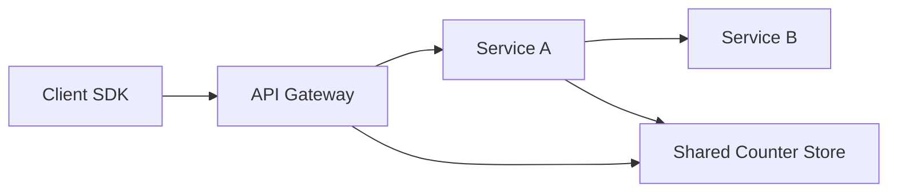

## Concept Overview

Every system has a capacity limit. **Rate limiting** enforces that limit deliberately: it caps how many requests a client, user, or API key may make in a given time window, rejecting or delaying the excess. Rather than letting overload decide who gets served (usually everyone, badly), you decide up front.

Why rate limit:

1. **Abuse prevention**: Brute-force login attempts, scraping, and spam all look like "too many requests from one identity."
2. **Fairness**: One aggressive client should not starve everyone else on shared infrastructure.
3. **Cost control**: Every request costs compute, bandwidth, and often money (think per-call pricing on downstream APIs).
4. **Protecting downstreams**: A rate limiter at the front keeps a burst from propagating into databases and internal services, preventing **cascading failure** where one overloaded component topples the next.

The limiter's core decision for each request is binary: within budget, allow; over budget, reject (typically with **HTTP 429 Too Many Requests**).

## Where to Enforce Limits



- **Client-side**: SDKs self-throttle and honor backoff hints. Polite but unenforceable; never rely on it alone.
- **API gateway**: The standard enforcement point. Centralized policy per API key or user, applied before requests consume backend resources.
- **Per-service**: Each internal service defends itself with its own limits, so a misbehaving internal caller cannot take it down. Defense in depth, since the gateway cannot know every service's true capacity.

Mature platforms enforce at all three layers with progressively tighter, service-specific budgets.

---

### Quiz: Placement

```quiz
{
  "question": "Why should internal services enforce their own rate limits even when the API gateway already limits external traffic?",
  "options": [
    "Gateway limits only apply to HTTPS traffic",
    "Internal callers and batch jobs can also overload a service, and only the service knows its own capacity",
    "It doubles the allowed request rate",
    "Gateways cannot return HTTP 429 responses"
  ],
  "correctAnswerIndex": 1,
  "explanation": "The gateway protects the perimeter, but overload often comes from inside: a buggy retry loop or a batch job. Per-service limits provide defense in depth calibrated to each service's real capacity."
}
```

---

## Real-World Use Cases

### 1. Login Brute-Force Defense
**Scenario**: An attacker scripts password guesses against a login endpoint.
**Problem**: Unlimited attempts make credential stuffing cheap, and the expensive password-hash verification burns CPU that legitimate users need.
**Solution**: Tight limits keyed on both account and source IP, for example 5 attempts per minute, with exponential lockout on repeat violations. Legitimate users almost never hit this; attackers hit it immediately.

### 2. Public API Monetization Tiers
**Scenario**: A maps API sells free, pro, and enterprise plans.
**Problem**: Plans are defined by request volume, so limits must be enforced precisely per API key, and paying customers expect bursts to be tolerated.
**Solution**: A **token bucket** per API key at the gateway: refill rate matches the plan's sustained quota, bucket size allows short bursts. Responses carry limit and remaining headers so clients can self-regulate.

### 3. Shielding a Fragile Downstream
**Scenario**: An order service calls a legacy inventory system that collapses beyond 500 requests per second.
**Problem**: During flash sales, upstream traffic far exceeds that. If the legacy system dies, orders fail entirely and its recovery takes minutes, amplifying the outage.
**Solution**: A **leaky bucket** in front of the legacy dependency smooths all bursts to a steady 450 requests per second, queueing brief excess and shedding the rest, so the fragile system never sees a spike.

---

## The Algorithms

Every algorithm answers the same question — has this identity exceeded its budget? — with different memory costs, burst behavior, and accuracy.

- **Fixed window**: Count requests per calendar window, for example per minute; reset at the boundary. Trivially cheap, but bursts at a boundary can allow nearly double the limit (100 requests at 12:00:59 plus 100 at 12:01:01).
- **Sliding window log**: Store a timestamp per request; count those within the trailing window. Perfectly accurate, but memory grows with request rate, which is exactly when you can least afford it.
- **Sliding window counter**: Keep counts for the current and previous fixed windows and weight the previous one by its overlap with the trailing window. Near-accurate at fixed-window cost; a popular production default.
- **Token bucket**: A bucket holds up to B tokens, refilled at R per second; each request spends one. Allows bursts up to B while enforcing a long-run rate of R. Two numbers to store per identity.
- **Leaky bucket**: Requests enter a queue drained at a constant rate; a full queue means rejection. Output is perfectly smooth regardless of input, ideal for protecting rate-sensitive downstreams, at the cost of queueing delay.

| Algorithm | Memory per Identity | Burst Handling | Accuracy |
| :--- | :--- | :--- | :--- |
| **Fixed window** | One counter | Poor, up to 2x at boundaries | Low at edges |
| **Sliding window log** | One timestamp per request | Precise | Exact |
| **Sliding window counter** | Two counters | Good | Approximate but close |
| **Token bucket** | Token count plus timestamp | Configurable bursts up to bucket size | High |
| **Leaky bucket** | Queue up to its cap | Smooths bursts into constant output | High |

**Token bucket** is the usual choice for user-facing APIs because tolerating short bursts matches real client behavior. **Leaky bucket** wins when the thing being protected needs a smooth arrival rate.

```callout
{
  "type": "tip",
  "content": "Remember the token bucket's two dials: refill rate sets the sustained throughput, bucket size sets the burst allowance. Being able to explain how you would tune each for a given SLA is a classic interview follow-up."
}
```

---

### Quiz: Algorithms

```quiz
{
  "question": "A client sends 100 requests at the very end of one minute and 100 more at the start of the next, against a limit of 100 per minute. Which algorithm lets all 200 through?",
  "options": [
    "Sliding window log",
    "Token bucket with bucket size 100 and refill 100 per minute",
    "Fixed window",
    "Leaky bucket draining at 100 per minute"
  ],
  "correctAnswerIndex": 2,
  "explanation": "Fixed window resets its counter at the boundary, so each burst of 100 lands in a different window and both pass. Sliding approaches see 200 requests in one trailing minute and reject the excess."
}
```

---

## Distributed Rate Limiting

One gateway instance can count in local memory. A fleet of instances cannot: a client whose requests spread across 10 nodes would get 10x its budget if each node counted independently.

- **Shared store**: Keep counters in a central store like Redis. Every node checks and increments the same counter, giving one global view. Costs a network round trip per decision and makes the store a scaling and availability concern.
- **Race conditions**: Read-then-write against a shared counter lets two nodes both read 99, both allow, and both write 100 against a limit of 100. The fix is making check-and-increment **atomic** at the store, using atomic increment operations or a server-side script that decides and updates in one step.
- **Local buckets with sync**: Each node enforces from a local bucket and reconciles with the global store asynchronously, or is pre-allocated a slice of the global budget. Decisions become memory-fast and the store leaves the hot path, at the price of temporary over-admission around bursts.

The trade-off is strictness versus latency and resilience. Most systems accept slight overshoot; billing-grade quotas demand atomic central counting.

```callout
{
  "type": "warning",
  "content": "Decide what happens when the counter store is unreachable. Fail-open preserves availability but drops protection exactly when the system may be under attack; fail-closed protects backends but turns a cache outage into a full API outage. This must be a deliberate choice, not an accident."
}
```

## Communicating Limits to Clients

A limiter that silently drops traffic breeds aggressive retries. Well-behaved APIs make limits observable:

- **HTTP 429 Too Many Requests** as the rejection status, clearly distinct from client errors and server faults.
- **Retry-After header** telling the client exactly how long to wait, preventing blind hammering.
- **Quota headers** on every response, conventionally reporting the limit, how much remains, and when the window resets, so clients can pace themselves before ever being rejected.

Clients should treat 429 with **exponential backoff plus jitter**; synchronized immediate retries from many clients are just a self-inflicted stampede.

## Rate Limiting vs Load Shedding vs Throttling

These get conflated in interviews; keep them distinct:

- **Rate limiting**: Per-identity budgets, enforced regardless of current system health. About fairness and contracts.
- **Load shedding**: A global overload response: when the system nears saturation, drop lower-priority work indiscriminately to keep the core alive. About survival, not fairness.
- **Throttling**: Slowing or queueing excess work rather than rejecting it, as the leaky bucket does. Degrades latency instead of failing requests.

A resilient system uses all three: rate limits for contracts, throttling to smooth bursts, and load shedding as the last line when everything else is exhausted.

---

## Failure & Scale Considerations

- **Limiter capacity**: The rate limiter handles every request, so it must be the most scalable component in the path. A limiter that adds 50ms per decision has become the bottleneck it was meant to prevent.
- **Hot keys in the counter store**: A single very active identity concentrates increments on one shard of the counter store, the same hot-key problem seen in [Advanced Caching: Patterns, Pitfalls & Scale](/system-design/module-3-core-building-blocks/caching-advanced).
- **Key choice matters**: Limiting by IP alone punishes users behind shared corporate NATs and misses attackers rotating IPs. Combine dimensions: API key, user account, IP, endpoint.
- **Retry amplification**: Aggressive client retries multiply load precisely during incidents. Retry-After plus jittered backoff on the client side is part of the rate limiting design, not an afterthought.

---

### Final Review

```match
{
  "question": "Match the mechanism to its defining behavior",
  "pairs": [
    {
      "left": "Token bucket",
      "right": "Allows bursts up to a cap while enforcing an average rate"
    },
    {
      "left": "Leaky bucket",
      "right": "Emits requests at a constant smooth rate"
    },
    {
      "left": "Load shedding",
      "right": "Drops low priority work when the whole system nears overload"
    },
    {
      "left": "Retry-After header",
      "right": "Tells a rejected client when to try again"
    }
  ]
}
```

```quiz
{
  "question": "Two gateway nodes sharing a Redis counter both read the value 99 against a limit of 100, and both admit a request. What is the correct fix?",
  "options": [
    "Lower the limit to 98 to leave a safety margin",
    "Make the check and increment a single atomic operation in the store, for example an atomic increment or server-side script",
    "Route all requests through one gateway node",
    "Switch from Redis to a SQL database"
  ],
  "correctAnswerIndex": 1,
  "explanation": "The bug is the non-atomic read-then-write. Performing the decision and the increment atomically at the store eliminates the race without sacrificing horizontal scale at the gateway tier."
}
```
