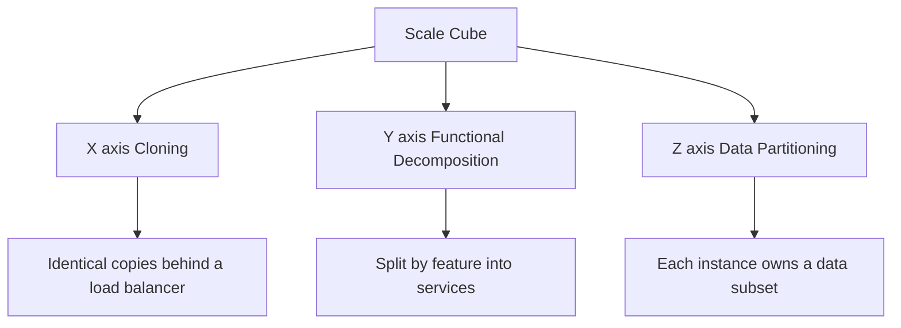

## Concept Overview

When a system starts buckling under load, "just add more servers" is rarely a complete answer. The **Scale Cube** is a mental model that breaks scaling into three independent dimensions, each solving a different bottleneck:

- **X-axis**: run multiple identical copies of the application (**cloning**) behind a load balancer.
- **Y-axis**: split the application by function into separate services (**functional decomposition**).
- **Z-axis**: split the data so each instance owns a subset (**data partitioning**, or sharding).

The power of the model is that the axes are **composable**. Real systems don't pick one; they combine all three as they grow. In an interview, the Scale Cube gives you a structured way to answer "how would you scale this?" instead of listing random techniques.

---

## The Three Axes



### X-Axis: Horizontal Duplication (Cloning)

Run N identical copies of the application behind a load balancer. Each copy can serve any request, and each typically talks to the same shared database. This is the cheapest axis to implement — no code changes, just more instances and a router in front (see [Load Balancing: Distributing Traffic at Scale](/system-design/module-3-core-building-blocks/load-balancing)).

- **Solves**: raw request throughput and availability (one instance dying is not an outage).
- **Limits**: every clone still carries the full codebase and the full working set. The shared database becomes the bottleneck, and caches on each clone are duplicated. It does nothing for growing **data volume** or growing **team size**.

### Y-Axis: Functional Decomposition

Split the application by **what it does**: a checkout service, a catalog service, a user service. Each service has its own codebase, deployment pipeline, and often its own datastore. This is the microservices axis (covered in depth in [Monolith vs Microservices](/system-design/module-3-core-building-blocks/monolith-vs-microservices)).

- **Solves**: independent scaling of hot features, team autonomy, fault isolation, targeted resource allocation (the search service can run on memory-heavy nodes while image processing runs on CPU-heavy nodes).
- **Limits**: introduces network calls between modules, distributed failure modes, and significant operational overhead. It does not help when a **single service's data** outgrows one database.

### Z-Axis: Data Partitioning (Sharding)

Run identical copies of the code, but each copy is responsible for only a **subset of the data**. A router directs requests based on a shard key: users A-M go to shard 1, users N-Z go to shard 2, or more commonly hash of user id modulo N.

- **Solves**: datasets and write throughput that exceed a single node, and blast-radius reduction (a bad shard affects only its slice of customers).
- **Limits**: cross-shard queries and transactions become expensive or impossible, resharding is operationally painful, and hot keys can leave one shard overloaded while others idle.

```callout
{
  "type": "tip",
  "content": "Quick mnemonic: X-axis scales traffic, Y-axis scales the team and the codebase, Z-axis scales the data. If you can name which resource is the bottleneck, you know which axis to reach for."
}
```

---

### Quiz: The Three Axes

```quiz
{
  "question": "Your stateless API servers are at 90% CPU, but the database is nearly idle and the dataset is small. Which axis addresses this most directly?",
  "options": [
    "Z-axis, shard the database by user id",
    "X-axis, add more identical API instances behind the load balancer",
    "Y-axis, split the API into microservices",
    "None, you must scale vertically first"
  ],
  "correctAnswerIndex": 1,
  "explanation": "The bottleneck is compute on stateless servers. Cloning them behind a load balancer is the cheapest fix; sharding or decomposition would add complexity without addressing CPU saturation."
}
```

```quiz
{
  "question": "X-axis cloning stops helping when which of the following becomes the bottleneck?",
  "options": [
    "Network bandwidth at the load balancer",
    "The shared database that all clones write to",
    "The number of available server instances",
    "DNS resolution time"
  ],
  "correctAnswerIndex": 1,
  "explanation": "Every clone hits the same primary database. Once writes saturate it, adding more clones only adds more contention. You need Z-axis partitioning or Y-axis decomposition with separate datastores."
}
```

---

## Real-World Use Cases

### 1. Flash-Sale Traffic Spike
**Scenario**: A ticketing platform announces a major concert and traffic jumps 40x in minutes.
**Problem**: The application tier saturates; requests queue and time out even though the database has headroom.
**Solution**: X-axis autoscaling. The platform runs stateless application instances in an autoscaling group behind a load balancer, cloning from 20 to 400 instances. No code change required because sessions live in a shared Redis, not on the instances.

### 2. One Team, One Deploy, Forty Engineers
**Scenario**: A food-delivery startup grew from 5 to 40 engineers all committing to one codebase.
**Problem**: Deploys are weekly and terrifying; a bug in the promotions module takes down order placement. Compute for the ML-heavy recommendations feature can't be scaled without scaling everything.
**Solution**: Y-axis decomposition. Orders, payments, and recommendations become separate services with independent deploys. The recommendations service scales on GPU nodes; the orders service stays lean.

### 3. The Database That Would Not Fit
**Scenario**: A messaging app stores billions of messages, far beyond what one primary database node can hold or serve.
**Problem**: Vertical scaling has hit the ceiling; even the largest instance cannot handle the write volume.
**Solution**: Z-axis sharding by conversation id. Each shard owns a slice of conversations, writes are spread across dozens of nodes, and a shard failure degrades only a fraction of chats.

---

## Design Strategies & Trade-offs

| Axis | Mechanism | Solves | Limits | Complexity |
| :--- | :--- | :--- | :--- | :--- |
| **X-axis** | Clone identical instances behind a load balancer | Request throughput, availability | Shared DB bottleneck, duplicated caches, no help for data or team growth | Low |
| **Y-axis** | Split by function into services | Team autonomy, independent deploys, fault isolation, targeted scaling | Network failure modes, distributed transactions, ops overhead | High |
| **Z-axis** | Partition data, each instance owns a subset | Data volume, write throughput, blast radius | Cross-shard queries, resharding pain, hot shards | High |

### How Real Systems Combine Axes

Consider an e-commerce platform evolving over five years:

1. **Year 1 — monolith on one box.** Traffic grows, so the team applies the **X-axis**: three clones of the monolith behind a load balancer, sessions moved to Redis. Cheap and effective.
2. **Year 2 — the shared database groans under read load.** Read replicas and caching buy time, but the codebase is now unmanageable for 30 engineers. The team applies the **Y-axis**: catalog, cart, checkout, and search are carved out as services.
3. **Year 4 — the orders service alone stores 2 billion rows.** No single node can take the write volume. The team applies the **Z-axis** inside that one service: orders are sharded by customer id across 16 database shards.

The end state uses all three axes at once: each Y-axis service is X-axis cloned for throughput, and the data-heavy services are Z-axis sharded. That layered combination is the normal shape of large production systems.

```match
{
  "question": "Match the scaling axis to its defining characteristic",
  "pairs": [
    {
      "left": "X-axis",
      "right": "Identical clones behind a load balancer"
    },
    {
      "left": "Y-axis",
      "right": "Split by business function into services"
    },
    {
      "left": "Z-axis",
      "right": "Each instance owns a subset of the data"
    },
    {
      "left": "Combined axes",
      "right": "Sharded services that are also cloned"
    }
  ]
}
```

---

## Failure & Scale Considerations

- **X-axis hides state bugs.** Cloning only works if instances are genuinely stateless. Sticky sessions or local file writes turn a clean X-axis scale-out into a correctness problem.
- **Y-axis multiplies failure modes.** Every service boundary is a network call that can time out. Without timeouts, retries, and circuit breakers, decomposition reduces availability instead of improving it.
- **Z-axis hot shards.** A celebrity user or a skewed shard key can concentrate load on one shard. Mitigations include hashing the key, splitting hot shards, or adding a cache in front.
- **Resharding is a project, not a config change.** Plan the shard key and shard count with growth headroom; moving live data between shards while serving traffic is one of the riskiest operations in production systems.
- **Premature Y and Z are expensive.** The X-axis is almost free; the other two axes cost engineering and operational maturity. Scale along the axis your actual bottleneck demands, not the one that looks most impressive.

---

### Final Quiz: Putting It Together

```quiz
{
  "question": "An e-commerce company has sharded its orders database by customer id, runs 12 clones of each service, and has separate catalog and checkout services. Which axes are in use?",
  "options": [
    "Only X-axis",
    "X-axis and Y-axis only",
    "All three axes",
    "Y-axis and Z-axis only"
  ],
  "correctAnswerIndex": 2,
  "explanation": "Cloning services is X-axis, splitting catalog from checkout is Y-axis, and sharding orders by customer id is Z-axis. Mature systems layer all three."
}
```
