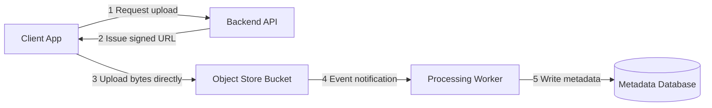

## Concept Overview

Databases excel at small structured records, but a 4 GB video, a database backup, or a billion log files fit none of their assumptions. **Blob storage** (binary large object storage, also called **object storage**) is purpose-built for this: it stores **objects** — arbitrary immutable byte payloads plus **metadata** — inside **buckets**, each addressed by a unique **key**.

The model is deliberately minimal:

*   **Object**: the data itself, from bytes to terabytes, treated as an opaque unit.
*   **Key**: the object's full name within its bucket, such as `videos/2024/06/intro.mp4`.
*   **Bucket**: a namespace holding objects, carrying access policies and lifecycle configuration.
*   **Metadata**: system fields like content type and size, plus custom tags.

Crucially, the namespace is **flat**. There are no real directories — `videos/2024/06/` is just a **key prefix** that tooling renders as pseudo-folders. Operations are whole-object: write it, read it (fully or by byte range), delete it. **No partial updates** — changing one byte means uploading a new version of the whole object. This simplicity is what lets object stores scale to trillions of objects with **eleven nines of durability** at pennies per gigabyte.

---

## Object vs File vs Block Storage

| Dimension | Block Storage | File Storage | Object Storage |
| :--- | :--- | :--- | :--- |
| **Unit** | Fixed-size blocks on a virtual disk | Files in hierarchical directories | Whole objects in a flat namespace |
| **Access** | Raw disk reads and writes by the OS | Shared filesystem protocols | HTTP API with get and put |
| **In-place updates** | Yes, any byte | Yes, any byte | No, replace whole object |
| **Scale ceiling** | One volume per host, terabytes | Cluster-bound, high coordination cost | Virtually unlimited |
| **Latency** | Sub-millisecond | Low milliseconds | Tens of milliseconds first byte |
| **Cost per GB** | Highest | High | Lowest |
| **Best fit** | Database volumes, boot disks | Shared home dirs, legacy apps | Media, backups, logs, data lakes |

Block storage is what your database sits on; file storage is a shared drive; object storage is where the unbounded, write-once bulk of your data belongs.

### Access Path: HTTP and Pre-signed URLs

Objects are read and written over **HTTP** — every object is effectively a URL guarded by access policies. This has a major architectural consequence: applications should not proxy large uploads and downloads through their own servers. Instead, the backend issues a **pre-signed URL** — a time-limited, cryptographically signed grant — and the client transfers bytes **directly** to or from the object store, keeping bulky traffic off the application fleet entirely. The full pattern is covered in [Direct-to-Object-Storage: Pre-signed URLs](/system-design/module-1-foundations-of-system-design/pre-signed-urls).



The companion pattern: keep the **bytes in the object store and the metadata in a database**. The database row for a video holds its title, owner, and the object key — never the video itself.

```quiz
{
  "question": "Why should a mobile app upload a 2 GB video via a pre-signed URL instead of POSTing it through the backend API?",
  "options": [
    "Pre-signed URLs compress the video automatically.",
    "The transfer goes directly to the object store, so gigabytes of traffic never occupy the application servers' bandwidth, memory, and connection slots.",
    "Backend APIs cannot handle files larger than 1 GB.",
    "Pre-signed URLs bypass all authentication for speed."
  ],
  "correctAnswerIndex": 1,
  "explanation": "Proxying large files through application servers ties up their connections and bandwidth on dumb byte-shuffling. A pre-signed URL is a scoped, expiring credential that lets the client talk to the object store directly, while the backend stays in control of who may upload what, and where."
}
```

---

## Real-World Use Cases

### 1. Video Platform Media Pipeline
**Scenario**: A video sharing platform ingests hundreds of thousands of uploads daily and streams to a global audience.
**Problem**: Petabytes of video cannot live in a database, and serving every view from origin storage would be slow and expensive.
**Solution**: Originals land in a bucket via pre-signed multipart uploads; transcoding workers write renditions back to another bucket; a CDN caches segments at the edge, hitting the bucket only on cache misses. The object store is the durable origin; the CDN absorbs read traffic.

### 2. Database Backups and Log Archives
**Scenario**: A company must retain nightly database snapshots and application logs for seven years for compliance.
**Problem**: Keeping years of cold data on database-grade disks costs an order of magnitude too much, and tape is operationally painful.
**Solution**: Backups and logs stream into a bucket where **lifecycle policies** demote them automatically: standard storage for 30 days, infrequent access for a year, archive class thereafter, deletion at seven years. **Versioning and immutability locks** prevent tampering or accidental deletion — including protection against ransomware that tries to encrypt backups.

### 3. Data Lake for Analytics
**Scenario**: An analytics team wants clickstream, transaction exports, and ML training data queryable by multiple engines.
**Problem**: Loading everything into one warehouse is costly and couples every team to one vendor and schema.
**Solution**: Raw data lands in a bucket as compressed columnar files organized by key prefix, such as `events/date=2024-06-01/`. Multiple query engines read the same objects in place — storage and compute scale independently, which is the defining economics of the data lake.

Other staples: static site hosting behind a CDN, user-generated content such as avatars and attachments, and ML artifact storage.

---

## Durability Engineering

Object stores advertise **eleven nines** — 99.999999999 percent annual durability — meaning that with 10 million objects stored, you statistically expect to lose one object per 10,000 years. Two mechanisms make this economical:

*   **Replication across zones**: every object is stored on multiple devices across multiple independent failure domains before the write is acknowledged. A disk, rack, or entire zone can fail with zero data loss.
*   **Erasure coding**: instead of 3 full copies costing 3x storage, the object is split into, say, 10 data fragments plus 4 parity fragments spread across 14 devices; any 10 of the 14 reconstruct it. That tolerates 4 simultaneous failures at 1.4x overhead instead of 3x — the trick that makes extreme durability cheap.
*   **Continuous scrubbing**: background processes checksum stored fragments and rebuild any silent corruption from parity.

```callout
{
  "type": "warning",
  "content": "Durability is not availability. Eleven nines means your data is essentially never lost, but the service still quotes availability around three to four nines, so reads can fail transiently. Design retries for availability blips, and remember durability does not protect you from your own deletes — that is what versioning and immutability locks are for."
}
```

```quiz
{
  "question": "Why do object stores use erasure coding rather than simply keeping three full copies of every object?",
  "options": [
    "Erasure coding makes reads three times faster.",
    "Erasure coding achieves equal or better failure tolerance at roughly 1.4x storage overhead instead of 3x, drastically cutting cost at scale.",
    "Full copies are illegal in some jurisdictions.",
    "Erasure coding removes the need for checksums."
  ],
  "correctAnswerIndex": 1,
  "explanation": "With 10 data plus 4 parity fragments, any 10 fragments reconstruct the object, tolerating four simultaneous device failures for 40 percent overhead. Triple replication tolerates two failures for 200 percent overhead. At exabyte scale that storage difference is the entire business model."
}
```

---

## Design Strategies & Trade-offs

### Storage Classes and Lifecycle Policies

Not all bytes deserve the same media. Object stores offer **classes** along a temperature spectrum — **hot** (frequent access, lowest latency, highest per-GB price), **infrequent access** (cheaper storage, per-retrieval fee), and **archive** (cheapest by far, retrieval taking minutes to hours). **Lifecycle policies** automate the demotion: transition objects between classes by age or access pattern, then expire them. The billing model inverts down the spectrum — cold classes charge little to hold data but meaningfully to retrieve it — so match class to real access frequency.

### Versioning, Immutability, and Multipart Upload

*   **Versioning**: a bucket can retain every version of an object; overwrites and deletes create new versions rather than destroying data, enabling recovery from bugs and mistakes.
*   **Immutability locks**: write-once-read-many retention prevents any deletion or overwrite for a set period — compliance-grade protection.
*   **Multipart upload**: large objects upload as independent parts, in parallel, with per-part retry; the store assembles them on completion. Essential above roughly 100 MB, mandatory for multi-gigabyte objects on unreliable networks.

### Limitations to Design Around

*   **No partial updates**: appending one line to a 1 GB object means rewriting the object. Write many small objects and compact them later instead.
*   **Listing is not a query**: enumerating keys by prefix is paginated and slow at millions of objects. Keep an index of keys in a database rather than listing buckets on hot paths.
*   **Per-request cost model**: you pay per operation as well as per GB. Millions of tiny objects can cost more in requests than in storage — batch small records into larger objects.
*   **First-byte latency**: tens of milliseconds makes object storage wrong for hot database-style reads; front it with a CDN or cache.

---

## Failure & Scale Considerations

*   **Hot prefixes**: request throughput scales per key prefix in some stores; sequential names like timestamps at the key head can concentrate load on one partition. High-entropy prefixes spread it.
*   **Availability blips**: transient errors and elevated latency happen; production clients use retries with exponential backoff and jitter, plus timeouts tuned for object size.
*   **Consistency edges**: modern object stores offer strong read-after-write for single objects, but listings may briefly trail heavy churn — avoid list-then-act logic on hot paths.
*   **Cost drift**: forgotten incomplete multipart uploads, unbounded old versions, and never-expiring logs silently accumulate. Lifecycle rules for abort, version expiry, and deletion are as much cost hygiene as data hygiene.

---

```match
{
  "question": "Match the blob storage concept to its purpose",
  "pairs": [
    {
      "left": "Erasure coding",
      "right": "High durability at far less overhead than full copies"
    },
    {
      "left": "Lifecycle policy",
      "right": "Automatic transition of aging objects to cheaper classes"
    },
    {
      "left": "Multipart upload",
      "right": "Parallel resumable transfer of large objects in parts"
    },
    {
      "left": "Pre-signed URL",
      "right": "Time-limited grant for direct client transfer"
    }
  ]
}
```

```quiz
{
  "question": "Your service writes 50 million 2 KB JSON events per day into an object store bucket and costs are exploding. What is the most likely cause and fix?",
  "options": [
    "Storage volume is too high; move everything to the archive class immediately.",
    "Per-request charges dominate at this object count; batch events into larger aggregated objects before writing.",
    "The bucket needs more replicas to spread cost.",
    "JSON is too verbose; switching to XML will fix the bill."
  ],
  "correctAnswerIndex": 1,
  "explanation": "Fifty million writes per day is request-cost territory: the events total only about 100 GB, but the put operations are billed per request. Aggregating events into fewer, larger objects, for example one object per stream per minute, cuts request count by orders of magnitude and also makes analytics reads far more efficient."
}
```
