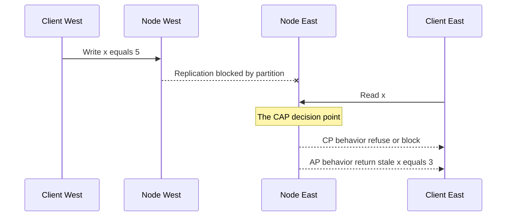

## Concept Overview

The **CAP theorem** states that a distributed data system can guarantee at most **two of three** properties when the network misbehaves. The precise definitions matter, because sloppy versions of CAP cause most of the confusion around it:

*   **Consistency (C)**: every read returns the most recent write or an error. Formally this is **linearizability** — the system behaves as if there were a single copy of the data and every operation took effect atomically at some instant.
*   **Availability (A)**: every request to a non-failed node receives a **non-error response**, without a guarantee that it reflects the latest write.
*   **Partition tolerance (P)**: the system keeps operating even when the network **drops or arbitrarily delays messages** between nodes.

The theorem is often misread as "pick any two." On a real network, **P is not optional** — switches fail, cables get cut, cross-region links congest, and long garbage-collection pauses are indistinguishable from partitions. Since partitions *will* happen, the real question is: **when a partition occurs, do you sacrifice consistency or availability?** Systems are therefore classified as **CP** or **AP** — a description of their behavior *during partitions*, not a permanent identity.

```callout
{
  "type": "info",
  "content": "The intuition in one line: if two halves of a cluster cannot talk, a node receiving a request must either refuse it (staying consistent but unavailable) or serve it from local, possibly stale state (staying available but inconsistent). The halves cannot coordinate, so there is no third option."
}
```

---

## Anatomy of a Partition

Consider two replicas in different zones when the link between them fails.



Node East cannot know whether newer writes exist on the other side. Its two options define the two system families:

*   **CP — refuse**: Node East returns an error or blocks until the partition heals. Reads are never stale, but part of the system is down for some clients. In practice, CP systems keep the **majority side** of a partition alive (via quorum or leader election) and take the minority side offline.
*   **AP — serve**: Node East answers from local state and accepts writes too. Everyone gets responses, but the two sides **diverge** and must reconcile after healing — via last-writer-wins, version vectors, or application-level merge logic.

---

```quiz
{
  "question": "Why is 'CA' not a realistic choice for a distributed system deployed across a real network?",
  "options": [
    "Because consistency and availability are mathematically incompatible at all times.",
    "Because partitions cannot be prevented, and a system that has not planned for them loses C or A or both anyway when one occurs.",
    "Because CA systems require infinite bandwidth.",
    "Because no database vendor implements CA mode."
  ],
  "correctAnswerIndex": 1,
  "explanation": "Choosing CA amounts to assuming the network never partitions. Real networks drop and delay messages, so P is a fact to tolerate, not a feature to trade away. The genuine engineering decision is which of C or A to give up while a partition is in progress."
}
```

---

## Real-World Use Cases

### 1. Distributed Lock and Coordination Service — CP
**Scenario**: A cluster uses a coordination service (ZooKeeper-style or etcd-style) to elect leaders and hold distributed locks.
**Problem**: If both sides of a partition could acquire the same lock, two nodes would both believe they are the leader — **split brain** — corrupting shared state.
**Solution**: The service requires a **majority quorum** to serve writes. The minority side refuses requests entirely. Availability is sacrificed on the minority side to guarantee at most one leader exists.

### 2. Shopping Cart — AP
**Scenario**: A global e-commerce site stores carts in a Dynamo-style database across regions.
**Problem**: During a partition, refusing cart writes means shoppers cannot add items — direct, measurable revenue loss. A briefly stale or duplicated cart item costs almost nothing.
**Solution**: Every replica accepts writes during the partition. On healing, divergent carts are **merged** — the classic resolution keeps the union of items, and the customer removes any extra at checkout.

### 3. Banking Core Ledger — CP
**Scenario**: A payments ledger processes balance-affecting transactions across data centers.
**Problem**: Serving a stale balance during a partition could allow double-spending the same funds — an unacceptable correctness failure with regulatory consequences.
**Solution**: The ledger runs CP: transactions commit only through a quorum. During a partition, the minority side rejects transactions, and ATMs or apps show a temporary error rather than risk inconsistency. Note the contrast: the bank's *marketing pages* and *branch locator* are AP, because staleness there is harmless.

Other classic AP citizens: DNS-like naming systems (stale answers beat no answers) and social feeds (a delayed post is invisible to users as an inconsistency).

---

## Common Misconceptions

*   **"CAP means permanently choosing two of three."** No — the trade-off binds **only while a partition is in progress**. During normal operation a well-built system delivers both consistency and availability.
*   **"The C in CAP is the C in ACID."** No. CAP's C is **linearizability**, a recency guarantee about reads across replicas. ACID's C means transactions preserve application invariants such as constraint validity — an unrelated concept sharing a letter.
*   **"AP systems are always inconsistent."** No — they are consistent almost all the time and converge quickly; they simply *permit* staleness in exchange for uptime when the network fails.
*   **"CP systems are down during every partition."** Usually only the minority side is; the quorum side keeps serving both reads and writes.

```quiz
{
  "question": "A system is described as AP. What does this actually tell you?",
  "options": [
    "It never provides consistent reads under any circumstances.",
    "During a network partition, it continues serving requests at the cost of possibly returning stale data.",
    "It does not tolerate network partitions.",
    "It cannot support ACID transactions on a single node."
  ],
  "correctAnswerIndex": 1,
  "explanation": "CP and AP describe behavior during partitions only. An AP system stays responsive on both sides of a partition and reconciles divergence afterward. Under healthy network conditions it can be, and typically is, consistent."
}
```

---

## Design Strategies & Trade-offs

### PACELC: The Missing Half

CAP says nothing about the 99.9 percent of time when the network is healthy. The **PACELC** formulation completes the picture in plain language: **if** a **P**artition occurs, choose **A**vailability or **C**onsistency; **E**lse, choose lower **L**atency or stronger **C**onsistency. Even with a perfect network, strong consistency requires coordination round-trips (to a quorum or a leader, possibly cross-region), so it costs latency on *every* request. That everyday latency cost, not partition behavior, is why many systems default to relaxed consistency.

### Tunable Consistency: A Spectrum, Not a Switch

Quorum-replicated stores such as Cassandra and DynamoDB expose the trade-off as **per-request knobs**. With N replicas, a write acknowledged by W nodes and a read consulting R nodes give strong consistency when **R + W > N**, because read and write sets must overlap.

| Configuration with N equals 3 | Behavior | Posture |
| :--- | :--- | :--- |
| W = 3, R = 1 | Slow writes, fast strongly-consistent reads | Leans CP |
| W = 2, R = 2 | Balanced, strong via overlap | Leans CP |
| W = 1, R = 1 | Fastest, staleness possible | Leans AP |

The same database can run carts at W = 1, R = 1 and payment state at quorum — the CAP posture is chosen **per workload**, not per product. See [Consistency in Distributed Systems](/system-design/module-2-non-functional-requirements/consistency) for the full spectrum of consistency models.

### System Categories at a Glance

| System category | Partition behavior | Posture | Why |
| :--- | :--- | :--- | :--- |
| Coordination services | Minority side refuses requests | CP | Split brain is catastrophic |
| Banking core ledgers | Quorum side only commits | CP | Stale balances enable double spending |
| Dynamo-style KV stores | All sides accept writes, merge later | AP by default, tunable | Uptime and latency outweigh brief staleness |
| DNS-like naming systems | Serve cached, possibly stale answers | AP | A stale answer beats a failed resolution |
| Social feeds and carts | Serve and reconcile | AP | Divergence is cheap and mergeable |

```callout
{
  "type": "tip",
  "content": "Strong interview answers never say 'I will use an AP database.' They identify which operations need linearizability (payments, inventory decrement, uniqueness checks) and which tolerate staleness (feeds, carts, counters), then pick a posture per operation."
}
```

---

## Failure & Scale Considerations

*   **Partitions are frequently partial and asymmetric**: node A sees B but not C. Quorum logic must be exact — counting *acknowledgments*, not assumptions about who is reachable.
*   **Slowness is indistinguishable from partition**: timeouts define partitions in practice. Aggressive timeouts create false partitions and needless failovers; lax ones stretch inconsistency or downtime windows.
*   **Reconciliation is a real workload**: AP systems must budget for it — version vectors to detect conflicts, merge or last-writer-wins policies to resolve them, and anti-entropy or hinted handoff to converge replicas after healing.
*   **Client-side effects matter**: an AP read can travel *backwards in time* for a user whose requests hit different replicas. Session guarantees like read-your-writes and monotonic reads patch the worst of this without paying full linearizability costs.

---

```match
{
  "question": "Match the term to its meaning in the CAP context",
  "pairs": [
    {
      "left": "Linearizability",
      "right": "Reads reflect the latest write as if one copy existed"
    },
    {
      "left": "Split brain",
      "right": "Both partition sides act as leader and diverge"
    },
    {
      "left": "PACELC",
      "right": "Adds the latency versus consistency trade-off in normal operation"
    },
    {
      "left": "R plus W greater than N",
      "right": "Quorum overlap condition for consistent reads"
    }
  ]
}
```

```quiz
{
  "question": "Your product needs strongly consistent inventory decrements but highly available product page reads. What is the best architectural takeaway from CAP?",
  "options": [
    "Pick one CP database for everything, since inventory dominates.",
    "Pick one AP database for everything, since page views dominate.",
    "Apply CP semantics to inventory operations and AP semantics to page reads, using quorum knobs or separate stores per workload.",
    "Avoid distribution entirely so CAP does not apply."
  ],
  "correctAnswerIndex": 2,
  "explanation": "CAP postures apply per operation, not per company. Inventory decrement needs linearizability to prevent overselling; product pages tolerate staleness happily. Tunable quorums or polyglot storage let each workload sit at the right point on the spectrum."
}
```
