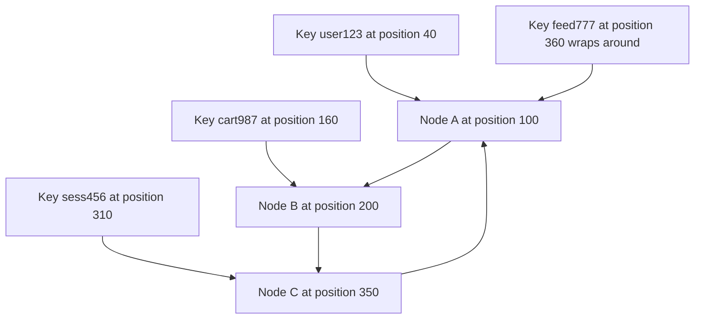

## Concept Overview

In [Distributed Hashing Strategy](/system-design/module-1-foundations-of-system-design/hashing) we saw why `Hash(Key) % N` fails in elastic clusters: changing `N` reshuffles nearly every key, flushing caches and hammering the database. **Consistent hashing** is the fix. It decouples key placement from the *number* of nodes by placing both keys and nodes on a shared **hash ring**, so membership changes disturb only the keys adjacent to the changed node.

The headline property: when a node joins or leaves a cluster of `N` nodes holding `K` keys, only about **K/N keys move** — the theoretical minimum — instead of nearly all of them.

This single idea underpins distributed caches, Dynamo-style databases like DynamoDB and Cassandra, and stateful request routing in load balancers.

---

## The Hash Ring

Imagine the output range of a hash function bent into a circle — say 0 to 2^32 - 1, where the maximum value wraps back to 0. Both **nodes and keys are hashed onto the same ring**:

1.  Each node is hashed (typically by its identifier or address) to one or more positions on the ring.
2.  Each key is hashed to a position on the same ring.
3.  A key is owned by the **first node encountered moving clockwise** from the key's position.



Lookups are cheap: keep node positions in a sorted structure and binary-search for the successor — `O(log M)` for `M` ring positions.

### Why Membership Changes Are Cheap

*   **Node C leaves**: only the keys in the arc between Node B and Node C move — they now continue clockwise to Node C's successor. Every other key's clockwise successor is unchanged.
*   **Node D joins** between A and B: Node D takes over only the keys in the arc between A and D, all previously owned by B. Nothing else moves.

Contrast with mod-N, where changing the divisor changes the answer for almost every key simultaneously.

```callout
{
  "type": "info",
  "content": "The insight worth stating in an interview: mod-N couples every key's placement to a single global number N, so any change to N is a global event. The ring makes placement a purely local relationship between a key and its nearest node, so changes have only local effects."
}
```

---

```quiz
{
  "question": "A consistent-hashing cluster has 10 nodes holding 1 million keys. One node is removed. Approximately how many keys must relocate?",
  "options": [
    "All 1 million keys",
    "About 500,000 keys",
    "About 100,000 keys",
    "Zero keys"
  ],
  "correctAnswerIndex": 2,
  "explanation": "Only the departed node's own share moves, roughly K/N = 1,000,000 / 10 = 100,000 keys, which flow to the clockwise successors. Under mod-N hashing, changing N from 10 to 9 would remap roughly 90 percent of all keys."
}
```

---

## Virtual Nodes

Placing each physical node at a single ring position has two problems: with few nodes, random positions produce **wildly uneven arcs** (one node may own triple the keyspace of another), and when a node leaves, its **entire load lands on one successor**.

**Virtual nodes (vnodes)** solve both. Each physical node is hashed to **many ring positions** — often 100 to 500 — under derived identifiers like `nodeA-0`, `nodeA-1`, and so on.

*   **Load smoothing**: with hundreds of positions per node, the law of large numbers evens out arc sizes; each physical node owns close to its fair share.
*   **Failure dispersion**: when a node dies, its many small arcs are absorbed by **many different successors**, spreading the recovered load across the whole cluster instead of doubling one neighbor's traffic.
*   **Weighted capacity**: heterogeneous hardware is handled by assigning vnode counts proportional to capacity — a machine with double the RAM simply gets double the vnodes and therefore roughly double the keys.

This is exactly how Cassandra distributes token ranges: each node owns many token ranges scattered around the ring rather than one contiguous slice.

```quiz
{
  "question": "What is the PRIMARY reason to assign each physical node hundreds of positions on the hash ring instead of one?",
  "options": [
    "It makes the hash function cryptographically stronger.",
    "It reduces the memory needed to store the ring.",
    "It statistically evens out load and spreads a failed node's keys across many successors instead of one.",
    "It eliminates the need for replication."
  ],
  "correctAnswerIndex": 2,
  "explanation": "A single position per node yields uneven arcs and dumps a failed node's entire keyspace onto one neighbor. Many small arcs per node average out to a fair share, and on failure the load disperses across many nodes. Vnodes also enable capacity weighting for mixed hardware."
}
```

---

## Replication on the Ring

The ring gives replication for free: instead of storing a key only on its successor, store it on the **next N distinct physical nodes** walking clockwise. With a replication factor of 3, the key's coordinator plus the next two distinct machines each hold a copy.

The word **distinct** matters with vnodes: consecutive ring positions may belong to the same physical machine, so the walk must skip duplicates (and, in rack-aware setups, prefer different racks or zones) to get real fault isolation. This "preference list" scheme is the placement backbone of Dynamo-style databases, and it pairs naturally with quorum reads and writes, where R + W > N gives read-your-writes behavior across the replicas.

---

## Real-World Use Cases

### 1. Distributed Cache Cluster Scaling
**Scenario**: A Memcached or Redis fleet fronting a relational database needs to grow from 20 to 25 nodes during a traffic ramp.
**Problem**: With mod-N routing, changing N remaps nearly every key. Hit rate collapses, and the resulting **cache avalanche** of misses can take down the database.
**Solution**: Client libraries place cache nodes on a consistent hash ring. Adding 5 nodes moves only about a fifth of the keys; the hit rate dips slightly and recovers within minutes.

### 2. Dynamo-Style Database Partitioning
**Scenario**: A DynamoDB-style or Cassandra-style store must spread petabytes across hundreds of nodes with no central directory of key locations.
**Problem**: A lookup table mapping every key to a node would itself be a scaling and availability bottleneck.
**Solution**: The ring position of a key *is* its location — any node can compute placement locally. Vnodes balance load, and the next-N-distinct-nodes rule places replicas. Rebalancing on membership change is incremental and bounded.

### 3. Sticky Routing in Load Balancers
**Scenario**: A WebSocket gateway fleet holds per-connection state; requests for a session must keep landing on the same backend as the fleet autoscales.
**Problem**: Round-robin breaks affinity, and mod-N re-homes nearly every session on each scale event, dropping connections en masse.
**Solution**: The load balancer hashes the session ID onto a ring of backends. Scale events re-home only the sessions in the affected arcs.

---

## Design Strategies & Trade-offs

| Dimension | Mod-N Hashing | Consistent Hashing | Lookup Directory |
| :--- | :--- | :--- | :--- |
| **Keys moved on node change** | Nearly all | About K/N | Fully controllable, per entry |
| **Lookup cost** | O of 1 | O of log M ring search | Directory query or cached map |
| **Load balance** | Even, if hash is uniform | Even with enough vnodes | Whatever the operator assigns |
| **Extra infrastructure** | None | Ring state on each router | Highly available directory service |
| **Placement flexibility** | None | Limited, hash decides | Total, can isolate hot keys |
| **Best fit** | Fixed-size clusters | Elastic caches and databases | Systems needing manual placement control |

The directory approach (used by some sharded systems) trades operational machinery — a strongly consistent metadata service — for total placement control. Consistent hashing sits in the sweet spot: near-minimal data movement with no central authority on the data path.

### Hotspots and Celebrity Keys

Consistent hashing balances the **keyspace**, not the **traffic**. One celebrity user's key still hashes to exactly one arc, and that node melts while others idle. Mitigations:

*   **Key salting**: split a hot key into `key#1` through `key#k` spread across the ring; readers pick a random suffix, writers update all or aggregate.
*   **Local caching**: cache the hot value at the client or edge so most reads never reach the ring.
*   **Read replicas for hot ranges**: serve the hot arc from its replica set, not just the primary owner.

```callout
{
  "type": "warning",
  "content": "Do not claim consistent hashing solves hot keys — interviewers probe this. It evens out how many keys each node owns, not how often each key is requested. A celebrity key needs salting, caching, or replica fan-out on top of the ring."
}
```

---

## Failure & Scale Considerations

*   **Ring membership agreement**: every router must agree on who is on the ring. If two clients hold different views, the same key routes to different nodes, causing stale reads or lost cache hits. Systems solve this with **gossip protocols** (Cassandra and Dynamo-style stores) or an external **configuration store** that publishes the authoritative ring.
*   **Flapping nodes**: a node that repeatedly fails and recovers triggers repeated data movement. Failure detection needs damping — mark nodes suspect via missed [Heartbeat](/system-design/module-1-foundations-of-system-design/heartbeat) signals before evicting them from the ring.
*   **Rebalance throttling**: moving K/N keys is minimal but not free; streaming that data must be rate-limited so recovery traffic does not starve foreground requests.
*   **Vnode count tuning**: more vnodes mean smoother balance but larger ring metadata and more ranges to track during repair. Hundreds per node is a common compromise.

---

```match
{
  "question": "Match the consistent hashing concept to its role",
  "pairs": [
    {
      "left": "Clockwise successor",
      "right": "The node that owns a key on the ring"
    },
    {
      "left": "Virtual nodes",
      "right": "Many ring positions per machine for load smoothing"
    },
    {
      "left": "Preference list",
      "right": "Next N distinct nodes holding a key's replicas"
    },
    {
      "left": "Gossip protocol",
      "right": "Decentralized agreement on ring membership"
    }
  ]
}
```

```quiz
{
  "question": "Your cluster mixes old servers and new servers with twice the capacity. How does consistent hashing accommodate this cleanly?",
  "options": [
    "Hash the new servers with a stronger hash function.",
    "Assign the new servers roughly twice as many virtual nodes as the old ones.",
    "Route all traffic to new servers and keep old ones as cold standbys.",
    "It cannot; consistent hashing requires identical hardware."
  ],
  "correctAnswerIndex": 1,
  "explanation": "Vnode count is a capacity weight. A machine with twice the vnodes owns roughly twice the keyspace and receives roughly twice the load, letting heterogeneous fleets share a single ring without any special routing logic."
}
```
