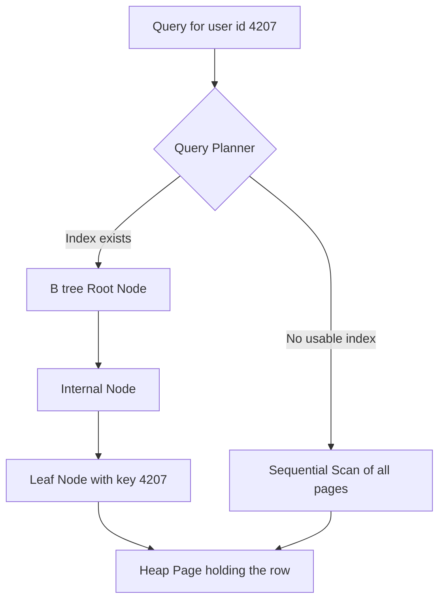

## Concept Overview

When a table grows to millions of rows, finding a single record by scanning every row becomes prohibitively slow. An **index** solves this: it is an **auxiliary data structure** that maps column values to the physical locations of rows, kept sorted (or hashed) so the database can jump directly to matching rows instead of reading the entire table.

The trade is fundamental: an index converts a **full-table scan** of `O(N)` disk reads into a lookup of `O(log N)` or better, but every index is a **second copy of data** that must be updated on every write. Indexes trade **write cost and storage** for **read speed**.

Think of it like the index at the back of a textbook. Without it, finding every mention of a term means reading every page. With it, you look up the term in a small sorted list and jump straight to the right pages. But every time the book is revised, the index must be revised too.

---

## Anatomy of an Indexed Lookup

Without an index, the query engine reads every data page of the table (a **sequential scan**). With an index, it traverses a small, balanced structure to find pointers to exactly the rows it needs.



### B-Tree and B+ Tree Indexes

The default index type in PostgreSQL, MySQL, and most relational engines is a **B-tree** (in practice, a B+ tree variant):

*   **Balanced**: Every leaf is the same depth, so every lookup costs the same small number of page reads — typically 3-4 for hundreds of millions of rows.
*   **Ordered**: Keys are stored sorted, so the index efficiently answers **range queries** (`WHERE created_at > '2024-01-01'`), prefix matches, and `ORDER BY` without a separate sort step.
*   **Wide nodes**: Each node holds hundreds of keys, keeping the tree shallow and disk-friendly.

### Hash Indexes

A **hash index** maps `hash(key)` to a row location. Lookups are `O(1)` on average — faster than a B-tree for exact matches — but the hash destroys ordering:

*   Only **equality lookups** (`WHERE email = '...'`) are supported.
*   **No range queries**, no sorted output, no prefix matching.

This is why B-trees dominate general-purpose databases while hash structures dominate in-memory key-value stores.

```callout
{
  "type": "tip",
  "content": "Interview heuristic: if the access pattern includes ranges, sorting, or prefix matching, you need an ordered structure like a B-tree. If it is strictly get-by-exact-key, a hash structure wins."
}
```

---

```quiz
{
  "question": "Why can a hash index NOT serve the query 'WHERE age BETWEEN 25 AND 30' efficiently?",
  "options": [
    "Hash indexes cannot store integer columns.",
    "Hashing destroys the ordering of keys, so adjacent values are scattered randomly across buckets.",
    "Hash indexes are only available in NoSQL databases.",
    "The query planner always ignores hash indexes."
  ],
  "correctAnswerIndex": 1,
  "explanation": "A hash function intentionally scatters similar inputs to unrelated outputs. Values 25, 26, 27 end up in unrelated buckets, so a range query would have to probe every possible value or fall back to a full scan. B-trees keep keys sorted, making ranges a simple ordered walk of leaf pages."
}
```

---

## Real-World Use Cases

### 1. Login by Email
**Scenario**: An authentication service with 200 million user rows must resolve `email -> user record` on every login.
**Problem**: A sequential scan reads gigabytes of data per login, pushing p99 latency into seconds and saturating disk I/O.
**Solution**: A **unique B-tree index** on `email` resolves each login in 3-4 page reads. The unique constraint doubles as data integrity, rejecting duplicate registrations at the storage layer.

### 2. Order History Pagination
**Scenario**: An e-commerce site shows a customer their orders, newest first, 20 at a time.
**Problem**: `WHERE customer_id = ? ORDER BY created_at DESC LIMIT 20` without an index forces the database to find all of the customer's orders and sort them on every page view.
**Solution**: A **composite index** on `(customer_id, created_at)`. The index groups each customer's orders together already sorted by time, so the database reads exactly 20 index entries and stops.

### 3. Write-Heavy Event Ingestion
**Scenario**: A telemetry pipeline inserts 50,000 events per second into an events table.
**Problem**: The team added seven indexes to speed up ad-hoc analyst queries. Each insert now updates seven B-trees, and ingestion throughput collapses to a fifth of what it was.
**Solution**: Drop the indexes to the two that serve real dashboards, and offload ad-hoc analytics to a replica or a columnar warehouse. Write-heavy tables should carry the **minimum viable set of indexes**.

---

## Composite, Covering, and Selectivity

### Composite Indexes and the Leftmost-Prefix Rule

A **composite index** on `(a, b, c)` is sorted by `a` first, then `b` within each `a`, then `c`. The consequence is the **leftmost-prefix rule**: the index can serve queries filtering on `(a)`, `(a, b)`, or `(a, b, c)` — but a query filtering only on `b` or `c` cannot use it, because entries for a given `b` are scattered throughout the index.

Column order matters: put equality-filtered columns first and range-filtered columns last.

### Covering Indexes

Normally an index lookup is two hops: find the entry in the index, then fetch the full row from the table. A **covering index** includes every column the query needs, so the second hop disappears — the query is answered entirely from the index. This is an **index-only scan**, and it can cut I/O dramatically for hot read paths.

### Selectivity and Cardinality

**Cardinality** is the number of distinct values in a column; **selectivity** is how sharply a filter narrows the result set. An index on `email` (every value unique) is highly selective and extremely useful. An index on `is_active` (two values) is nearly useless: matching half the table via an index is slower than just scanning it, because index access reads rows in random order.

```quiz
{
  "question": "You have a composite index on (country, city, signup_date). Which query CANNOT use this index effectively?",
  "options": [
    "WHERE country = 'IN'",
    "WHERE country = 'IN' AND city = 'Pune'",
    "WHERE city = 'Pune'",
    "WHERE country = 'IN' AND city = 'Pune' AND signup_date > '2024-01-01'"
  ],
  "correctAnswerIndex": 2,
  "explanation": "The index is sorted by country first. Rows for city 'Pune' are scattered across every country section, so filtering on city alone violates the leftmost-prefix rule and forces a full scan or a different index."
}
```

---

## Design Strategies & Trade-offs

### The Write Penalty

Every `INSERT` must add an entry to every index on the table. Every `UPDATE` of an indexed column must delete and re-insert the entry. Each of those is a B-tree traversal plus a page write, and occasionally a **page split** that cascades upward. A table with six indexes pays roughly seven structure updates per insert. Indexes also consume real storage — it is common for indexes to exceed the size of the table itself on heavily indexed schemas.

### When Indexes Hurt

*   **Write-heavy tables**: ingestion, queues, event logs — every index directly taxes throughput.
*   **Low-selectivity columns**: booleans, status enums with few values — the planner will rightly ignore the index.
*   **Over-indexing**: redundant indexes, such as `(a)` alongside `(a, b)`, pay full write cost for zero read benefit.

### B-Tree Engines vs LSM-Tree Engines

Relational engines update B-trees **in place**, optimizing for reads. Write-optimized stores like Cassandra and RocksDB use **LSM-trees**: writes go to an in-memory buffer and are flushed as sorted immutable files, merged in the background by **compaction**. LSM engines absorb far higher write rates but pay with **read amplification** (a read may check several files) and background compaction cost.

| Dimension | B-Tree Index | Hash Index | LSM-Tree Engine |
| :--- | :--- | :--- | :--- |
| **Exact-match lookup** | Fast, O of log N | Fastest, O of 1 | Fast, may check multiple files |
| **Range queries** | Excellent | Not supported | Good, via sorted files |
| **Write throughput** | Moderate, in-place updates | Moderate | Highest, sequential appends |
| **Read amplification** | Low | Low | Higher, mitigated by Bloom filters |
| **Typical home** | PostgreSQL, MySQL | In-memory stores | Cassandra, RocksDB |

### How the Planner Chooses

The **query planner** uses table statistics (row counts, value histograms) to estimate the cost of each access path. If a filter matches a tiny fraction of rows, the index scan wins. If it matches a large fraction, the sequential scan wins, because reading pages in order is much cheaper per row than random index-driven hops. Stale statistics are a classic cause of a "missing index" mystery where the index exists but is ignored.

```callout
{
  "type": "warning",
  "content": "An index the planner never chooses is pure cost: it slows every write and consumes storage while providing zero read benefit. Audit unused indexes periodically and drop them."
}
```

---

## Failure & Scale Considerations

*   **Index bloat**: B-trees fragment under heavy update and delete churn, growing larger and slower. Periodic rebuilds or vacuum-style maintenance reclaim the space.
*   **Blocking index builds**: creating an index on a large table can lock writes for minutes. Production systems use online or concurrent index builds, which are slower but non-blocking.
*   **Hot index pages**: monotonically increasing keys such as timestamps or sequential IDs make every insert land on the same rightmost leaf page, creating contention at high write rates.
*   **Replication lag**: indexes must be maintained on replicas too; index-heavy write bursts can widen lag. See [Replication](/system-design/module-1-foundations-of-system-design/replication) for how replicas apply changes.

---

```match
{
  "question": "Match the indexing concept to its definition",
  "pairs": [
    {
      "left": "Covering index",
      "right": "Contains all queried columns, avoiding the table fetch"
    },
    {
      "left": "Leftmost-prefix rule",
      "right": "Composite index usable only from its first column onward"
    },
    {
      "left": "Selectivity",
      "right": "How sharply a filter narrows the matching rows"
    },
    {
      "left": "Compaction",
      "right": "Background merging of sorted files in LSM engines"
    }
  ]
}
```

```quiz
{
  "question": "A table receives 40,000 inserts per second and has 8 indexes. Ingestion is too slow. What is the most effective first step?",
  "options": [
    "Add more indexes so the planner has more options.",
    "Identify and drop indexes that no production query actually uses.",
    "Switch every index from B-tree to hash.",
    "Disable the query planner."
  ],
  "correctAnswerIndex": 1,
  "explanation": "Each insert must update every index, so 8 indexes multiply the write cost roughly ninefold versus the bare table. Dropping unused indexes recovers write throughput immediately with no read-path regression, making it the highest-leverage and lowest-risk change."
}
```
