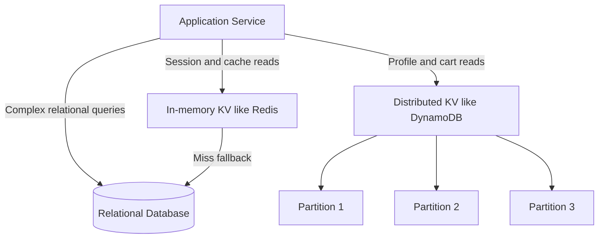

## Concept Overview

A **key-value store** is the simplest possible database model: an **opaque value** addressed by a **unique key**, with an API of essentially three operations — `get(key)`, `put(key, value)`, and `delete(key)`. The store does not interpret the value; it could be a JSON blob, a serialized object, a counter, or raw bytes. There are no joins, no schemas, and typically no multi-key transactions.

That austerity is the point. Because every operation touches exactly one key, the store can **partition data by key** across hundreds of nodes with no coordination between them. No joins means no cross-node query planning; no cross-row transactions means no distributed locking on the hot path. The result: single-digit-millisecond lookups at millions of requests per second — throughput that relational systems reach only with heavy effort.

The trade: you give up query power. If your access pattern is anything other than "I know the key," a KV store fights you.

---

## Where KV Stores Sit in the Architecture

KV stores appear in two distinct roles: as a **fast in-memory layer** in front of a system of record, and as the **system of record itself** for key-addressable data.



### In-Memory vs Persistent Distributed KV

*   **In-memory stores** (Redis, Memcached): data lives in RAM; reads and writes complete in microseconds to low milliseconds. Redis adds rich value types — lists, sets, sorted sets, hashes — and optional persistence; Memcached is a pure volatile cache. Capacity is bounded by RAM and data may be lost on crash, so these usually *augment* a durable store.
*   **Persistent distributed stores** (DynamoDB-style, Cassandra-style): data is replicated and durable on disk across many nodes, scaling to petabytes. They serve as the primary database for workloads whose access pattern is key-based, offering predictable latency at almost any scale.

Under the hood, keys are spread across partitions by hashing — typically the ring mechanics covered in [Consistent Hashing: Stable Data Distribution](/system-design/module-4-data-layer-and-storage/consistent-hashing), which is why these systems scale out by simply adding nodes.

```quiz
{
  "question": "What property of the key-value model is MOST responsible for its horizontal scalability?",
  "options": [
    "Values are stored in compressed binary format.",
    "Each operation addresses exactly one key, so data partitions cleanly across nodes with no cross-node joins or transactions.",
    "KV stores always keep all data in RAM.",
    "Keys are limited to 64 characters."
  ],
  "correctAnswerIndex": 1,
  "explanation": "Because a get or put touches a single key, the store can route each request to exactly one partition and nodes never coordinate on the hot path. Joins and multi-row transactions are what force relational databases into cross-node coordination, which is precisely what the KV model removes."
}
```

---

## Real-World Use Cases

### 1. Session Storage
**Scenario**: A stateless web fleet behind a load balancer must recognize logged-in users on every request.
**Problem**: Storing sessions in server memory breaks the moment a request lands on a different instance; querying the relational users table on every request crushes it under read load.
**Solution**: Sessions live in Redis keyed by session token, with a TTL matching the session lifetime. Any instance resolves any session in under a millisecond, and expiry is automatic.

### 2. Shopping Cart
**Scenario**: An e-commerce platform serves carts for tens of millions of concurrent shoppers, including through regional outages.
**Problem**: Cart writes must never be refused — a failed add-to-cart is lost revenue — and traffic spikes 20x during sales events.
**Solution**: Carts live in a Dynamo-style KV store keyed by `cart#customerId`, with multi-replica writes and eventual consistency. The cart is a single value fetched by a single key: no joins, no contention, and write availability survives node failures.

### 3. Feature Flags and Counters
**Scenario**: Every request evaluates dozens of feature flags; a gaming platform updates leaderboards on every match.
**Problem**: Both are trivial data shapes hit at extreme frequency — precisely where relational overhead is pure waste.
**Solution**: Flags are small values cached in Redis and read in microseconds. Leaderboards use Redis sorted sets, where increment-score and top-100 queries are single native operations.

Other classic fits: user profiles fetched by user ID, device shadow state in IoT platforms, and rate-limiter token buckets.

---

## Key Design

In a KV store, the key is your *only* index, so key design is schema design:

*   **Composite keys**: encode the access path directly, such as `user#42#orders#2024-06`. Stores with partition and sort keys split this into a partition key for placement and a sort key for ordered range reads within the partition.
*   **Namespacing**: prefix keys by entity type (`session#`, `cart#`, `flag#`) so types cannot collide and operational tooling can reason about categories.
*   **Avoiding hot keys**: a single celebrity key concentrates traffic on one partition. Salt hot keys across shards (`feed#popstar#0` through `feed#popstar#9`), cache them near the client, or aggregate writes before flushing.

```callout
{
  "type": "warning",
  "content": "Design keys around your queries, not your entities. In a KV store you cannot ask 'which carts contain product X' after the fact — if a lookup path is not encoded in a key somewhere, it effectively does not exist."
}
```

---

## Storage Engines and Consistency

### Engines, Briefly

*   **Hash-table engines**: an in-memory hash index over data, giving O of 1 point lookups — the design of Memcached, Redis, and Riak-style Bitcask engines. Blazing for exact match, no ordered scans.
*   **LSM-tree engines**: writes append to a memtable flushed as sorted immutable files, merged by background compaction — the design of Cassandra and RocksDB-based stores. Very high write throughput and ordered range scans within a partition, at the cost of some read amplification.

### Consistency Options

Replicated KV stores expose consistency as a dial rather than a fixed guarantee:

*   **Eventually consistent reads**: served by any replica; fastest and cheapest, may briefly return stale data.
*   **Strongly consistent reads**: routed through the leader or a quorum; a read overlapping the write set (R + W > N) always observes the latest write, at higher latency and cost.
*   **Per-request choice**: the same table can serve a cart read eventually and a checkout-time inventory read strongly.

```quiz
{
  "question": "A leaderboard tolerates scores that are a second stale, but checkout must read the latest inventory count. Using one quorum-replicated KV store with N equals 3, what is the right approach?",
  "options": [
    "Use strongly consistent reads everywhere to be safe.",
    "Use eventually consistent reads everywhere for speed.",
    "Read the leaderboard eventually consistent with R equals 1, and read inventory with quorum so R plus W exceeds N.",
    "Move both workloads to a relational database."
  ],
  "correctAnswerIndex": 2,
  "explanation": "Consistency is a per-request knob in quorum-replicated stores. Paying quorum latency on leaderboard reads wastes capacity; reading inventory eventually risks overselling. Matching the consistency level to each operation gets both speed and correctness."
}
```

---

## Design Strategies & Trade-offs

### Limitations to Design Around

*   **No rich queries**: no joins, aggregations, or ad-hoc filters over values. Any query not answerable by key must be precomputed into its own keyed record.
*   **Expensive scans**: enumerating all keys touches every partition — an operation to design out, not optimize.
*   **Secondary indexes cost extra**: where offered, they are effectively maintained copies of the data, adding write amplification and often weaker consistency than primary-key reads.
*   **Value size ceilings**: items are typically capped at kilobytes to a few megabytes; large payloads belong in blob storage with the KV record holding a pointer.

### KV vs Relational

| Dimension | Key-Value Store | Relational Database |
| :--- | :--- | :--- |
| **Data model** | Opaque value per unique key | Typed rows, tables, foreign keys |
| **Query power** | Get, put, delete by key | Full SQL with joins and aggregations |
| **Transactions** | Single key, sometimes single partition | Multi-row, multi-table ACID |
| **Horizontal scaling** | Native, partition by key | Hard, requires manual sharding |
| **Latency profile** | Predictable single-digit ms at any scale | Degrades with data size and query complexity |
| **Schema evolution** | None enforced, app-managed | Enforced schema and migrations |
| **Best fit** | Sessions, carts, profiles, flags, counters | Reporting, complex relationships, ad-hoc queries |

The mature pattern is polyglot: relational for relational questions, KV for key-addressable hot paths — and often both, with the KV layer absorbing the traffic that would otherwise melt the relational core.

---

## Failure & Scale Considerations

*   **Hot partitions**: skewed key traffic overloads one node while the rest idle. Watch per-partition metrics; fix with salting, caching, or better key distribution.
*   **Large-value creep**: values that grow unbounded (an ever-growing list in one item) slowly poison latency. Cap and paginate values, or split across keys.
*   **Cache-role failures**: when an in-memory KV layer dies, its traffic lands on the backing store — the avalanche scenario. Size the fallback path, and warm caches before returning them to rotation.
*   **Eventual-consistency surprises**: read-after-write of a stale value confuses users and code alike. Use read-your-writes sessions or strongly consistent reads on the paths where it matters.

---

```match
{
  "question": "Match the KV concept to its description",
  "pairs": [
    {
      "left": "Composite key",
      "right": "Access path encoded into the key such as user id plus date"
    },
    {
      "left": "Hot key",
      "right": "One key receiving disproportionate traffic on one partition"
    },
    {
      "left": "LSM-tree engine",
      "right": "Append-heavy design giving very high write throughput"
    },
    {
      "left": "Secondary index",
      "right": "Extra queryable copy paid for with write amplification"
    }
  ]
}
```

```quiz
{
  "question": "Which workload is the WEAKEST fit for a key-value store?",
  "options": [
    "Storing user sessions keyed by token.",
    "Monthly finance reporting with ad-hoc joins across orders, refunds, and customers.",
    "Feature flag lookups on every request.",
    "Shopping carts keyed by customer id."
  ],
  "correctAnswerIndex": 1,
  "explanation": "Ad-hoc multi-entity joins and aggregations are exactly what the KV model gives up in exchange for scale. Sessions, flags, and carts are all single-key access patterns and thrive in KV stores; reporting belongs in a relational database or analytical warehouse."
}
```
