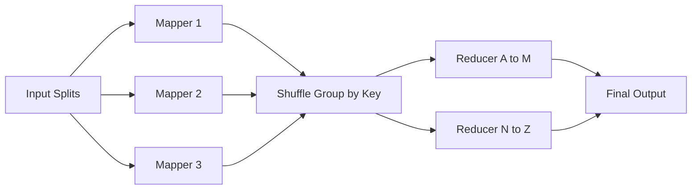

## Concept Overview

Some computations simply do not fit on one machine. Counting word frequencies across a petabyte of web pages, building a search index from billions of documents, or aggregating a year of clickstream logs would take a single server weeks, if the data even fit on its disks.

**MapReduce** is the programming model that made such jobs routine. Its core insight: if you express a computation as two pure functions, **map** and **reduce**, the framework can automatically parallelize it across thousands of commodity machines, handle machine failures mid-job, and shield the programmer from all distributed-systems plumbing.

The developer writes two small functions. The framework handles splitting the input, scheduling tasks near the data, moving intermediate results between machines, retrying failures, and collecting output. That separation of concerns, business logic versus distribution logic, is the model's lasting contribution, even as newer engines have replaced its original implementation.

## The Programming Model: Map, Shuffle, Reduce

A MapReduce job flows through three phases:

1. **Map**: Each mapper reads a chunk (split) of input and emits intermediate key-value pairs. Mappers run in parallel, one per input split, with no coordination between them.
2. **Shuffle**: The framework groups all intermediate pairs by key and delivers every pair sharing a key to the **same** reducer. This is the only all-to-all network transfer in the job, and usually its most expensive phase.
3. **Reduce**: Each reducer receives one key plus the list of all its values, and aggregates them into final output. Reducers also run in parallel, one per key range.

### Word Count Walkthrough

The canonical example: count how often each word appears across millions of documents.

```python
def map(document_id, text):
    # emit a count of 1 for every word occurrence
    for word in text.split():
        emit(word, 1)

def reduce(word, counts):
    # counts is the list of all 1s emitted for this word
    emit(word, sum(counts))
```

A mapper reading "the cat sat" emits (the, 1), (cat, 1), (sat, 1). The shuffle routes every (the, 1) pair from every mapper to one reducer, which sums them into (the, 5000000). Thousands of mappers and reducers do this simultaneously across the cluster.



---

```quiz
{
  "question": "In the word count job, why must the shuffle phase send every occurrence of the same word to the same reducer?",
  "options": [
    "To keep network traffic low",
    "Because a correct total for a word requires one place to see all of its partial counts",
    "Because mappers cannot emit the same key twice",
    "To keep output sorted alphabetically"
  ],
  "correctAnswerIndex": 1,
  "explanation": "The reduce function aggregates all values for one key. If occurrences of 'cat' were split across two reducers, each would emit a partial total and no single correct count would exist. Grouping by key is the correctness contract of the shuffle."
}
```

---

## What Makes It Work at Scale

### Data Locality: Move Compute to Data
Shipping a petabyte across the network to the computation is absurd; the input already sits on the cluster's distributed file system, spread over the same machines that can run tasks. The scheduler assigns each map task to a machine that **already holds** its input split, so the heaviest reads happen from local disk. This inversion, moving the small program to the big data, is a foundational principle of all big-data systems.

### Fault Tolerance via Re-Execution
On a 1,000-node cluster running for hours, machine failures are a statistical certainty. MapReduce's answer is elegantly simple: because map and reduce are **deterministic and side-effect free**, any failed task can be **re-executed from its input** on another machine, producing identical results. No checkpointing of intermediate state, no coordination: the job as a whole succeeds even as individual machines die.

### Stragglers and Speculative Execution
A job finishes when its **last** task finishes. One machine with a failing disk can run 10x slower and hold the entire job hostage. The fix is **speculative execution**: near the end of a phase, the framework launches duplicate copies of the slowest remaining tasks on other machines and takes whichever copy finishes first.

### Combiners: Cutting Shuffle Volume
The shuffle is the bottleneck, so shrink it. A **combiner** runs a mini-reduce on each mapper's local output before it crosses the network: instead of shipping 100,000 (the, 1) pairs, the mapper pre-sums them into one (the, 100000) pair. For associative operations like sum, count, max, combiners cut shuffle traffic by orders of magnitude.

```callout
{
  "type": "tip",
  "content": "Interview shortcut: almost every MapReduce optimization question is really a shuffle question. Combiners shrink it, good key design balances it, and skewed keys (one reducer receiving most of the data) break it: the celebrity problem, resurfacing in batch form."
}
```

---

```quiz
{
  "question": "A 1000-task job is 99 percent complete, but two tasks on a machine with a degraded disk have been running 8x longer than the median. What mechanism addresses this?",
  "options": [
    "Combiners",
    "Data locality scheduling",
    "Speculative execution launching backup copies of the slow tasks elsewhere",
    "Increasing the number of reducers"
  ],
  "correctAnswerIndex": 2,
  "explanation": "These are stragglers. Speculative execution runs duplicate copies of the slowest tasks on healthy machines and accepts whichever finishes first, preventing one sick node from dictating job completion time."
}
```

---

## Real-World Use Cases

### 1. Log Analytics at Fleet Scale
**Scenario**: A large web platform generates tens of terabytes of access logs daily across thousands of servers.
**Problem**: Product and security teams need daily aggregates (top pages, error rates by region, suspicious IP patterns) but no single machine can even read a day's logs in a day.
**Solution**: A nightly batch job maps over raw logs emitting (dimension, metric) pairs and reduces them into aggregate tables, with combiners pre-summing per node to keep the shuffle tractable.

### 2. Search Index Construction
**Scenario**: A search engine must rebuild its inverted index over billions of crawled documents.
**Problem**: Building "word to list of documents" mappings requires grouping by word across the entire corpus, an inherently all-to-all operation.
**Solution**: Mappers parse documents and emit (word, document-id) pairs; the shuffle groups by word; reducers write sorted posting lists. The shuffle phase is doing exactly the grouping the index requires.

### 3. ETL into a Data Lake
**Scenario**: An enterprise lands raw event data from dozens of sources into object storage, as covered in [Blob Storage: Storing Unstructured Data at Scale](/system-design/module-4-data-layer-and-storage/blob-storage).
**Problem**: Raw events are messy: duplicated, inconsistently formatted, mixed schemas, and unusable by analysts.
**Solution**: Scheduled batch jobs map over raw files to clean and normalize records, then reduce to deduplicate and partition output by date into query-ready columnar files.

---

## Design Strategies & Trade-offs

### Limitations of Classic MapReduce
The original model shows its age in three ways:

1. **Disk I/O between stages**: Every job writes its full output to the distributed file system before the next job can read it. A pipeline of 10 chained jobs pays 10 rounds of disk writes and reads.
2. **Rigid two-phase structure**: Real computations (multi-way joins, iterative machine learning) must be contorted into chains of map-reduce pairs, multiplying the disk penalty. An iterative algorithm running 50 passes re-reads its data 50 times.
3. **Batch-only latency**: A job gives answers in minutes to hours. Questions like "what is trending right now" cannot wait for the next batch window.

### The Evolution: DAG Engines and Stream Processing
- **In-memory DAG engines** (Spark-style): Express the whole pipeline as a directed acyclic graph of operations, keep intermediate data in memory across stages, and only spill to disk when necessary. Iterative and multi-stage workloads speed up by orders of magnitude while keeping re-execution-based fault tolerance via lineage tracking.
- **Stream processing** (Kafka plus Flink-style): Instead of processing accumulated data periodically, process each event as it arrives, maintaining running state. Latency drops from hours to seconds, at the cost of harder correctness questions: late events, exactly-once state updates, and windowing semantics.

### Batch vs. Stream Comparison

| Dimension | Batch Processing | Stream Processing |
| :--- | :--- | :--- |
| **Latency to results** | Minutes to hours | **Seconds or less** |
| **Throughput per unit cost** | **Very high** (sequential scans) | Moderate (per-event overhead) |
| **Correctness model** | Simple (complete input, rerun on failure) | Hard (late data, watermarks, exactly-once state) |
| **Reprocessing old data** | **Trivial** (rerun the job) | Awkward (replay streams, rebuild state) |
| **Typical use** | ETL, reports, index builds, ML training | Alerting, fraud detection, live dashboards |

Many production architectures run both: streams for fresh approximate answers, nightly batch for the authoritative version.

---

## Failure & Scale Considerations

- **Reducer skew is the batch celebrity problem**: If one key holds 40 percent of the data, its reducer runs alone for hours after every other task finishes. Mitigate with key salting plus a second aggregation pass.
- **The shuffle can saturate the network**: An all-to-all transfer between thousands of machines stresses cluster bisection bandwidth. Combiners and compression are the first defenses.
- **Non-deterministic tasks break the recovery model**: Fault tolerance assumes re-running a task yields identical output. Tasks reading wall-clock time, random numbers, or external services can produce corrupt results after retries.
- **Small files poison throughput**: Batch engines are built for large sequential reads. Millions of tiny input files create per-task overhead that dwarfs useful work; compact them first.

```match
{
  "question": "Match the mechanism to the problem it solves",
  "pairs": [
    {
      "left": "Combiner",
      "right": "Excessive shuffle network volume"
    },
    {
      "left": "Speculative execution",
      "right": "One slow machine delaying the whole job"
    },
    {
      "left": "Deterministic task re-execution",
      "right": "Machine failures mid-job"
    },
    {
      "left": "Data locality scheduling",
      "right": "Moving petabytes to compute is infeasible"
    }
  ]
}
```

```quiz
{
  "question": "A fraud detection team needs to flag suspicious transactions within 5 seconds of occurrence. The data platform currently runs hourly batch jobs. What is the right architectural direction?",
  "options": [
    "Run the batch job every 5 seconds",
    "Add more reducers to the hourly job",
    "Move fraud scoring to a stream processing pipeline consuming events as they arrive",
    "Cache the batch results in Redis"
  ],
  "correctAnswerIndex": 2,
  "explanation": "Batch latency is structural: results cannot be fresher than the job interval, and running heavyweight batch jobs every few seconds collapses under startup overhead. A 5-second detection requirement is the textbook trigger for stream processing."
}
```
