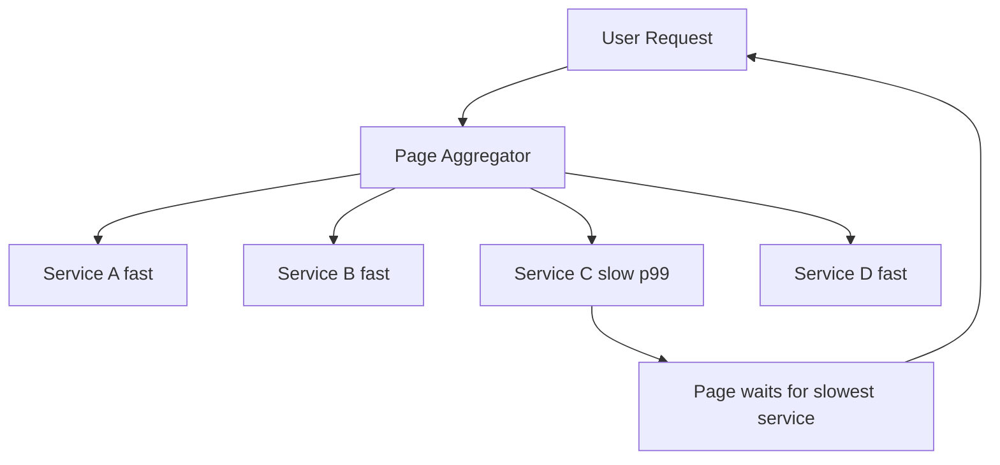

## Concept Overview

You already know what latency is from [Latency vs. Throughput: Mastering System Performance Metrics](/system-design/module-1-foundations-of-system-design/latency-throughput). This lesson is about the harder question: how do you **measure and report** latency without fooling yourself?

The short answer: never trust the average. Latency distributions in real systems are heavily **skewed**: most requests are fast, but a long tail of slow requests stretches far to the right. The mean gets dragged around by that tail while telling you nothing about who is suffering, and it can look healthy while a meaningful slice of your users has an awful experience.

### A Worked Example: The Lying Average
Imagine 100 requests. Ninety-nine complete in 50 ms; one takes 8,000 ms (a lock contention stall).

- Mean = (99 x 50 + 8000) / 100 = 129.5 ms. Looks fine on a dashboard.
- But one user in a hundred just waited 8 seconds. At a million requests a day, that is 10,000 terrible experiences the average completely erased.

Flip it around: the mean can also **overstate** a problem when a few enormous outliers inflate it while the typical experience is fine. Either way, a single number summarizing a skewed distribution misleads. **Percentiles** are the fix.

## Percentiles: p50 to p99.9

The **pXX** is the value below which XX percent of requests fall. Sort all latencies; walk to the XX percent mark.

- **p50 (median)**: The typical request. Half are faster, half slower. This is your "how does it usually feel" number.
- **p90**: 1 in 10 requests is slower than this. Regular users hit this daily.
- **p95**: 1 in 20. A user making 20 requests per session likely feels this every session.
- **p99**: 1 in 100. Sounds rare, but your **most active users** (the ones making hundreds of requests) hit it constantly. They are often your most valuable users.
- **p99.9**: 1 in 1,000. At a billion requests a day, this is still a million slow requests.

The gap between p50 and p99 is itself diagnostic: a small gap means consistent performance; a huge gap means something intermittent (GC pauses, lock contention, cold caches, a sick replica) is punishing an unlucky subset.

```callout
{
  "type": "warning",
  "content": "The heaviest users make the most requests, so they sample your tail most often. Your p99 is disproportionately experienced by exactly the customers you least want to lose. That is why serious latency targets are set at p99, not p50."
}
```

---

```quiz
{
  "question": "A service reports mean latency of 80 ms, p50 of 40 ms, and p99 of 2,400 ms. What is the most accurate interpretation?",
  "options": [
    "The service is healthy because the mean is low",
    "Typical requests are fast, but 1 in 100 requests is roughly 60x slower, indicating an intermittent problem worth investigating",
    "The p99 must be a measurement error since it is far from the mean",
    "The median is wrong because it is below the mean"
  ],
  "correctAnswerIndex": 1,
  "explanation": "A median far below the mean with a huge p99 is the signature of a skewed distribution: most requests are fine, a tail is badly hurt. The mean sits between them and describes nobody. The tail is real and usually points to GC, contention, or a degraded node."
}
```

---

## Tail Latency Amplification Under Fan-Out

Percentiles get dramatically worse when a single user action fans out to many backends. Modern pages routinely call dozens or hundreds of services in parallel, and the page is only as fast as its **slowest** dependency.

Plain-text math: suppose each backend answers within its p99 with probability 0.99. If a page fans out to 100 backends in parallel:

- Probability all 100 respond faster than their p99 = 0.99^100, which is about 0.366.
- So roughly **63 percent of page loads** hit at least one backend's worst 1 percent.

A backend's "rare" tail becomes the **typical** experience of the composed page. This is **tail latency amplification**, and it is why large-scale systems obsess over p99 and p99.9 rather than medians: at high fan-out, the tail IS the product.



```quiz
{
  "question": "A dashboard page calls 50 services in parallel, each with a solid p99 of 100 ms. Why do most page loads still exceed 100 ms?",
  "options": [
    "Parallel calls add their latencies together",
    "With 50 chances to hit a 1-in-100 slow response, most page loads include at least one service exceeding its p99, and the page waits for the slowest",
    "The aggregator adds 100 ms of overhead",
    "p99 only applies to single-service systems"
  ],
  "correctAnswerIndex": 1,
  "explanation": "0.99 to the power 50 is about 0.605, so roughly 40 percent of page loads hit some service's worst 1 percent, and near-tail responses drag the rest. Under fan-out, per-service tails compound into the composed experience."
}
```

---

## SLIs, SLOs, and SLAs

Percentiles are how latency targets get written down and enforced:

- **SLI (Service Level Indicator)**: The measured quantity. Example: "p99 latency of the checkout API, measured at the load balancer."
- **SLO (Service Level Objective)**: The internal target for that SLI. Example: "p99 under 300 ms for 99.9 percent of 5-minute windows per quarter." SLOs drive engineering priorities.
- **SLA (Service Level Agreement)**: The external contract with customers, with financial penalties attached. Always looser than the internal SLO, so you breach your own alarm long before you breach the contract.

### Error Budgets in Brief
An SLO of 99.9 percent implies a tolerated 0.1 percent of bad windows: the **error budget**. While budget remains, teams ship features freely; when it is exhausted, releases pause and reliability work takes priority. The budget converts "how reliable is reliable enough" from an argument into arithmetic.

---

## Real-World Use Cases

### 1. E-Commerce Checkout SLO
**Scenario**: A retailer's checkout service backs a revenue-critical flow.
**Problem**: Mean latency dashboards stayed green during incidents where conversion measurably dropped; slow checkouts were invisible in the average.
**Solution**: Redefine the SLI as p99 checkout latency measured client-side, set an SLO of 500 ms, and alert on error-budget burn rate instead of mean thresholds.

### 2. Search Fan-Out Tail Taming
**Scenario**: A search frontend queries dozens of index partitions in parallel and must render within 200 ms.
**Problem**: Each partition's occasional slow response (disk hiccup, GC pause) delayed almost every search due to amplification.
**Solution**: **Hedged requests**: after waiting the partition's p95, send a duplicate request to a replica and take the first answer. Tail latency collapsed for a small percentage of duplicated traffic.

### 3. Load Test That Lied
**Scenario**: A team load-tests a new API with a closed-loop tool that sends the next request only after the previous one returns.
**Problem**: When the server stalled for 5 seconds, the tool politely stopped sending, recording one slow sample instead of the hundreds of queued requests real users would have generated. Reported p99 was flattering fiction. This is **coordinated omission**: the measuring tool coordinates with the system's slowness and omits the pain.
**Solution**: Use a constant-rate load generator that timestamps requests by their **intended** send time, so a stall correctly shows up as many delayed requests.

---

## Measuring Correctly

- **Histograms, not pre-averaged metrics**: Percentiles cannot be recovered from stored averages, and averaging percentiles across hosts is mathematically wrong. Ship full latency histograms from each host and merge them, then derive percentiles at query time.
- **Client-side vs. server-side**: Server-side numbers miss the network, TLS handshakes, retries, and queueing in front of the service, which is exactly where users suffer. Measure server-side for debugging, but define user-facing SLOs as close to the client as you can.
- **Watch for coordinated omission**: Any measurement loop that waits for a response before issuing the next request under-reports tail latency during stalls. Prefer open-loop, constant-rate load generation.

## Design Strategies & Trade-offs

Tail-latency mitigations, and what they cost:

| Approach | What It Tells You | What It Hides | Storage Cost | Use For |
| :--- | :--- | :--- | :--- | :--- |
| **Average (mean)** | Aggregate load trend | The entire shape of the distribution and every outlier | Tiny | Capacity math only, never user experience |
| **p50** | Typical experience | The unlucky tail | Small | Baseline feel of the service |
| **p99 / p99.9** | Worst realistic experiences, felt most by heaviest users | Very little | Small | **SLOs, alerting, fan-out systems** |
| **Full histogram** | Everything, mergeable across hosts | Nothing significant | Moderate | The raw source all of the above derive from |

Mitigation toolbox for the tail itself:
- **Hedged requests**: Duplicate a request to another replica after a p95 delay; take the first response. Cheap tail insurance for idempotent reads.
- **Aggressive timeouts with retries**: Fail fast on a stuck backend and retry elsewhere. Requires retry budgets to avoid retry storms during real overload.
- **Load shedding**: Reject excess traffic early to keep latency bounded for the rest; a slightly higher error rate beats universal slowness.
- **Replica selection**: Route around consistently slow replicas using recent latency observations rather than pure round-robin.

---

## Failure & Scale Considerations

- **Percentile math has traps**: The p99 of averaged 1-minute buckets is not the p99 of requests. Aggregation must happen on histograms, not on derived percentiles.
- **Tails are where failures announce themselves**: A dying disk, a saturated replica, or an imminent cascading failure shows up in p99.9 long before the median moves. Treat tail regressions as early warnings.
- **Overload makes tails vertical**: As utilization approaches saturation, queueing makes tail latency explode far faster than the median. If p99 is climbing while p50 is flat, you are watching queues form.
- **Mitigations can backfire at scale**: Hedged requests and retries add load; during a genuine capacity shortfall they amplify the overload. Cap them with budgets and disable them under shed conditions.

```match
{
  "question": "Match the concept to its meaning",
  "pairs": [
    {
      "left": "p99",
      "right": "Latency the slowest 1 percent of requests exceed"
    },
    {
      "left": "Tail amplification",
      "right": "Fan-out makes backend p99s the typical page experience"
    },
    {
      "left": "Coordinated omission",
      "right": "Closed-loop measurement hides stall-time pain"
    },
    {
      "left": "Error budget",
      "right": "Allowed unreliability implied by an SLO"
    }
  ]
}
```

```quiz
{
  "question": "Your monitoring stores only per-minute average latency per host. Leadership asks for the fleet-wide p99. What is the honest answer?",
  "options": [
    "Average the per-host averages and multiply by 2.33",
    "Report the max of the per-host averages",
    "It cannot be computed from averages; you need to ship latency histograms from each host and merge them",
    "Use the slowest single request from the last minute"
  ],
  "correctAnswerIndex": 2,
  "explanation": "Averages destroy the distribution; no arithmetic on them recovers percentiles. Correct percentile reporting requires recording distributions (histograms) at the source and merging those, deriving percentiles only at the end."
}
```
