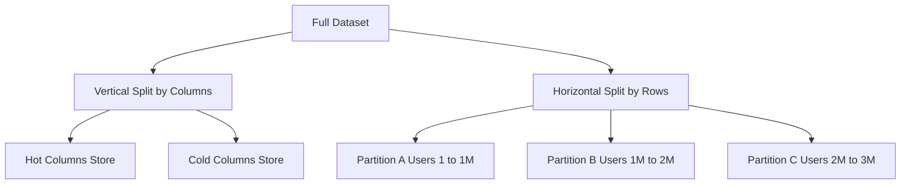

## Concept Overview

At some point, a dataset outgrows a single machine. Either the data itself no longer fits on one disk, or the read/write traffic exceeds what one node's CPU, memory, and I/O can serve. **Partitioning** is the answer: splitting a large dataset into smaller pieces called **partitions**, each of which can live on a different node.

Partitioning delivers three distinct benefits:

1. **Capacity**: A 50 TB dataset can be spread across 50 nodes holding 1 TB each.
2. **Parallel throughput**: Queries and writes touching different partitions run on different machines simultaneously, multiplying total throughput.
3. **Blast-radius reduction**: A failure, hot query, or bad migration on one partition affects only a fraction of the data, not the whole system.

The catch: once data is split, every design decision downstream (routing, indexing, transactions, rebalancing) becomes harder. The partitioning strategy you choose determines how evenly load spreads, which queries stay fast, and how painful growth becomes.

## Vertical vs. Horizontal Partitioning

There are two fundamentally different ways to split data:

- **Vertical partitioning** splits by **columns or tables**. Frequently accessed columns (username, email) go in one store; wide, rarely read columns (profile bio, preferences blob) go in another. Different tables can also move to different databases entirely (orders DB, analytics DB).
- **Horizontal partitioning** splits by **rows**. Every partition has the same schema, but each holds a different subset of rows, usually determined by a **partition key** (user ID, order ID, timestamp).

Vertical partitioning helps when specific columns dominate I/O. Horizontal partitioning is the tool for raw scale, because row counts grow without bound while schemas stay fixed.



```callout
{
  "type": "info",
  "content": "Terminology check: **partitioning** is the general concept of splitting data. **Sharding** usually means horizontal partitioning where partitions live on separate machines. Interviewers use the terms loosely, so state your definition up front."
}
```

---

```quiz
{
  "question": "Your users table has a rarely read 200KB JSON preferences column that is slowing down full row reads on the hot path. Which technique addresses this most directly?",
  "options": [
    "Hash partitioning on user ID",
    "Vertical partitioning to move the JSON column into a separate store",
    "Adding a global secondary index",
    "Range partitioning on the created_at timestamp"
  ],
  "correctAnswerIndex": 1,
  "explanation": "The problem is column width, not row count. Vertical partitioning separates the wide cold column from the hot narrow columns, shrinking I/O on the critical path. Horizontal strategies would copy the problem onto every partition."
}
```

---

## Real-World Use Cases

### 1. Time-Series Metrics Platform
**Scenario**: An observability platform ingests billions of metric data points per day.
**Problem**: All writes carry a current timestamp. With naive range partitioning on time, every single write lands on the newest partition, creating a permanent write hotspot while older partitions sit idle.
**Solution**: Use a **compound key** of source ID plus timestamp. Writes spread across partitions by source, while time ranges within one source remain contiguous for fast dashboard scans.

### 2. Multi-Tenant SaaS Database
**Scenario**: A B2B SaaS product stores data for 40,000 customer organizations.
**Problem**: One database can no longer hold all tenants, and a noisy tenant's heavy queries degrade everyone else.
**Solution**: Partition horizontally by tenant ID. Each tenant's data is colocated in one partition, so queries never cross partitions, and a runaway tenant only saturates its own partition.

### 3. Social Network Celebrity Problem
**Scenario**: A social platform partitions posts and likes by author ID.
**Problem**: A celebrity with 80 million followers publishes a post, and the single partition owning that author melts under read load. This is **skew**: uneven distribution of load across partitions.
**Solution**: **Key salting**. Append a small random suffix (celebrity-id-1 through celebrity-id-16) to spread that entity's rows over 16 partitions. Reads must now query all 16 and merge, so salting is applied only to the few keys that need it.

---

## Horizontal Partitioning Strategies

### Range Partitioning
Assign contiguous key ranges to partitions: A through F on partition 1, G through M on partition 2, and so on.
*   **Pros**: Range scans are efficient because adjacent keys are colocated. Great for time-series reads and ordered pagination.
*   **Cons**: Prone to **hotspots**. Time-ordered or sequential keys concentrate all writes on one partition.

### Hash Partitioning
Apply a hash function to the key and assign the result to a partition.
*   **Pros**: Even spread of keys and load, since the hash destroys any ordering in the input.
*   **Cons**: Range queries are lost. Keys that were adjacent are now scattered, so a scan over a key range becomes a query to every partition.

### Directory (Lookup-Based) Partitioning
A lookup service maintains an explicit map from key (or key range) to partition.
*   **Pros**: Maximum flexibility. You can move any key anywhere, isolate a hot tenant onto dedicated hardware, and rebalance surgically.
*   **Cons**: Every request pays an extra hop to consult the directory, and the directory itself is a potential **single point of failure** that must be cached and replicated.

```quiz
{
  "question": "A logistics system partitions shipments by an auto-incrementing shipment ID using range partitioning. What problem will appear first as write volume grows?",
  "options": [
    "Range scans become impossible",
    "All new writes hit the partition owning the highest ID range, creating a hotspot",
    "The hash function produces collisions",
    "Reads of old shipments slow down"
  ],
  "correctAnswerIndex": 1,
  "explanation": "Auto-incrementing IDs are monotonically increasing, so every insert targets the tail partition. Range partitioning plus sequential keys is the classic write hotspot recipe. Hashing the key or using a compound key fixes it."
}
```

---

## Secondary Indexes Across Partitions

Partitioning by one key makes queries on **other** attributes awkward. If users are partitioned by user ID, how do you find all users in a given city? Two index designs exist:

- **Local indexes** (document-partitioned): Each partition indexes only its own rows. Writes are cheap (index update stays local), but a query on the indexed attribute must be sent to **every partition** and the results merged: a **scatter-gather** read whose latency is set by the slowest partition.
- **Global indexes** (term-partitioned): The index itself is partitioned by the indexed value, so a city lookup hits exactly one index partition. Reads are cheap, but a single row write may update index partitions on other nodes, making writes slower and often asynchronous.

The trade is direct: local indexes favor writes, global indexes favor reads.

---

## Request Routing

Once data is split, every request must find the right partition. Three common approaches:

1. **Client-aware routing**: Clients know the partition map and connect directly. Lowest latency, but every client must track map changes.
2. **Routing tier**: A lightweight proxy owns the map and forwards requests. Clients stay simple; the proxy adds a hop and must be highly available.
3. **Coordinator node**: Any node accepts any request and forwards it internally to the owner. Simple for clients, but adds intra-cluster hops.

Rebalancing (moving partitions as nodes join or leave) must update this map without downtime. Good schemes move a minimal amount of data; naive hash mod N schemes reshuffle nearly everything when N changes. This is precisely the problem addressed in [Consistent Hashing: Stable Data Distribution](/system-design/module-4-data-layer-and-storage/consistent-hashing).

---

## Design Strategies & Trade-offs

| Strategy | Load Distribution | Range Queries | Extra Infrastructure | Hotspot Risk | Best For |
| :--- | :--- | :--- | :--- | :--- | :--- |
| **Range** | Uneven if keys are skewed | **Excellent** | None | **High** (sequential keys) | Time-series reads, ordered scans |
| **Hash** | **Even** | Poor (scatter-gather) | None | Low (except celebrity keys) | Uniform key-value workloads |
| **Directory** | Fully controllable | Depends on layout | Lookup service (SPOF risk) | Low (can isolate hot keys) | Multi-tenant, surgical placement |

A practical middle ground used by systems like Cassandra and DynamoDB: **hash the partition key** to pick the partition, then **sort by a clustering key within** the partition. You get even distribution across partitions and efficient range scans inside each one.

```match
{
  "question": "Match the partitioning strategy to its defining weakness",
  "pairs": [
    {
      "left": "Range partitioning",
      "right": "Sequential keys create a write hotspot"
    },
    {
      "left": "Hash partitioning",
      "right": "Range scans require querying every partition"
    },
    {
      "left": "Directory partitioning",
      "right": "Lookup service adds a hop and a failure point"
    },
    {
      "left": "Local secondary index",
      "right": "Attribute queries become scatter-gather reads"
    }
  ]
}
```

---

## Failure & Scale Considerations

- **Skew compounds silently**: A perfectly balanced key space at launch can develop hotspots as usage patterns shift (one tenant grows 100x). Monitor per-partition load, not just cluster averages.
- **Rebalancing is expensive**: Moving a partition means copying data while serving traffic. Schemes that pre-create many small partitions (more partitions than nodes) rebalance by reassigning whole partitions instead of splitting live ones.
- **Scatter-gather amplifies tail latency**: A query touching 100 partitions is as slow as the slowest one. Keep dominant queries single-partition by choosing the partition key to match access patterns.
- **The directory becomes critical state**: If the lookup service is down or stale, requests route to wrong nodes. Replicate it and cache the map aggressively in clients.

Partitioning tells you how to split data logically. The operational discipline of running those partitions across real machines, picking shard keys, resharding live systems, and surviving cross-shard queries, is covered next in [Sharding: Horizontal Scaling in Practice](/system-design/module-4-data-layer-and-storage/sharding).

```quiz
{
  "question": "Your analytics query must aggregate data for one attribute across a hash-partitioned table with 200 partitions. The p99 latency is far worse than the median. Why?",
  "options": [
    "Hash functions are slow at percentile boundaries",
    "The scatter-gather read completes only when the slowest of 200 partitions responds",
    "Aggregations are not possible on hash-partitioned data",
    "The routing tier caches results incorrectly"
  ],
  "correctAnswerIndex": 1,
  "explanation": "A fan-out query is gated by its slowest participant. With 200 partitions, almost every query hits at least one partition having a bad moment, so tail latency of any single partition becomes the typical latency of the whole query."
}
```
