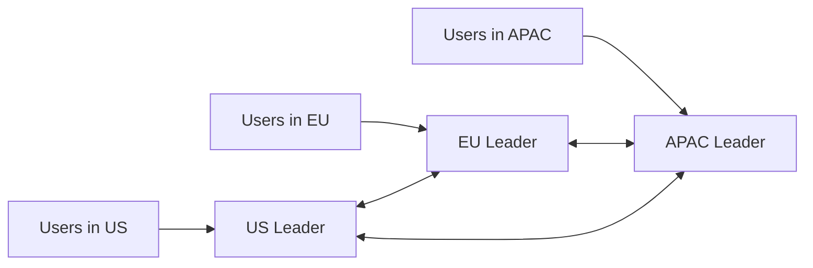

## Concept Overview

The single-leader model from [Database Replication: Strategies & Scalability](/system-design/module-1-foundations-of-system-design/replication) has one enormous virtue: all writes flow through one node, so there is a single authoritative ordering of events and no write conflicts. It also has one enormous limit: every write on the planet must reach that one node, and if it dies, writes stop until failover completes.

This lesson covers what large systems do when that limit becomes unacceptable: **multi-leader replication** (several nodes accept writes), **leaderless quorum replication** (any replica accepts writes, Dynamo-style), and the machinery both require to detect and repair **divergent data**: conflict resolution, anti-entropy, and read repair. The recurring theme: once you allow writes in more than one place, conflicts stop being a failure mode and become a design parameter.

## Multi-Leader Replication

In multi-leader replication, multiple nodes (typically one per datacenter or region) accept writes, and each leader asynchronously replicates its writes to the others.

**Why do it**: A user in Singapore writes to the Singapore leader at local latency instead of crossing an ocean to a single global primary. Each region also survives the loss of other regions' leaders.

**Topologies**: Leaders can replicate in a ring (each forwards to the next), a star (all through a central hub), or all-to-all. All-to-all is most robust; ring and star create dependency chains where one failed node stalls propagation for others.

**The core problem, write conflicts**: Two leaders can accept conflicting writes to the same record at the same moment, and both are "committed" locally before either hears about the other. Unlike single-leader systems, conflict is not an anomaly here; it is the steady state to be managed.



## Conflict Resolution

When two replicas hold different versions of the same record, something must decide the outcome:

- **Last-write-wins (LWW)**: Attach a timestamp to every write; the highest timestamp wins, the other write is silently discarded. Simple and convergent, but clocks on different machines disagree (**clock skew**), so a write that logically happened later can lose to an earlier one with a fast clock. LWW is best described honestly: a policy for choosing which data to lose. Acceptable for ephemeral data, dangerous for anything users typed.
- **Version vectors**: Each replica tracks a counter per node, so the system can distinguish "version A supersedes B" from "A and B were written **concurrently**". Concurrent versions are kept as **siblings** and surfaced to the application, which merges them with domain knowledge (union of cart items, for example). No silent loss, but the application inherits merge logic.
- **CRDTs (conflict-free replicated data types)**: Data structures (counters, sets, registers) whose merge operation is mathematically commutative and associative, so any two replicas merge to the same result automatically, in any order. No coordination, no lost updates within the type's semantics, but you must express your data in CRDT vocabulary, and some structures carry metadata overhead.

```callout
{
  "type": "warning",
  "content": "Last-write-wins plus clock skew silently destroys data: a node with a clock a few seconds fast wins every conflict for those seconds. If you must use LWW, keep it away from user-authored content, and never trust it for counters or balances."
}
```

---

```quiz
{
  "question": "Two datacenter leaders accept concurrent updates to the same shopping cart. With last-write-wins, one update vanishes. Which mechanism lets the system detect the concurrency and merge both updates instead?",
  "options": [
    "Synchronous replication",
    "Version vectors surfacing sibling versions for the application to merge",
    "A higher-resolution timestamp",
    "Routing all cart writes through one leader"
  ],
  "correctAnswerIndex": 1,
  "explanation": "Version vectors capture causality: they prove neither write saw the other, so both are kept as siblings and merged (for carts, typically a union). Better timestamps still lose one write; routing to one leader avoids conflict but abandons multi-leader benefits."
}
```

---

## Leaderless Replication and Quorums

Dynamo-style systems (Cassandra, Riak, and DynamoDB's lineage) abandon leaders entirely: a client (or coordinator) sends writes to **all N replicas** of a key in parallel and considers the write successful once **W** replicas acknowledge. Reads query all replicas and succeed once **R** respond, taking the newest version seen.

The correctness lever is one inequality, written in plain text: **R + W > N**. If the write set and read set together exceed N, they must **overlap** in at least one replica, so every read touches at least one node holding the latest acknowledged write.

Tuning for the workload, with N = 3:
- **W = 2, R = 2**: Balanced; tolerates one node down for both reads and writes.
- **W = 3, R = 1**: Expensive writes, cheap fast reads: read-heavy workloads.
- **W = 1, R = 3**: Fast writes, expensive reads: write-heavy ingestion where reads are rare.
- **W = 1, R = 1** (R + W not greater than N): Fast and available, but reads can miss the latest write: eventual consistency by dial setting.

### Sloppy Quorums and Hinted Handoff
During a partition, strict quorums would reject writes when too few of a key's **home** replicas are reachable. A **sloppy quorum** instead accepts the write on any W reachable nodes, with substitutes holding a **hint** noting the intended owner. When the home node recovers, the substitute performs **hinted handoff**, delivering the parked writes. Availability improves, but note the fine print: a sloppy quorum write may live entirely on non-home nodes, so even R + W > N does not guarantee a read sees it until handoff completes.

### Repairing Divergence
Without a leader, replicas drift and something must reconverge them:
- **Read repair**: When a read observes replicas with different versions, the coordinator writes the newest version back to the stale ones. Hot keys self-heal; rarely read keys do not.
- **Anti-entropy**: A background process continuously compares replicas (typically via Merkle trees, which localize differences without scanning everything) and syncs discrepancies. This catches the cold data read repair misses.

```quiz
{
  "question": "A Cassandra-style cluster has N of 3 with W of 1 and R of 1. A user writes a value, then immediately reads it back and sees the old value. Why is this expected behavior?",
  "options": [
    "The write must have failed",
    "R plus W equals 2, which does not exceed N of 3, so the read set can miss the one replica that took the write",
    "Anti-entropy deleted the new value",
    "Hinted handoff rerouted the read"
  ],
  "correctAnswerIndex": 1,
  "explanation": "With R + W not greater than N, read and write sets are not guaranteed to overlap. The write landed on one replica; the read consulted a different one. This configuration deliberately trades read-your-writes consistency for latency and availability."
}
```

---

## Real-World Use Cases

### 1. Global Session Store
**Scenario**: A consumer app serves users from three continents and stores session state (preferences, feature flags, last-seen) with strict local-latency requirements.
**Problem**: A single-leader store forces two continents to pay cross-ocean write latency, and a regional outage severs their writes entirely.
**Solution**: Multi-leader replication with a leader per region and LWW conflict resolution, acceptable because session fields are individually overwritable and low-stakes.

### 2. Shopping Cart on a Leaderless Store
**Scenario**: A retailer's cart service must accept writes during node failures and network partitions; a rejected add-to-cart is lost revenue.
**Problem**: Concurrent updates from a phone and a laptop produce divergent carts, and node outages must not block writes.
**Solution**: Dynamo-style leaderless store with sloppy quorums for availability, version vectors to detect concurrent cart versions, and an application merge that unions items. The known cost: deleted items can resurrect on merge unless deletions are recorded as tombstones.

### 3. Read-Your-Writes on a Social Profile
**Scenario**: A user edits their profile and the app immediately re-renders it from a replica.
**Problem**: With asynchronous replication in any topology, the read can hit a replica that has not applied the edit; the user concludes the save failed and edits again.
**Solution**: **Read-your-own-writes** guarantees: route a user's reads of their own data to a sufficiently fresh replica (or the accepting node) for a window after their write. Pair with **monotonic reads** (pin a session to one replica) so time never appears to move backward across refreshes. The consistency-model vocabulary behind these guarantees is covered in [Consistency in Distributed Systems](/system-design/module-2-non-functional-requirements/consistency).

---

## Design Strategies & Trade-offs

**Chain replication**, in brief, is a third structure worth naming: replicas form a chain where writes enter at the head and flow node to node, and reads are served by the tail. Once the tail has a write, every node has it, giving strong consistency with cheap reads; the cost is write latency proportional to chain length and the need for an external coordinator to repair the chain on failure.

| Dimension | Single-Leader | Multi-Leader | Leaderless (Quorum) |
| :--- | :--- | :--- | :--- |
| **Write conflicts** | None (single ordering) | **Core problem**, needs resolution machinery | Handled via quorum overlap plus versioning |
| **Write latency (global users)** | Poor (all writes to one node) | **Good** (local leader per region) | Good (parallel to nearby replicas) |
| **Consistency ceiling** | Strong (read from leader) | Eventual across leaders | Tunable via R and W |
| **Failover story** | Promotion required, brief write outage | Other leaders continue | **No failover concept**, quorum absorbs node loss |
| **Operational complexity** | Lowest | High (conflict handling, topology) | High (quorum tuning, repair processes) |
| **Best fit** | Correctness-critical transactional data | Geo-distributed writes, offline-capable apps | High-availability key-value workloads |

```match
{
  "question": "Match the mechanism to its purpose",
  "pairs": [
    {
      "left": "R + W > N",
      "right": "Guarantees read and write replica sets overlap"
    },
    {
      "left": "Hinted handoff",
      "right": "Delivers writes parked on substitutes to recovered home nodes"
    },
    {
      "left": "Anti-entropy",
      "right": "Background comparison and sync of cold divergent data"
    },
    {
      "left": "CRDT",
      "right": "Data type whose replicas merge automatically to one result"
    }
  ]
}
```

---

## Failure & Scale Considerations

- **Split brain, generalized**: In multi-leader systems a partition does not stop writes on either side; both sides accumulate valid-looking history. Convergence afterward is only as good as your conflict resolution, and with LWW, one whole side's writes can silently lose.
- **Stale quorum reads after node loss**: Quorum overlap assumes replica sets are stable. After a node dies and is rebuilt empty, or after sloppy-quorum writes landed on substitutes, a numerically valid quorum can consist mostly of stale nodes until repair completes. R + W > N is a probability booster during turbulence, not an absolute guarantee.
- **Tombstone hygiene**: Leaderless deletes must be recorded as tombstones and retained longer than the repair cycle; purge them too early and anti-entropy resurrects deleted data.
- **Quorum latency is tail latency**: A W of 2 write completes at the **second-slowest** replica's speed, and one chronically slow replica drags every quorum it participates in. The percentile thinking from [Mastering Latency Metrics: Percentiles & Tail Latency](/system-design/module-4-data-layer-and-storage/mastering-latency-metrics) applies directly.

```quiz
{
  "question": "A leaderless cluster with N of 3, W of 2, R of 2 loses a node, and a fresh empty replacement joins. A read quorum immediately returns the replacement plus one replica that missed recent writes. What does this illustrate?",
  "options": [
    "R + W > N was configured incorrectly",
    "Quorum guarantees can be temporarily violated after membership changes until anti-entropy and read repair restore replica convergence",
    "Leaderless systems cannot lose nodes",
    "The replacement node should reject all reads forever"
  ],
  "correctAnswerIndex": 1,
  "explanation": "The overlap argument assumes replicas actually hold acknowledged writes. A rebuilt-empty node satisfies quorum counts without the data. Production systems bootstrap new nodes via streaming before serving, and rely on repair processes to close exactly this window."
}
```
