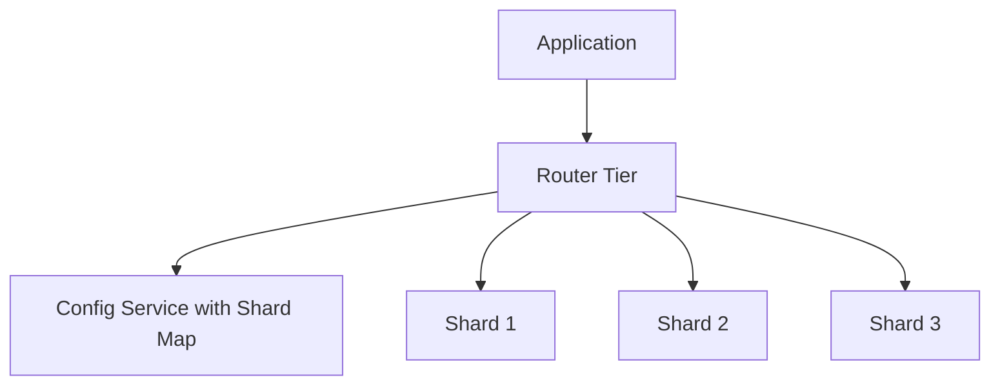

## Concept Overview

The previous lesson, [Partitioning: Splitting Data for Scale](/system-design/module-4-data-layer-and-storage/partitioning), covered the logical strategies for splitting data: range, hash, and directory-based. **Sharding** is what happens when you actually run those partitions across separate machines in production. Each machine (or replica set) owning a subset of data is a **shard**.

The theory is the easy part. The operational reality is where sharded systems earn their reputation for pain: picking a **shard key** you will live with for years, routing every query to the right place, executing schema migrations across dozens of databases, and moving data between shards without downtime.

This lesson focuses on that operational side: the decisions and failure modes that show up after you shard, not before.

## Choosing a Shard Key

The shard key is the most consequential and least reversible decision in a sharded system. A good shard key has three properties:

1. **High cardinality**: Many distinct values. Sharding by country gives you at most ~200 buckets, and one of them is enormous. Sharding by user ID gives you millions.
2. **Even distribution**: Values spread load uniformly. Cardinality alone is not enough; if 40% of traffic belongs to one key value, that shard burns.
3. **Alignment with dominant query patterns**: The queries you run most should include the shard key, so they resolve to a **single shard**. A chat app sharded by conversation ID keeps every message fetch on one shard; sharded by sender ID, loading one conversation touches many shards.

### The Celebrity Problem in Practice
Even a statistically excellent shard key fails on **hot entities**. One viral post, one enterprise tenant doing a bulk import, one celebrity account: each concentrates load on a single shard regardless of how well the other million keys are spread. Production mitigations include salting just the hot keys, giving whale tenants dedicated shards via a directory entry, and caching hot reads in front of the shard.

```callout
{
  "type": "warning",
  "content": "Changing a shard key later means rewriting and re-routing every row in the system, effectively a full migration. Teams routinely spend weeks modeling query patterns before committing, because the shard key is close to permanent."
}
```

---

```quiz
{
  "question": "A messaging platform must choose a shard key. 95 percent of queries are 'load all messages in conversation X'. Which shard key is best?",
  "options": [
    "Sender user ID, because users are numerous",
    "Message timestamp, because it is high cardinality",
    "Conversation ID, because the dominant query resolves to a single shard",
    "A random UUID per message, for perfect distribution"
  ],
  "correctAnswerIndex": 2,
  "explanation": "Conversation ID keeps the dominant query single-shard. Timestamp creates a write hotspot on the newest shard, and random per-message keys make every conversation read a scatter-gather across all shards. Distribution matters, but query alignment matters more."
}
```

---

## Routing Architectures

Every request must find its shard. Three architectures dominate:

1. **App-aware routing**: The application library holds the shard map and connects directly to the right shard. Lowest latency, no extra tier, but every service and language needs a correct, up-to-date client, and map changes must propagate to all of them.
2. **Proxy or router tier**: A stateless routing layer (like MongoDB's mongos or Vitess's vtgate pattern) sits between apps and shards. Applications see one logical database. Costs an extra network hop and the tier must itself be scaled and kept highly available.
3. **Config service holding the shard map**: A small, strongly consistent metadata store (often ZooKeeper-style) is the source of truth for which shard owns which key range. Routers and clients cache it and watch for changes. If it is unavailable, cached maps keep traffic flowing, but rebalancing freezes.



### Comparison: Routing Approaches

| Approach | Extra Hop | Client Complexity | Map Update Propagation | Operational Burden |
| :--- | :--- | :--- | :--- | :--- |
| **App-aware** | None (fastest) | **High** (smart clients everywhere) | Hard (push to all clients) | Low infra, high coordination |
| **Router tier** | One hop | Low (looks like one DB) | Easy (update routers only) | Must scale and monitor the tier |
| **Config service + cache** | Amortized (cached) | Medium | **Clean** (watch-based) | Config service is critical state |

---

## Cross-Shard Operations

Everything that stays on one shard is easy. Everything that crosses shards gets expensive:

- **Scatter-gather queries**: A query without the shard key fans out to all shards and merges results. Latency is gated by the slowest shard, and cost scales with shard count.
- **Cross-shard joins**: Joining rows living on different machines means shipping data over the network. Most teams denormalize or duplicate reference data onto each shard instead.
- **Distributed transactions**: Atomically updating rows on two shards requires a protocol like **two-phase commit**: a coordinator asks all shards to prepare, then commit. It works, but it holds locks across a network round trip and blocks entirely if the coordinator dies mid-flight. Most high-scale systems avoid it, preferring **sagas**: a sequence of local transactions with compensating actions on failure, accepting eventual consistency in exchange for availability.

```quiz
{
  "question": "Why do most large-scale sharded systems avoid two-phase commit for cross-shard writes?",
  "options": [
    "It cannot guarantee atomicity",
    "It holds locks across network round trips and blocks if the coordinator fails, hurting availability and throughput",
    "It only works with SQL databases",
    "It requires all shards to use the same hardware"
  ],
  "correctAnswerIndex": 1,
  "explanation": "Two-phase commit is atomic but fragile: participants hold locks while waiting on the coordinator, and a coordinator crash between prepare and commit leaves them stuck. Sagas trade that blocking behavior for compensating actions and eventual consistency."
}
```

---

## Resharding and Rebalancing

Shards grow unevenly, and clusters need more nodes. Moving data safely is a core competency:

- **Shard splitting**: A shard exceeding its capacity is split into two, each taking half its key space. Pre-splitting into many small shards at design time (256 logical shards on 8 physical nodes) makes future moves a matter of reassigning whole shards rather than splitting live data.
- **Consistent hashing**: Placing shards on a hash ring means adding a node moves only the keys adjacent to it, roughly 1/N of the data, instead of reshuffling everything. Details in [Consistent Hashing: Stable Data Distribution](/system-design/module-4-data-layer-and-storage/consistent-hashing).
- **Live migration with dual writes**: To move a key range with zero downtime: (1) start writing to both old and new shard, (2) backfill historical rows to the new shard, (3) verify checksums match, (4) flip reads to the new shard, (5) stop writing to the old one. Each step is reversible until the final cutover.

---

## Real-World Use Cases

### 1. SaaS Whale Tenant Isolation
**Scenario**: A B2B analytics product shards by tenant ID; one enterprise customer is 30x larger than the median.
**Problem**: The whale tenant's shard runs at 90 percent utilization while others idle, and its bulk imports cause latency spikes for co-located tenants.
**Solution**: A directory-based override maps that single tenant to a dedicated shard with larger hardware, while all other tenants continue through the standard hash route.

### 2. Payments Ledger Resharding
**Scenario**: A payments company must double shard count from 16 to 32 without a maintenance window.
**Problem**: Ledger writes cannot be paused, and any lost or duplicated row is a financial incident.
**Solution**: Dual writes to old and new shards, an asynchronous backfill with row-level checksum verification, a week of read-shadowing to compare results, then a staged read cutover shard by shard.

### 3. Social Feed Scatter-Gather Budget
**Scenario**: A social app sharded by user ID must build a home feed from hundreds of followed users.
**Problem**: Naive fan-out reads touch nearly every shard per feed load, and p99 latency explodes with shard count.
**Solution**: Precompute feeds at write time into a per-reader store, converting an any-shard read problem into a single-shard read, at the cost of write amplification.

---

## Failure & Scale Considerations

- **When NOT to shard**: Sharding is a last resort, not a badge of maturity. Exhaust the cheaper levers first: **vertical scaling** (bigger box buys years), **read replicas** (if reads dominate), **caching**, and **archiving or partition pruning** (most tables carry dead weight). Every one of these is simpler to operate and to undo.
- **Operational cost multiplies by shard count**: Backups, restores, schema migrations, and upgrades now run per shard. A migration that takes minutes on one database becomes a multi-day orchestrated rollout across 64, and it must handle partial failure midway.
- **Uneven growth is the default**: Shards drift apart in size and load over time. Without monitoring per-shard metrics and a practiced rebalancing runbook, you rediscover the hotspot problem in production.
- **The shard map is critical state**: A stale or corrupted map silently routes writes to the wrong shard. Treat map changes with the same rigor as schema changes: versioned, audited, and reversible.

```match
{
  "question": "Match the operational technique to the problem it solves",
  "pairs": [
    {
      "left": "Dual writes plus backfill",
      "right": "Migrating a key range with zero downtime"
    },
    {
      "left": "Consistent hashing",
      "right": "Adding nodes while moving minimal data"
    },
    {
      "left": "Directory override for whale tenants",
      "right": "Isolating one hot entity on dedicated hardware"
    },
    {
      "left": "Saga pattern",
      "right": "Cross-shard workflows without blocking locks"
    }
  ]
}
```

```quiz
{
  "question": "Your single Postgres instance is at 70 percent CPU with a read-heavy workload, and the team proposes sharding. What should you evaluate first?",
  "options": [
    "Which shard key to use",
    "Read replicas and caching, since reads dominate and sharding is the most expensive option to operate and reverse",
    "Two-phase commit support",
    "A router tier vendor"
  ],
  "correctAnswerIndex": 1,
  "explanation": "Sharding solves write scaling and dataset size limits at a heavy operational price. A read-heavy workload at moderate utilization is exactly what replicas and caches are for. Shard only when cheaper levers are exhausted."
}
```
